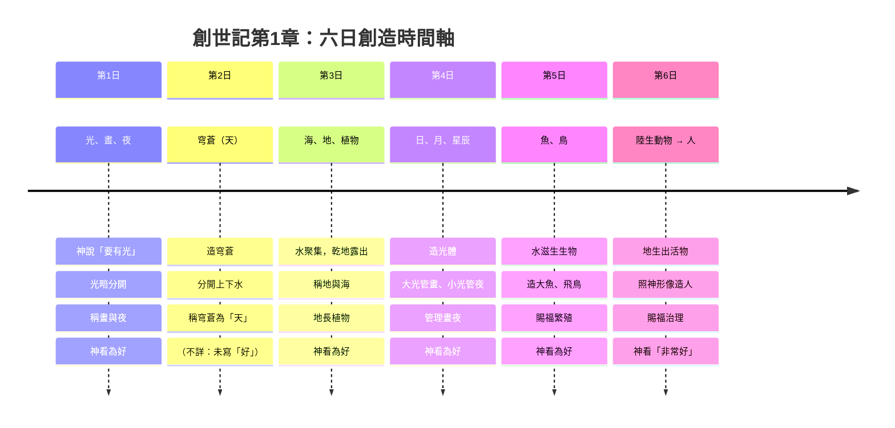
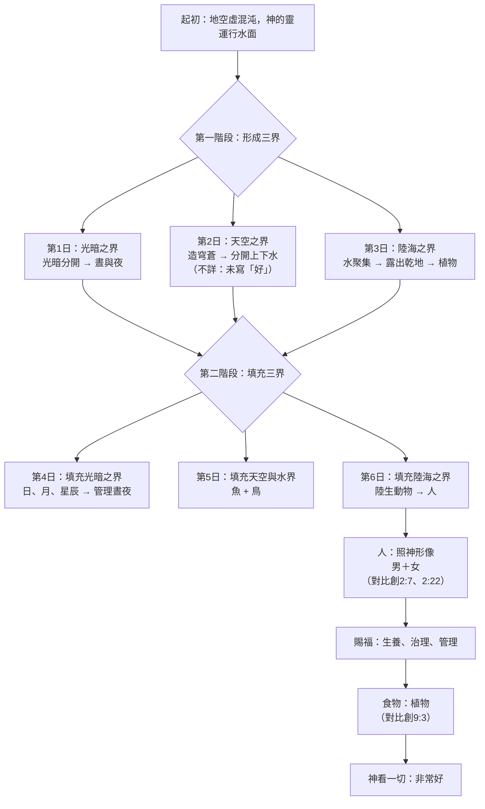
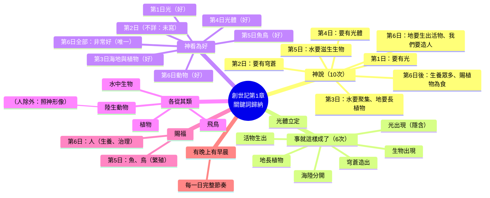

# 《創世記》第1章 ── 六日創造整理（嚴謹經文對比版）

## 📖 經文背景

> 本章記述神在六日之內創造天地的過程，從「空虛混沌」到「非常好」。以下所有整理均以經文為據，不確定的地方標示「（不詳）」。

**核心經文範圍**：創世記1:1-31

---

## 1️⃣ 時間軸表格法（經文對比版）

**適合**：快速對照、記憶順序、分析創造模式。

| 日 | 創造內容 | 神的行動 | 創造類別 | 神的評價 | 經文 | 經文對比／備註 |
|---|---|---|---|---|---|---|
| 第1日 | 光、晝、夜 | 神說「要有光」；將光暗分開，稱光為晝、暗為夜 | 宇宙基本結構（時間、光暗） | 好 | 1:3-5 | 光在光體被造之前出現 |
| 第2日 | 穹蒼（天） | 神說「眾水之間要有穹蒼」；造穹蒼，分開上下水，稱穹蒼為「天」 | 宇宙空間（天空） | （不詳：未明確寫「好」） | 1:6-8 | 唯一未明確寫「好」的一日 |
| 第3日 | 海、地、植物 | 神說「天下水要聚集，露出乾地」；稱地為「地」、水為「海」；地長植物（各從其類） | 陸地、海洋、植物界 | 好（兩次） | 1:9-13 | 植物在太陽之前出現 |
| 第4日 | 日、月、星辰 | 神說「天上要有光體分晝夜、作記號、定節令年日」；造大光小光及星辰 | 天體與時間管理 | 好 | 1:14-19 | 對應並管理第1日的光暗 |
| 第5日 | 魚類、水中生物、飛鳥 | 神說「水要滋生生物」；造大魚、水中生物、飛鳥（各從其類）；賜福要繁殖增多 | 水中動物、空中動物 | 好 | 1:20-23 | 首次出現「賜福」 |
| 第6日 | 陸生動物、人（男和女） | 神說「地要生出活物（各從其類）」；「照我們形像造人」；造男造女；賜福生養治理；賜植物為食 | 地上動物、人類（神形像、管理權） | **非常好** | 1:24-31 | 唯一被評價為「非常好」；人是最後被造 |

### 📌 補充說明（經文對比）

- **重複模式**：`神說 → 事就這樣成了 → 神看為好 → 有晚上、有早晨`（第2日缺「神看為好」）
- **「造」字的層次（經文對比）**：  
  - `bara`（創造）：1:1（天）、1:21（大魚）、1:27（人）——僅三次  
  - `asah`（造作）：1:7（穹蒼）、1:16（光體）、1:25（動物）等——多次
- **「各從其類」**：出現於1:11-12（植物）、1:21（魚鳥）、1:24-25（陸生動物）；**人例外**（1:26-27）
- **食物設定**：人與動物皆素食（1:29-30），與創9:3形成對比
- **第七日安息**：不在本章，接續於創2:1-3

---

## 2️⃣ 三界模式法（經文對比版）

**適合**：理解創造次序的邏輯（天地海 → 生物 → 人的管理）。

### 第一階段：形成三界（第1–3日）

| 日子 | 形成的領域 | 神的行動 | 經文 | 經文對比／備註 |
|---|---|---|---|---|
| 第1日 | **時間／光暗之界** | 光暗分開，稱晝與夜 | 1:3-5 | 先有光，後有光體 |
| 第2日 | **天空／上下水之界** | 造穹蒼，分開上下水 | 1:6-8 | （不詳：未寫「好」） |
| 第3日 | **陸地與海洋之界** | 水聚集露出乾地，地生植物 | 1:9-13 | 植物在太陽之前出現 |

> 這三日建立創造的「容器」或「領域」：光暗、天（空間）、地與海。

### 第二階段：填充三界（第4–6日）

| 日子 | 填充對象 | 對應之「界」 | 神的行動 | 經文 | 經文對比／備註 |
|---|---|---|---|---|---|
| 第4日 | 日、月、星辰 | 第1日（光暗之界） | 管理晝夜 | 1:14-19 | 對應並管理第1日的創造 |
| 第5日 | 魚類與飛鳥 | 第2日（天與水之界） | 居住水中與天空 | 1:20-23 | 對應第2日的空間 |
| 第6日 | 陸生動物與人 | 第3日（地與海之界） | 居住並管理地 | 1:24-31 | 對應第3日的陸地與海 |

> - 第4日光體 **管理** 第1日晝夜  
> - 第5日魚鳥 **居住** 在第2日水與天空  
> - 第6日動物與人 **居住並管理** 第3日地與萬物

### 整體對照表（經文對比）

| 階段 | 日子 | 創造行動 | 類型 | 經文 | 對比經文 |
|---|---|---|---|---|---|
| 形成 | 1 | 光暗分開（時間） | 界／領域 | 1:3-5 | （無對應） |
| 形成 | 2 | 穹蒼分開上下水（天空） | 界／領域 | 1:6-8 | （不詳：未寫「好」） |
| 形成 | 3 | 海與地分開，地生植物 | 界／領域 + 初級生物 | 1:9-13 | 植物與創2:5對比 |
| 填充 | 4 | 日、月、星辰（管理晝夜） | 對應第1日 | 1:14-19 | 對比1:3-5 |
| 填充 | 5 | 魚與鳥（居住水中與天空） | 對應第2日 | 1:20-23 | 對比1:6-8 |
| 填充 | 6 | 陸生動物 → 人（居住並管理地） | 對應第3日 | 1:24-31 | 對比1:9-13 |

### ✨ 神學重點（經文對比）

- **從混沌到秩序**：先分界（1-3日），後賦予功能與居民（4-6日）
- **對稱創造**：第4–6日為第1–3日的「統治者／居住者」——經文結構明確對應
- **人的獨特性**：最後被造（1:26-27），按神形像，與創2:7、2:22形成對比
- **評價遞增**：每日「好」→ 第六日「**非常好**」（1:31）——唯獨此處用「טוֹב מְאֹד」

---

## 3️⃣ 關鍵詞歸納法（經文對比版）

**適合**：默想、講章預備、主題式研經。

### 📌 「神說」── 創造的權柄與話語

| 次數 | 內容 | 經文 | 經文對比／備註 |
|---|---|---|---|
| 1 | 要有光 | 1:3 | 光在光體之前 |
| 2 | 要有穹蒼 | 1:6 | （不詳：未寫「好」） |
| 3 | 水要聚集，乾地露出 | 1:9 | 植物隨後出現 |
| 4 | 地要長出植物 | 1:11 | 植物在太陽之前 |
| 5 | 天上要有光體 | 1:14 | 對應第1日的光 |
| 6 | 水要滋生生物；要有飛鳥 | 1:20 | 首次出現生命之物 |
| 7 | 地要生出活物 | 1:24 | 陸生動物 |
| 8 | 照我們形像造人 | 1:26 | 與創2:7、2:22形成對比 |
| 9 | 要生養眾多，治理這地 | 1:28 | 賜福的一部分 |
| 10 | 賜植物為食物 | 1:29 | 與創9:3對比 |

> 創造行動皆由「神說」啟動，共10次明確記載。

### ✅ 「事就這樣成了」── 神的話必成就

| 對應事件 | 經文 | 經文對比／備註 |
|---|---|---|
| 光出現 | 1:3（隱含） | 未寫「事就這樣成了」但直接「有了光」 |
| 穹蒼造出 | 1:7 | 明確寫出 |
| 海與地分開 | 1:9 | 明確寫出 |
| 地長出植物 | 1:11 | 明確寫出 |
| 造出光體 | 1:15 | 明確寫出 |
| 水滋生生物、造出飛鳥 | 1:20-21 | 明確寫出 |
| 地生出活物 | 1:24 | 明確寫出 |

> 除第一日外，其餘六日都明寫「事就這樣成了」（第2-6日）。

### 👀 「神看為好的」── 創造的價值判斷

| 次數 | 事件 | 經文 | 經文對比／備註 |
|---|---|---|---|
| 1 | 光（第1日） | 1:4 | 首次評價 |
| 2 | 海與地（第3日） | 1:10 | 分開後立即評價 |
| 3 | 植物（第3日） | 1:12 | 植物被評價 |
| 4 | 光體（第4日） | 1:18 | 管理功能被確認 |
| 5 | 魚與鳥（第5日） | 1:21 | 生命之物被評價 |
| 6 | 陸生動物（第6日） | 1:25 | 動物被評價 |
| 7 | **全部所造** → 「非常好」 | 1:31 | 唯一用「טוֹב מְאֹד」 |

> **經文對比**：前六次為「好」（טוֹב），最後一次為「**非常好**（טוֹב מְאֹד）」。第2日未寫「好」（不詳原因）。

### 🌿 「各從其類」── 創造的秩序與分別

| 對象 | 經文 | 經文對比／備註 |
|---|---|---|
| 植物（五穀菜蔬、樹） | 1:11-12 | 首次出現 |
| 水中生物 | 1:21 | 與魚同列 |
| 飛鳥 | 1:21 | 與水中生物同節 |
| 牲畜、爬行動物、走獸 | 1:24-25 | 陸生動物 |
| **人** | 1:26-27 | **例外：不按「各從其類」，而是按神的形像** |

> 「各從其類」共出現4次（1:11, 1:12, 1:21, 1:24-25），人完全不在其中。

### 🙌 「賜福」── 神的恩賜與使命

| 次數 | 對象 | 賜福內容 | 經文 | 經文對比／備註 |
|---|---|---|---|---|
| 1 | 魚、鳥 | 繁殖增多，充滿海與地 | 1:22 | 首次出現賜福 |
| 2 | 人（男和女） | 生養眾多、治理全地、管理生物 | 1:28 | 賜福內容更豐富 |

> **經文對比**：只有第五日生物與第六日人直接領受賜福。動植物（第三日）未被賜福。人的賜福結合「生養」與「治理」。

### 🌙 「有晚上，有早晨」── 創造的節奏

| 日子 | 經文 | 經文對比／備註 |
|---|---|---|
| 第一日 | 1:5 | 模式建立 |
| 第二日 | 1:8 | 唯一未寫「好」但仍有此結構 |
| 第三日 | 1:13 | 模式持續 |
| 第四日 | 1:19 | 模式持續 |
| 第五日 | 1:23 | 模式持續 |
| 第六日 | 1:31 | 模式完成 |

> 以「晚上」開始（猶太曆法），每一日完整有序。第七日無此結構（創2:1-3）。

### 📖 其他重要關鍵詞（經文對比）

| 關鍵詞 | 經文 | 意義 | 經文對比／備註 |
|---|---|---|---|
| `bara`（創造） | 1:1, 1:21, 1:27 | 專指神從無到有的創造 | 僅用於天、大魚、人 |
| `asah`（造作） | 1:7, 1:16, 1:25 等 | 一般性「製造」 | 多次出現，與 `bara` 區別 |
| 形像／樣式 | 1:26-27 | 人與神的特殊關係 | 與創5:1-3對比 |
| 管理 | 1:26, 1:28 | 人的受託權柄 | 與創2:15對比 |
| 食物 | 1:29-30 | 起初的素食設定 | 與創9:3對比 |

### 🧠 歸納總結（經文對比版）

> 神藉 **話語** 創造（10次「神說」），一切 **成就**（6次「事就這樣成了」）且 **有序**（4次「各從其類」），神 **看為好**（6次「好」+1次「非常好」）並 **賜福**（2次：生物與人），最終以 **非常完好** 完成六日創造，形成 **晚上到早晨** 的創造節奏。與創世記第2章形成創造順序、方法、材料上的明顯對比。

---

## 4️⃣ 視覺化地圖法（Mermaid 圖表）

> 以下 Mermaid 程式碼可複製到支援 Mermaid 的編輯器中渲染。不確定的地方以「（不詳）」標示。

### 📅 時間軸表格法（Mermaid：時序圖）

### 🔄 三界模式法（Mermaid：流程圖）

### 🧠 關鍵詞歸納法（Mermaid：腦圖）

---

## 5️⃣ 對比／比較整理法（經文對比版）

**適合**：跨文本比較（創2、詩104、約1、古代近東神話等）。

### 📖 內部對比：創1 vs 創2

| 比較維度 | 創世記第1章 | 創世記第2章 | 經文對比／備註 |
|---|---|---|---|
| 創造順序 | 光 → 天 → 海/地 → 植物 → 光體 → 魚/鳥 → 動物 → 人（最後） | 人 → 植物 → 動物 → 女人（最後） | 順序明顯不同 |
| 創造方法 | 藉話語（「神說」） | 藉行動（塵土、肋骨、吹氣） | 方法論上的對比 |
| 人的材料 | 照「神的形像」被造（沒有提及塵土） | 用「地上的塵土」造，吹生命之氣 | 創1無塵土，創2有塵土 |
| 人的性別 | 同時造男造女（1:27） | 先造男人，後從男人造女人（2:7, 2:22） | 順序與方式不同 |
| 命名權 | 神命名：晝/夜、天、地/海 | 人命名：動物、女人 | 權責分配不同 |
| 食物設定 | 素食（植物與菜蔬） | 園中各樣果子（包括分別善惡樹） | 創2有禁令 |
| 管理範圍 | 治理全地、管理一切生物 | 修理看守伊甸園 | 範圍大小不同 |
| 神的名稱 | 神（Elohim） | 耶和華神（Yahweh Elohim） | 名稱與強調點不同 |

### 🌍 外部比較：創1 vs 古代近東神話

| 比較維度 | 創世記第1章 | 巴比倫《埃努瑪·埃利什》 | 埃及創世神話 | 經文對比／備註 |
|---|---|---|---|---|
| 原始狀態 | 空虛混沌，神的靈運行（1:2） | 淡水（阿普蘇）與鹹水（提亞瑪特）混合 | 混沌之水努恩 | 創1無神爭戰 |
| 創造方式 | 神藉話語，不用戰鬥 | 眾神爭戰，殺提亞瑪特造天地 | 神藉思想／話語／自我生殖 | 創1無暴力 |
| 多神 vs 一神 | 獨一真神 | 多神 | 多神 | 根本差異 |
| 人的目的 | 照神形像，管理萬物（1:26-28） | 作神明的奴僕 | 服務神祇 | 人的地位不同 |
| 安息 | 有（第七日，創2:1-3） | 無 | 無 | 獨特於聖經 |
| 光體來源 | 第四日被造（1:14-19） | 太陽神、月神從馬爾杜克命令出現 | 太陽神拉是主要神祇 | 創1光體非神祇 |

### 🔍 創1內部對比結構（經文對比）

| 對比類型 | 項目 A | 項目 B | 經文對比／備註 |
|---|---|---|---|
| 時間對稱 | 第1-3日（形成領域） | 第4-6日（填充領域） | 結構性對應 |
| 光暗對比 | 光（晝） | 暗（夜） | 1:4-5 |
| 水上下對比 | 穹蒼以上的水 | 穹蒼以下的水 | 1:7 |
| 海陸對比 | 海（水聚集處） | 地（乾地） | 1:10 |
| 大光 vs 小光 | 大的管晝（太陽） | 小的管夜（月亮） | 1:16 |
| 祝福對象 | 魚、鳥（第五日） | 人（第六日） | 1:22 vs 1:28 |
| 食物來源 | 人：植物 | 動物：綠色植物 | 1:29-30 |
| 神形像 vs 各從其類 | 人（照神形像） | 其他生物（各從其類） | 1:26-27 vs 1:11-25 |

### ✍️ 語言對比：三個「造」字（經文對比）

| 希伯來文 | 發音 | 意義 | 出現（創1） | 經文對比／備註 |
|---|---|---|---|---|
| בָּרָא | bara | 從無到有的創造（只用神作主詞） | 1:1（天）、1:21（大魚）、1:27（人） | 僅三次，用於最核心的創造 |
| עָשָׂה | asah | 製造、做成（可用於人或神） | 1:7（穹蒼）、1:16（光體）、1:25（動物）等 | 多次出現 |
| יָצַר | yatsar | 塑造、捏成 | （未出現在創1） | 出現在創2:7、2:19 |

> 創1刻意避免使用 `yatsar`（形塑的隱喻），強調超越性的話語創造。

### 📈 評價對比：好 → 非常好

| 日子 | 評價 | 經文 | 經文對比／備註 |
|---|---|---|---|
| 第1日 | 好 | 1:4 | 第一次評價 |
| 第2日 | （不詳：未寫「好」） | 1:6-8 | 唯一未寫評價的一日 |
| 第3日 | 好（兩次） | 1:10, 1:12 | 分開海地與植物各一次 |
| 第4日 | 好 | 1:18 | 光體管理功能被確認 |
| 第5日 | 好 | 1:21 | 生物被評價 |
| 第6日（動物） | 好 | 1:25 | 陸生動物被評價 |
| 第6日（全部） | **非常好** | 1:31 | 唯一使用「טוֹב מְאֹד」 |

> 創造隨著逐步完成，評價從「好」遞增到「非常好」；人與全宇宙的完整連結才是最終的「非常好」。

### 🍽️ 食物對比：起初 vs 挪亞之後（跨章比較）

| 時期 | 人的食物 | 動物的食物 | 經文 | 經文對比／備註 |
|---|---|---|---|---|
| 創世記第1章（起初） | 一切含種子的五穀菜蔬、會結果子的樹 | 綠色植物 | 1:29-30 | 和平的創造秩序 |
| 創世記9:3（洪水之後） | 凡活的動物也可作食物（加上植物） | （不詳：未明確改變） | 9:3 | 人獲准吃肉 |

> 起初為和平、非暴力的創造秩序；洪水後人獲准吃肉（與1:29-30形成明顯對比）。

### 📊 總結表（經文對比版）

| 比較類別 | 主題 A | 主題 B | 經文對比／備註 |
|---|---|---|---|
| 同卷比較 | 創1（超越秩序） | 創2（親密關係） | 順序、方法、材料均不同 |
| 跨文化比較 | 創1（一神、話語、無爭戰） | 古代神話（多神、爭戰、人造為奴） | 創1獨特 |
| 內部結構 | 第1-3日（形成） | 第4-6日（填充） | 對稱結構 |
| 創造動詞 | bara（從無到有） | asah（製造） | 使用對象不同 |
| 評價 | 好 | 非常好 | 1:4-25 vs 1:31 |
| 食物 | 起初（素食，1:29-30） | 洪水後（葷食允許，9:3） | 跨章對比 |
| 人類 vs 動物 | 照神形像（1:26-27） | 各從其類（1:11-25） | 人的獨特地位 |

---

## ✅ 總結（經文對比版）

《創世記》第1章以高度對稱、重複而有序的文學結構，展現了：

- 神藉 **話語** 創造的權能（10次「神說」）
- 從 **混沌** 到 **秩序**、從 **簡單** 到 **複雜** 的創造進程
- 人作為 **神的形像**，被賦予 **管理** 與 **生養** 的祝福（1:26-28）
- 創造的逐步完成，最終被評價為「**非常好**」（1:31）

與創世記第2章的對比（創造順序、方法、材料）以及與古代近東神話的對比（一神、無爭戰、人的尊嚴），凸顯本章獨特的神學信息。

**經文中不確定的地方已標示「（不詳）」**：
- 第2日未寫「神看為好」（原由不詳）
- 洪水後動物的食物變化（不詳）

這些不同的整理方法，可依使用場景（研經、教學、講道、比較、默想）靈活選用。
