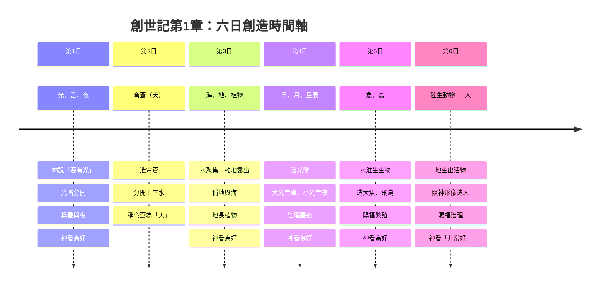
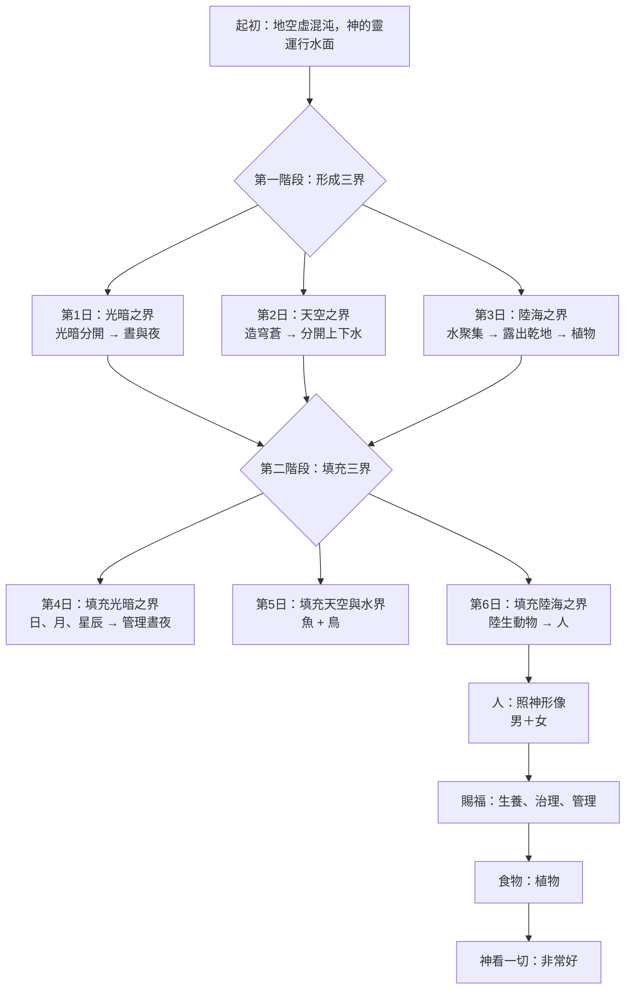
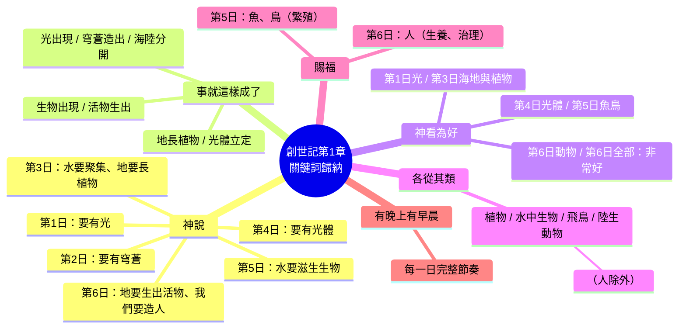
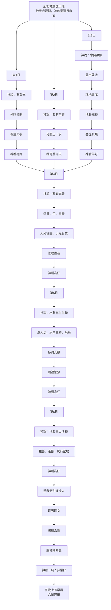
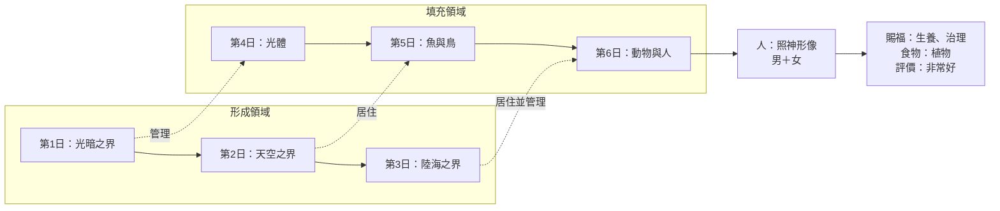

# 《創世記》第1章 ── 六日創造整理

## 📖 經文背景

> 本章記述神在六日之內創造天地的過程，從「空虛混沌」到「非常好」，展現從混沌到秩序、從話語到成就的創造結構。

---

## 1️⃣ 時間軸表格法（最經典、最清晰）

**適合**：快速對照、記憶順序、分析創造模式。

| 日 | 創造內容 | 神的行動 | 創造類別 | 神的評價 | 經文 |
|---|---|---|---|---|---|
| 第1日 | 光、晝、夜 | 神說「要有光」；將光暗分開，稱光為晝、暗為夜 | 宇宙基本結構（時間、光暗） | 好 | 1:3-5 |
| 第2日 | 穹蒼（天） | 神說「眾水之間要有穹蒼」；造穹蒼，分開上下水，稱穹蒼為「天」 | 宇宙空間（天空） | （未明確寫「好」） | 1:6-8 |
| 第3日 | 海、地、植物 | 神說「天下水要聚集，露出乾地」；稱地為「地」、水為「海」；地長植物（各從其類） | 陸地、海洋、植物界 | 好（兩次） | 1:9-13 |
| 第4日 | 日、月、星辰 | 神說「天上要有光體分晝夜、作記號、定節令年日」；造大光小光及星辰 | 天體與時間管理 | 好 | 1:14-19 |
| 第5日 | 魚類、水中生物、飛鳥 | 神說「水要滋生生物」；造大魚、水中生物、飛鳥（各從其類）；賜福要繁殖增多 | 水中動物、空中動物 | 好 | 1:20-23 |
| 第6日 | 陸生動物、人（男和女） | 神說「地要生出活物（各從其類）」；「照我們形像造人」；造男造女；賜福生養治理；賜植物為食 | 地上動物、人類（神形像、管理權） | **非常好** | 1:24-31 |

### 📌 補充說明

- **重複模式**：`神說 → 事就這樣成了 → 神看為好 → 有晚上、有早晨`
- **「造」字的層次**：  
  - `bara`（創造）：用於第1日、大魚、人  
  - `asah`（造作）：用於穹蒼、光體、動物等
- **「各從其類」**：適用於植物、魚鳥、陸生動物，**人例外**（按神形像）
- **食物設定**：起初人與動物皆素食（1:29-30）
- **第七日安息**：不在本章，接續於創2:1-3

---

## 2️⃣ 三界模式法（神學／結構分析）

**適合**：理解創造次序的邏輯（天地海 → 生物 → 人的管理）。

### 第一階段：形成三界（第1–3日）

| 日子 | 形成的領域 | 神的行動 | 經文 |
|---|---|---|---|
| 第1日 | **時間／光暗之界** | 光暗分開，稱晝與夜 | 1:3-5 |
| 第2日 | **天空／上下水之界** | 造穹蒼，分開上下水 | 1:6-8 |
| 第3日 | **陸地與海洋之界** | 水聚集露出乾地，地生植物 | 1:9-13 |

> 這三日建立創造的「容器」或「領域」：光暗、天（空間）、地與海。

### 第二階段：填充三界（第4–6日）

| 日子 | 填充對象 | 對應之「界」 | 神的行動 | 經文 |
|---|---|---|---|---|
| 第4日 | 日、月、星辰 | 第1日（光暗之界） | 管理晝夜 | 1:14-19 |
| 第5日 | 魚類與飛鳥 | 第2日（天與水之界） | 居住水中與天空 | 1:20-23 |
| 第6日 | 陸生動物與人 | 第3日（地與海之界） | 居住並管理地 | 1:24-31 |

> - 第4日光體 **管理** 第1日晝夜  
> - 第5日魚鳥 **居住** 在第2日水與天空  
> - 第6日動物與人 **居住並管理** 第3日地與萬物

### 整體對照表

| 階段 | 日子 | 創造行動 | 類型 |
|---|---|---|---|
| 形成 | 1 | 光暗分開（時間） | 界／領域 |
| 形成 | 2 | 穹蒼分開上下水（天空） | 界／領域 |
| 形成 | 3 | 海與地分開，地生植物 | 界／領域 + 初級生物 |
| 填充 | 4 | 日、月、星辰 | 對應第1日 |
| 填充 | 5 | 魚與鳥 | 對應第2日 |
| 填充 | 6 | 陸生動物 → 人 | 對應第3日 |

### ✨ 神學重點

- **從混沌到秩序**：先分界，後賦予功能與居民
- **對稱創造**：第4–6日為第1–3日創造「統治者／居住者」
- **人的獨特性**：最後被造，作為「地的管理者」，按神形像，有男有女
- **評價遞增**：每日「好」→ 第六日「**非常好**」

---

## 3️⃣ 關鍵詞歸納法

**適合**：默想、講章預備、主題式研經。

### 📌 「神說」── 創造的權柄與話語

| 次數 | 內容 | 經文 |
|---|---|---|
| 1 | 要有光 | 1:3 |
| 2 | 要有穹蒼 | 1:6 |
| 3 | 水要聚集，乾地露出 | 1:9 |
| 4 | 地要長出植物 | 1:11 |
| 5 | 天上要有光體 | 1:14 |
| 6 | 水要滋生生物；要有飛鳥 | 1:20 |
| 7 | 地要生出活物 | 1:24 |
| 8 | 照我們形像造人 | 1:26 |
| 9 | 要生養眾多，治理這地 | 1:28 |
| 10 | 賜植物為食物 | 1:29 |

> 創造行動皆由「神說」啟動，顯明話語的創造性與權能。

### ✅ 「事就這樣成了」── 神的話必成就

出現於：光、穹蒼、海陸分開、植物、光體、生物、活物等。

> 除第一日直接「有了光」，其餘多處明寫「事就這樣成了」，強調神的話不落空。

### 👀 「神看為好的」── 創造的價值判斷

| 次數 | 事件 | 經文 |
|---|---|---|
| 1 | 光（第1日） | 1:4 |
| 2 | 海與地（第3日） | 1:10 |
| 3 | 植物（第3日） | 1:12 |
| 4 | 光體（第4日） | 1:18 |
| 5 | 魚與鳥（第5日） | 1:21 |
| 6 | 陸生動物（第6日） | 1:25 |
| 7 | **全部所造** → 「非常好」 | 1:31 |

> 前六次為「好」，最後一次為「**非常好**（טוֹב מְאֹד）」。第2日未寫「好」，可能因穹蒼尚未填充。

### 🌿 「各從其類」── 創造的秩序與分別

- **對象**：植物、水中生物、飛鳥、陸生動物
- **例外**：人 **不按**「各從其類」，而是按 **神的形像**

### 🙌 「賜福」── 神的恩賜與使命

| 次數 | 對象 | 賜福內容 |
|---|---|---|
| 1 | 魚、鳥 | 繁殖增多，充滿海與地 |
| 2 | 人 | 生養眾多、治理全地、管理生物 |

> 只有第五日生物與第六日人直接領受賜福。人的賜福包含 **生養** 與 **治理／管理**。

### 🌙 「有晚上，有早晨」── 創造的節奏

每晚早晨為一日的完整結構，以「晚上」開始（猶太曆法），指向第七日安息的預備。

### 📖 其他重要關鍵詞

| 關鍵詞 | 次數／重點 | 意義 |
|---|---|---|
| `bara`（創造） | 3次：天、大魚、人 | 專指神從無到有的創造 |
| `asah`（造作） | 多次 | 一般性「製造」 |
| 形像／樣式 | 人 | 人與神的特殊關係 |
| 管理 | 人 | 受託權柄 |
| 食物 | 人：植物；動物：綠色植物 | 起初的素食設定 |

### 🧠 歸納總結（一句話）

> 神藉 **話語** 創造，一切 **成就** 且 **有序**（各從其類），神 **看為好** 並 **賜福** 生物與人類，最終以 **非常完好** 完成六日創造，形成 **晚上到早晨** 的創造節奏。

---

## 4️⃣ 視覺化地圖法（Mermaid 圖表）

**適合**：教學、講道、兒童主日學、簡報展示。

> 以下 Mermaid 程式碼可複製到支援 Mermaid 的編輯器（GitHub、Obsidian、Notion 等）中渲染為圖表。

### 📅 時間軸表格法（Mermaid：時序圖）

### 🔄 三界模式法（Mermaid：流程圖）

### 🧠 關鍵詞歸納法（Mermaid：腦圖）

### 🌳 視覺化地圖法（Mermaid：樹狀圖）

### 🔁 對應式視覺地圖（Mermaid：對比圖）

### 📋 使用說明

| 圖類型 | Mermaid 類型 | 適合用途 |
|---|---|---|
| 時間軸表格法 | `timeline` | 展示每日順序與內容 |
| 三界模式法 | `flowchart TD` | 展示形成→填充的神學結構 |
| 關鍵詞歸納法 | `mindmap` | 歸納重複主題詞 |
| 視覺化地圖法 | `flowchart TB` | 完整樹狀圖，教學/海報 |
| 對應式視覺地圖 | `flowchart LR` | 顯示第1-3日與第4-6日對應 |

---

## 5️⃣ 對比／比較整理法

**適合**：跨文本比較（創2、詩104、約1、古代近東神話等）。

### 📖 內部對比：創1 vs 創2

| 比較維度 | 創世記第1章 | 創世記第2章 |
|---|---|---|
| 創造順序 | 光 → 天 → 海/地 → 植物 → 光體 → 魚/鳥 → 動物 → 人（最後） | 人 → 植物 → 動物 → 女人（最後） |
| 創造方法 | 藉話語（「神說」） | 藉行動（塵土、肋骨、吹氣） |
| 人的材料 | 照「神的形像」 | 塵土 + 生命之氣 |
| 人的性別 | 同時造男造女 | 先亞當後夏娃 |
| 命名權 | 神命名 | 人命名 |
| 食物設定 | 素食 | 園中果子（包括分別善惡樹） |
| 管理範圍 | 治理全地、管理一切 | 修理看守伊甸園 |
| 神的名稱 | Elohim（超越性） | Yahweh Elohim（關係性） |

### 🌍 外部比較：創1 vs 古代近東神話

| 比較維度 | 創世記第1章 | 巴比倫《埃努瑪·埃利什》 | 埃及創世神話 |
|---|---|---|---|
| 原始狀態 | 空虛混沌，神的靈運行 | 淡水與鹹水混合 | 混沌之水努恩 |
| 創造方式 | 神藉話語，不用戰鬥 | 眾神爭戰，殺提亞瑪特造天地 | 神藉思想／話語／自我生殖 |
| 多神 vs 一神 | 獨一真神 | 多神 | 多神 |
| 人的目的 | 照神形像，管理萬物 | 作神明的奴僕 | 服務神祇 |
| 安息 | 有（第七日） | 無 | 無 |

### 🔍 創1內部對比結構

| 對比類型 | 項目 A | 項目 B |
|---|---|---|
| 時間對稱 | 第1-3日（形成） | 第4-6日（填充） |
| 光暗對比 | 晝 | 夜 |
| 水上下對比 | 穹蒼以上水 | 穹蒼以下水 |
| 海陸對比 | 海 | 地 |
| 大光 vs 小光 | 太陽（管晝） | 月亮（管夜） |
| 祝福對象 | 魚、鳥 | 人 |
| 食物來源 | 人：植物 | 動物：綠色植物 |
| 形像 vs 種類 | 人（神形像） | 生物（各從其類） |

### ✍️ 語言對比：三個「造」字

| 希伯來文 | 意義 | 出現（創1） |
|---|---|---|
| בָּרָא (bara) | 從無到有創造 | 天、大魚、人 |
| עָשָׂה (asah) | 製造、做成 | 穹蒼、光體、動物等 |
| יָצַר (yatsar) | 塑造、捏成 | （創2才出現） |

### 📈 評價對比：好 → 非常好

| 日子 | 評價 | 備註 |
|---|---|---|
| 第1日 | 好 | 光 |
| 第2日 | （未寫） | 穹蒼 |
| 第3日 | 好（兩次） | 海/地、植物 |
| 第4日 | 好 | 光體 |
| 第5日 | 好 | 魚、鳥 |
| 第6日（動物） | 好 | 陸生動物 |
| 第6日（全部） | **非常好** | 包括人 |

### 🍽️ 食物對比：起初 vs 洪水後

| 時期 | 人的食物 | 動物的食物 |
|---|---|---|
| 創1（起初） | 植物、菜蔬、果子 | 綠色植物 |
| 創9:3（洪水後） | 動物也可作食物 | （未明確改變） |

> 起初為和平、非暴力的創造秩序；洪水後人獲准吃肉。

### 📊 總結表

| 比較類別 | 主題 A | 主題 B |
|---|---|---|
| 同卷比較 | 創1（超越秩序） | 創2（親密關係） |
| 跨文化比較 | 創1（一神、話語、無爭戰） | 古代神話（多神、爭戰、人造為奴） |
| 內部結構 | 第1-3日（形成） | 第4-6日（填充） |
| 創造動詞 | bara（從無到有） | asah（製造） |
| 評價 | 好 | 非常好 |
| 食物 | 起初（素食） | 洪水後（葷食允許） |
| 人類 vs 動物 | 照神形像 | 各從其類 |

---

## ✅ 總結

《創世記》第1章以高度對稱、重複而有序的文學結構，展現了：

- 神藉**話語**創造的權能
- 從**混沌**到**秩序**、從**簡單**到**複雜**的創造進程
- 人作為**神的形像**，被賦予**管理**與**生養**的祝福
- 創造的逐步完成，最終被評價為「**非常好**」

這些不同的整理方法，可依使用場景（研經、教學、講道、比較、默想）靈活選用。

---

如果需要我再幫你輸出為 `.md` 檔案、轉換為 PDF 格式、或針對特定平台（如 GitHub、Notion、Obsidian）進一步調整語法，請告訴我。
