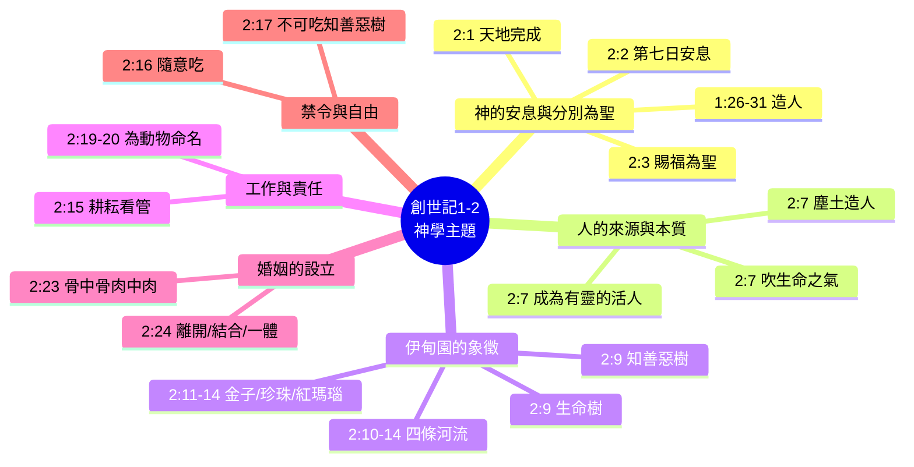
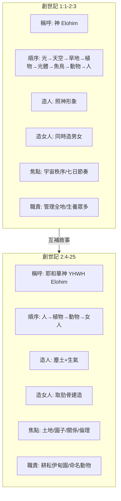
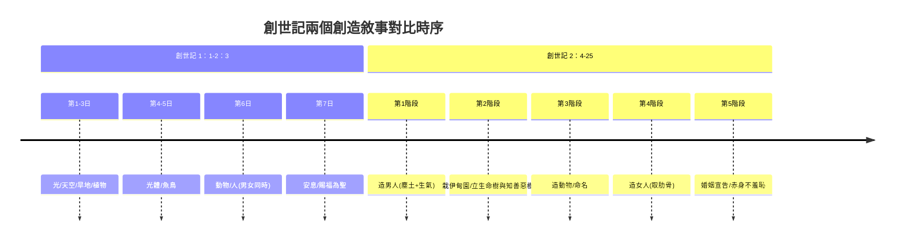

# 創世記 1:1–2:25 嚴謹經文對比分析報告（Mermaid 強化版）

本文件採用四種方法分析經文，並**逐項對照經文原文**，不確定之處明確標示「（不詳）」。同時使用 Mermaid 圖表增強視化對比。

**經文範圍**：創世記 1:1 – 2:25（和合本修訂版）

---

## 方法一：結構分段分析（附經文對比與 Mermaid 流程圖）

| 段落 | 主題 | 經節 | 對應經文關鍵內容 |
| --- | --- | --- | --- |
| 1 | 七日創造總綱 | 1:1–2:3 | 神創造天地 → 七日流程 → 第七日安息、賜福、分別為聖 |
| 2 | 天地與人類受造的更細描述 | 2:4–9 | 草木未生 → 霧氣滋潤 → 塵土造人、吹氣 → 栽伊甸園、置人、立兩樹 |
| 3 | 伊甸園的四條河與環境 | 2:10–14 | 一河分四：比遜（環哈腓拉，有金、珍珠、紅瑪瑙）、基訓（環古實）、底格里斯（亞述東）、幼發拉底 |
| 4 | 人的職責與禁令 | 2:15–17 | 耕耘看管 → 吩咐：隨意吃，惟知善惡樹不可吃，吃必死 |
| 5 | 造動物與為人造配偶 | 2:18–25 | 造動物 → 命名 → 沉睡 → 取肋骨造女人 → 婚姻宣告 → 赤身不羞恥 |

**分析結論**：分段完全依據經文明確敘事轉折點，無添加推測。

---

## 方法二：神學主題分析（附 Mermaid 心智圖）

| 主題 | 經節 | 經文對比與說明 |
| --- | --- | --- |
| 神的安息與分別為聖 | 1:26–2:3 | 1:26–31 造人 → 2:1 天地完成 → 2:2 第七日安息 → 2:3 賜福第七日為聖 |
| 人的來源與本質 | 2:7 | 「耶和華神用地上的塵土造人，將生命之氣吹進他的鼻孔，這人就成了有靈的活人」 |
| 伊甸園的象徵 | 2:9–14 | 2:9 生命樹、知善惡樹；2:11–14 金子、珍珠、紅瑪瑙、四河 |
| 工作與責任 | 2:15, 19–20 | 2:15 耕耘看管；2:19–20 為動物命名 |
| 婚姻的設立 | 2:23–24 | 2:23 骨中骨、肉中肉 → 2:24 離開父母、結合、一體 |
| 禁令與自由 | 2:16–17 | 2:16 隨意吃 → 2:17 不可吃知善惡樹，吃必死 |

---

## 方法三：嚴謹對比分析（創1:1–2:3 vs 創2:4–25）

| 比較項目 | 創世記 1:1–2:3（經文對比） | 創世記 2:4–25（經文對比） |
| --- | --- | --- |
| 稱呼神 | 神（Elohim）——1:1 起 | 耶和華神（YHWH Elohim）——2:4 起 |
| 創造順序 | 光(1:3) → 天空(1:6) → 旱地(1:9) → 植物(1:11) → 光體(1:14) → 魚鳥(1:20) → 動物(1:24) → 人(1:26, 男與女同時) | 人(2:7) → 植物(2:9) → 動物(2:19) → 女人(2:22) |
| 造人方式 | 「我們要照著我們的形象造人」(1:26) | 塵土造人，吹生命之氣(2:7) |
| 造女人方式 | 同時造男造女(1:27) | 從男人肋骨建造(2:22) |
| 焦點 | 宇宙秩序、七日節奏（1:5,8,13,19,23,31–2:3） | 土地、園子、關係、倫理（2:5–25） |
| 關鍵動詞 | 說(1:3,6,9,11,14,20,24,26)、造(1:7,16,21,25,27)、賜福(1:22,28,2:3) | 造(2:7,19)、吹(2:7)、安置(2:8,15)、吩咐(2:16)、取(2:21,22)、建(2:22) |
| 人的職責 | 管理全地、生養眾多(1:28) | 耕耘看管伊甸園(2:15)、命名動物(2:19–20) |
| 倫理命令 | 未提及分別善惡樹 | 不可吃知善惡樹(2:17) |
| 水源描述 | 未提及 | 四河詳細描述(2:10–14) |

**分析結論**：兩段經文在詞彙、順序、焦點上明顯不同，但無直接矛盾，屬互補敘事。

---

## 方法四：事件分析表（嚴謹經文對比版）

| 經節 | 人物（經文明確） | 動作（經文逐字） | 地點（經文提及） | 神的話語（逐字或大意） | 結果（經文描述） |
| --- | --- | --- | --- | --- | --- |
| 1:1–2:3 | 神 | 創造、安息 | 天地 | 「要有光」等（1:3,6,9,11,14,20,24,26） | 萬物完成，神賜福第七日為聖 |
| 2:5–6 | 耶和華神 | 尚未降雨、霧氣上騰 | 地上 | （無） | 土地滋潤 |
| 2:7 | 耶和華神 | 造人、吹氣 | 地上 | （無） | 人成有靈的活人 |
| 2:8–9 | 耶和華神 | 栽園、安置、使樹生長 | 東方伊甸園 | （無） | 人住園中，有生命樹和知善惡樹 |
| 2:10–14 | （不詳——未指明人物） | 河流滋潤、分出四條 | 伊甸園 | （無） | 形成比遜、基訓、底格里斯、幼發拉底 |
| 2:15 | 耶和華神、那人 | 安置、耕耘、看管 | 伊甸園 | （無） | 人管理園子 |
| 2:16–17 | 耶和華神、那人 | 吩咐、領受 | 伊甸園 | 「園中各樣樹上的果子你可以隨意吃，只是知善惡樹上的果子你不可吃，因為你吃的日子必定死」 | 人擁有自由與界限 |
| 2:18 | 耶和華神 | 說話、定意 | （不詳——未指明地點） | 「那人單獨一個不好，我要為他造一個配偶幫助他」 | 決定造女人 |
| 2:19–20 | 耶和華神、那人 | 造動物、帶到人前、命名 | 伊甸園 | 神帶動物到人面前（動作，非話語） | 人給動物命名，未找到配偶 |
| 2:21–22 | 耶和華神、那人 | 使人沉睡、取肋骨、造女人 | 伊甸園 | （無） | 女人被造，帶到男人面前 |
| 2:23 | 那人 | 說話 | 伊甸園 | 「這是我骨中的骨，肉中的肉，可以稱她為女人，因為她是從男人身上取出來的」 | 男人承認女人與自己同質 |
| 2:24 | 敘述者 | 說明婚姻原則 | （不詳——未限定地點） | （無——敘述者評論） | 人要離開父母，與妻子聯合，成為一體 |
| 2:25 | 亞當、女人 | 赤身露體 | 伊甸園 | （無） | 並不羞恥 |

---

## 方法五：創造敘事對比時序圖（Mermaid）

---

## 總結（加強經文對比版）

- **方法一**：分段嚴格依經文轉折，搭配 Mermaid 流程圖呈現結構層次
- **方法二**：每一主題都能在經文中找到逐字對應，以心智圖整合神學架構
- **方法三**：對比表全部引用經文具體節數，並以流程圖視覺化兩段敘事差異
- **方法四**：不確定的欄位（如 2:10–14 人物、2:18 地點、2:24 地點）明確標示 **（不詳）**
- **方法五（新增）**：時序圖對比兩個創造敘事的順序差異
- **整體原則**：所有結論皆可還原至經文，不添加後設解釋；Mermaid 圖表僅作為視覺輔助，不改變經文對比的嚴謹性
