# 創世記第3章 ─ 整理筆記（嚴謹經文對比版）

## 0. 角色與對話索引

### 角色列表

| 角色 | 說明 | 經文節數 |
|------|------|----------|
| **🐍 蛇** | 耶和華神所造的田野走獸，比一切更狡猾 | 1, 4–5, 14–15 |
| **👩 女人（夏娃）** | 亞當的妻子，首先被引誘吃果子 | 1–6, 13, 16 |
| **👨 男人（亞當）** | 女人的丈夫，聽從妻子也吃了果子 | 6–12, 17–21 |
| **👑 耶和華神** | 創造主，在園中行走、審問、宣判、施行恩典與懲罰 | 1, 8–19, 21–24 |
| **🌟 女人的後裔** | 預言中將要傷蛇的頭（最終指向耶穌基督） | 15 |
| **🐍 蛇的後裔** | 與女人後裔為仇的一方 | 15 |
| **🔥 基路伯／火焰劍** | 安設在伊甸園東邊，把守生命樹的道路 | 24 |

> 默認角色（未直接說話但出現）：生命樹、分別善惡樹。

---

### 對話記錄（經文逐字對照版）

#### 第一段對話：蛇與女人（1-5）

| 說話者 | 經文原文 | 節數 |
|--------|----------|------|
| 🐍 蛇 | 「神豈是真說，你們不可吃園中任何樹上所出的嗎？」 | 1 |
| 👩 女人 | 「園中樹上的果子，我們都可以吃；只是園子中間那棵樹的果子，神曾說：『你們不可吃，也不可摸，免得你們死。』」 | 2–3 |
| 🐍 蛇 | 「你們不一定死；因為神知道，你們吃的日子眼睛就開了，你們就像神一樣知道善惡。」 | 4–5 |

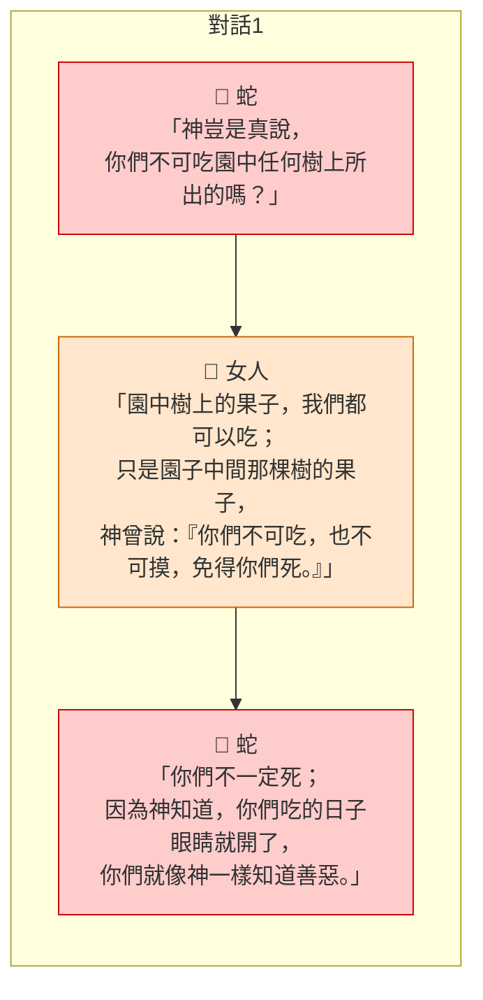

---

#### 第二段對話：神與亞當（9-12）

| 說話者 | 經文原文 | 節數 |
|--------|----------|------|
| 👑 耶和華神 | 「你在哪裏？」 | 9 |
| 👨 亞當 | 「我在園中聽見你的聲音，我就害怕；因為我赤身露體，我就藏了起來。」 | 10 |
| 👑 耶和華神 | 「誰告訴你，你是赤身露體呢？莫非你吃了那樹上所出的，就是我吩咐你不可吃的嗎？」 | 11 |
| 👨 亞當 | 「你賜給我、與我一起的女人，是她把那樹上所出的給我，我就吃了。」 | 12 |

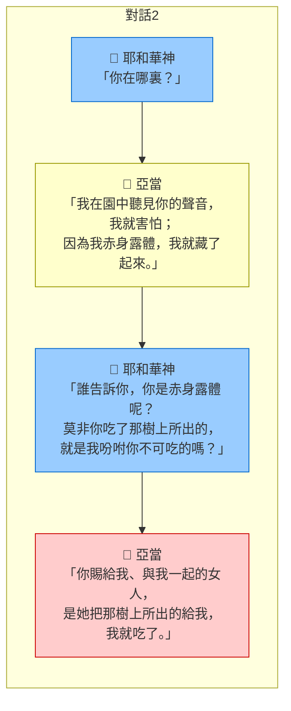

---

#### 第三段對話：神與女人（13）

| 說話者 | 經文原文 | 節數 |
|--------|----------|------|
| 👑 耶和華神 | 「你怎麼會做這種事呢？」 | 13 |
| 👩 女人 | 「那蛇引誘我，我就吃了。」 | 13 |

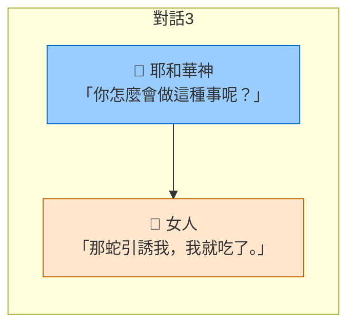

---

#### 第四段：神對蛇的宣判（14-15）

| 說話者 | 經文原文 | 節數 |
|--------|----------|------|
| 👑 耶和華神 | 「你既做了這事，就必受詛咒，比一切的牲畜和野獸更重。你必用肚子行走，終生吃土。我要使你和女人彼此為仇，你的後裔和女人的後裔也彼此為仇。他要傷你的頭，你要傷他的腳跟。」 | 14–15 |

---

#### 第五段：神對女人的宣判（16）

| 說話者 | 經文原文 | 節數 |
|--------|----------|------|
| 👑 耶和華神 | 「我必多多加增你懷胎的痛苦，你生兒女時必多受痛苦。你必戀慕你丈夫，他必管轄你。」 | 16 |

---

#### 第六段：神對亞當的宣判（17-19）

| 說話者 | 經文原文 | 節數 |
|--------|----------|------|
| 👑 耶和華神 | 「你既聽從你妻子的話，吃了那樹上所出的，就是我吩咐你不可吃的，土地必因你的緣故受詛咒；你必終生勞苦才能從土地得吃的。土地必給你長出荊棘和蒺藜來；你也要吃田間的五穀菜蔬。你必汗流滿面才有食物可吃，直到你歸了土地，因為你是從土地而出的。你本是塵土，仍要歸回塵土。」 | 17–19 |

---

#### 第七段：神的內部說話（22）

| 說話者 | 經文原文 | 節數 |
|--------|----------|------|
| 👑 耶和華神 | 「看哪，那人已經像我們中間的一個，知道善惡，現在恐怕他又伸手摘生命樹所出的來吃，就永遠活著。」 | 22 |

> ⚠️ **註**：「我們」指涉對象經文未明確說明。可能的解釋包括：神格內部對話（三位一體）、神與天使、或尊嚴複數。此處標示為 **（不詳）**。

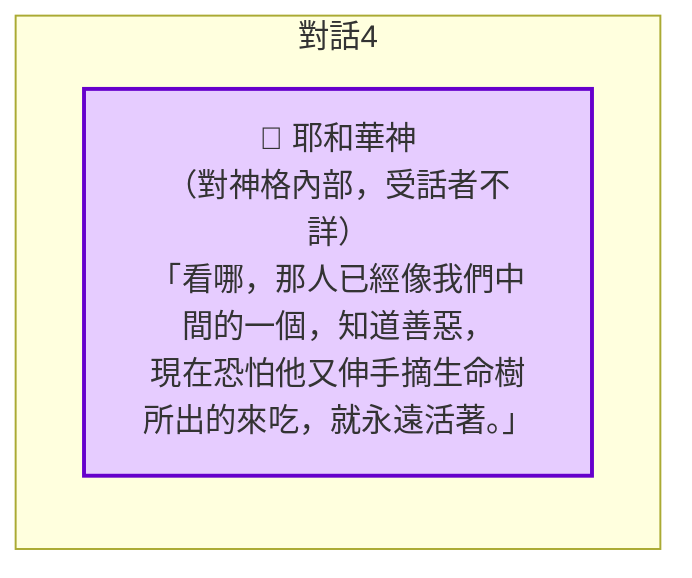

---

#### 第八段：神對亞當的驅逐命令（22-24）- 行動記錄，非對話

> 此段為敘事，非直接引語。神的說話記錄於第七段（22節），23-24節為執行行動。

| 經文 | 內容 | 類型 |
|------|------|------|
| 23 | 「耶和華神就驅逐他出伊甸園，使他耕種土地，他原是從土地裏被取出來的。」 | 敘事（非對話） |
| 24 | 「耶和華神把那人趕出去，就在伊甸園東邊安設基路伯和發出火焰轉動的劍，把守生命樹的道路。」 | 敘事（非對話） |

---

### 對話結構總圖

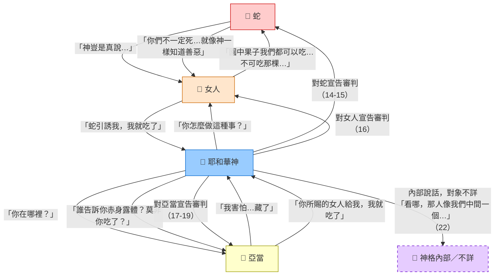

---

## 1. 結構分析圖（敘事流程）

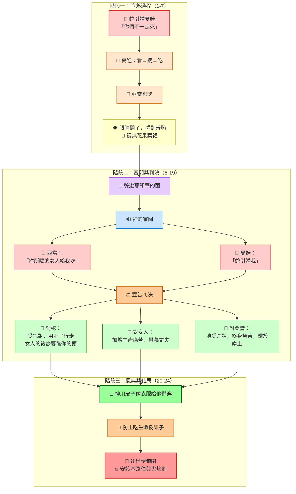

---

## 2. 問題應答樹（互動式問答）

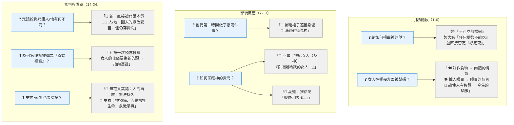

---

## 3. 主題歸納（心智圖）

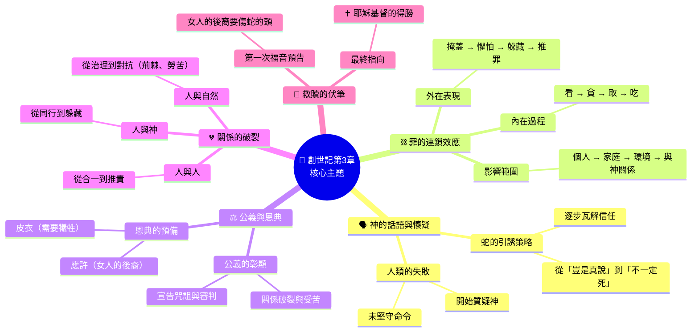

---

## 4. 時序線圖（事件脈絡）

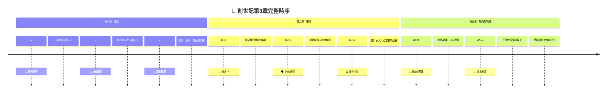

---

## 5. 關鍵詞串聯 + 應用建議（整合圖）

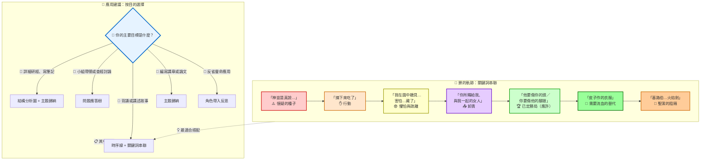

> **🎨 圖示說明**  
> | 顏色 | 代表意義 | 對應階段 |
> |------|----------|----------|
> | 🔴 紅色系 | 罪的開端與引誘 | 1-5節 |
> | 🟡 黃色系 | 罪的行動與即時反應 | 6-7節 |
> | 🟣 紫色系 | 懼怕與卸責 | 8-13節 |
> | 🟢 綠色系 | 審判中的應許與恩典 | 14-21節 |
> | 🟠 橘色系 | 最終的隔離 | 22-24節 |

---

## 📌 角色帶入反思（生命應用）

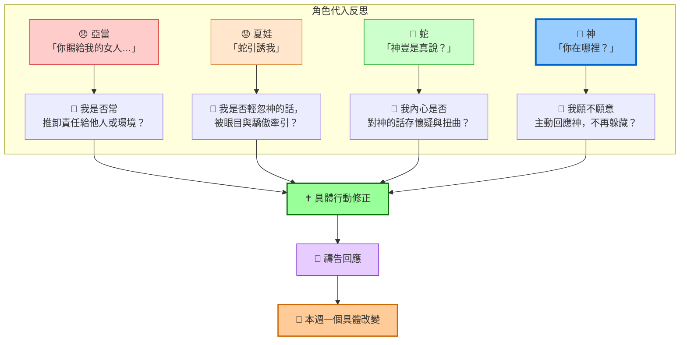
