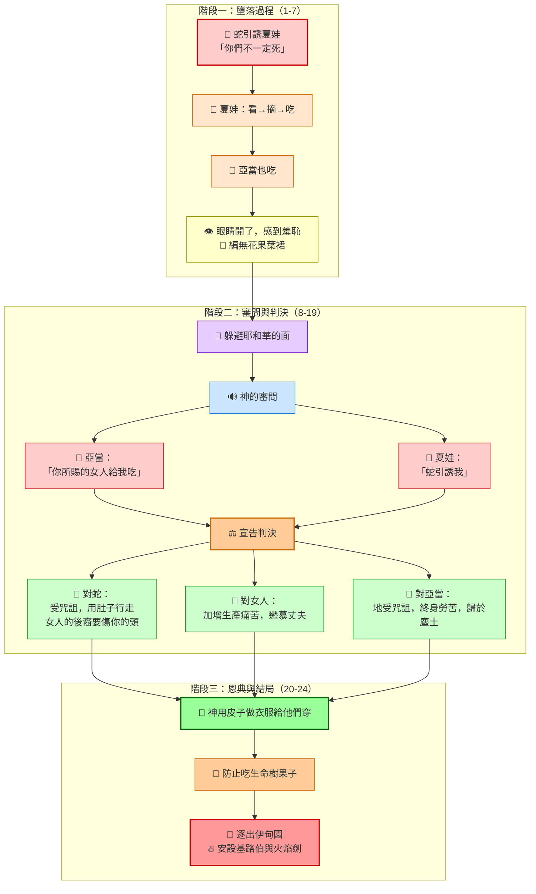
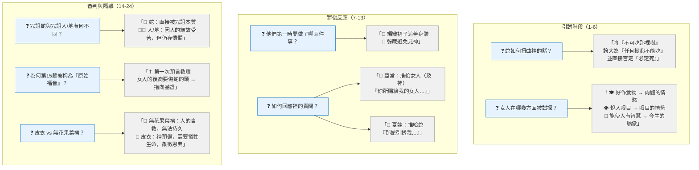
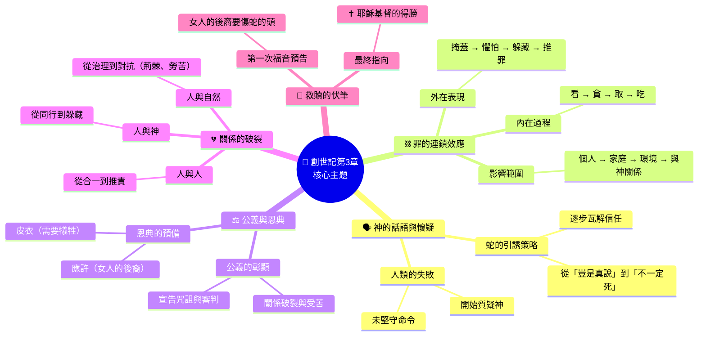
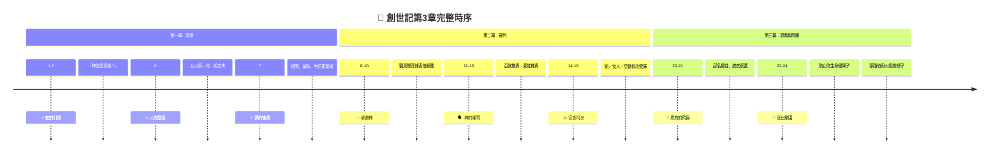
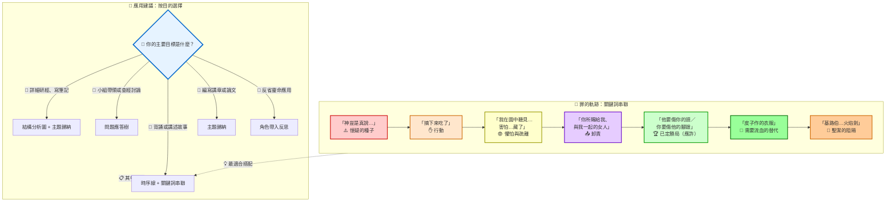
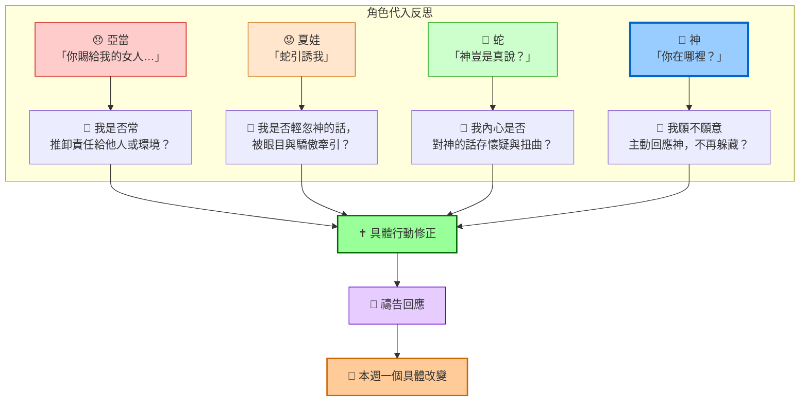

# 創世記第3章 ─ 整理筆記（Mermaid 全圖像化版）

## 1. 結構分析圖（敘事流程）

---

## 2. 問題應答樹（互動式問答）

---

## 3. 主題歸納（心智圖）

---

## 4. 時序線圖（事件脈絡）

---

## 5. 關鍵詞串聯 + 應用建議（整合圖）

> **🎨 圖示說明**  
> | 顏色 | 代表意義 | 對應階段 |
> |------|----------|----------|
> | 🔴 紅色系 | 罪的開端與引誘 | 1-5節 |
> | 🟡 黃色系 | 罪的行動與即時反應 | 6-7節 |
> | 🟣 紫色系 | 懼怕與卸責 | 8-13節 |
> | 🟢 綠色系 | 審判中的應許與恩典 | 14-21節 |
> | 🟠 橘色系 | 最終的隔離 | 22-24節 |

---

## 📌 角色帶入反思（生命應用）

