# 創世記第3章 ─ 整理筆記（嚴謹經文對比版）

## 0. 角色與對話索引

### 角色列表（附經文出處）

| 角色 | 說明 | 經文節數 |
|------|------|----------|
| **🐍 蛇** | 耶和華神所造的田野走獸，比一切更狡猾 | 1a, 1c–5, 14–15 |
| **👩 女人（夏娃）** | 亞當的妻子，首先被引誘吃果子 | 1c–6, 13, 16 |
| **👨 男人（亞當）** | 女人的丈夫，聽從妻子也吃了果子 | 6b–12, 17–21 |
| **👑 耶和華神** | 創造主，在園中行走、審問、宣判、施行恩典與懲罰 | 1a, 8–19, 21–24 |
| **🌟 女人的後裔** | 預言中將要傷蛇的頭（最終指向耶穌基督） | 15b |
| **🐍 蛇的後裔** | 與女人後裔為仇的一方 | 15b |
| **🔥 基路伯／火焰劍** | 安設在伊甸園東邊，把守生命樹的道路 | 24 |

> **經文註**：1a「耶和華神所造的，惟有蛇比田野一切的走獸更狡猾」——此為敘事者描述，非角色說話。
> 
> 默認角色（未直接說話但出現）：生命樹（22–24）、分別善惡樹（3, 6）。

---

### 對話記錄（逐節經文對照版）

#### 第一段對話：蛇與女人（1b–5）

| 節數 | 說話者 | 經文原文 |
|------|--------|----------|
| 1b | 🐍 蛇 | 「神豈是真說，你們不可吃園中任何樹上所出的嗎？」 |
| 2–3 | 👩 女人 | 「園中樹上的果子，我們都可以吃；只是園子中間那棵樹的果子，神曾說：『你們不可吃，也不可摸，免得你們死。』」 |
| 4–5 | 🐍 蛇 | 「你們不一定死；因為神知道，你們吃的日子眼睛就開了，你們就像神一樣知道善惡。」 |

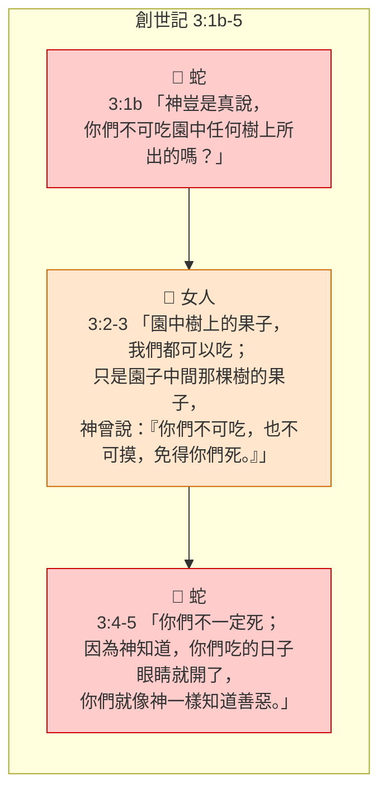

---

#### 第二段對話：神與亞當（9–12）

| 節數 | 說話者 | 經文原文 |
|------|--------|----------|
| 9 | 👑 耶和華神 | 「你在哪裏？」 |
| 10 | 👨 亞當 | 「我在園中聽見你的聲音，我就害怕；因為我赤身露體，我就藏了起來。」 |
| 11 | 👑 耶和華神 | 「誰告訴你，你是赤身露體呢？莫非你吃了那樹上所出的，就是我吩咐你不可吃的嗎？」 |
| 12 | 👨 亞當 | 「你賜給我、與我一起的女人，是她把那樹上所出的給我，我就吃了。」 |

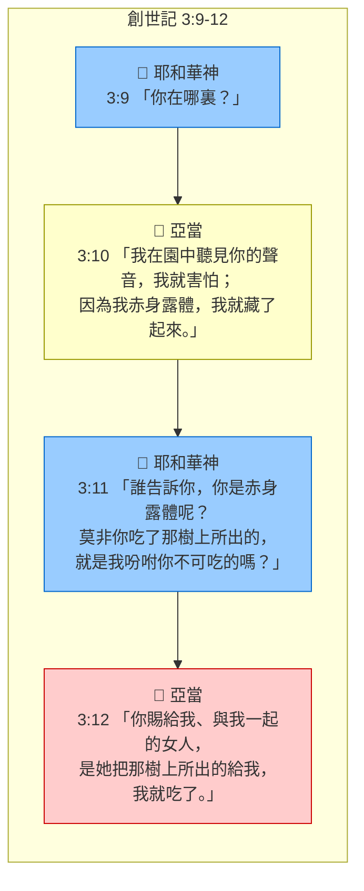

---

#### 第三段對話：神與女人（13）

| 節數 | 說話者 | 經文原文 |
|------|--------|----------|
| 13a | 👑 耶和華神 | 「你怎麼會做這種事呢？」 |
| 13b | 👩 女人 | 「那蛇引誘我，我就吃了。」 |

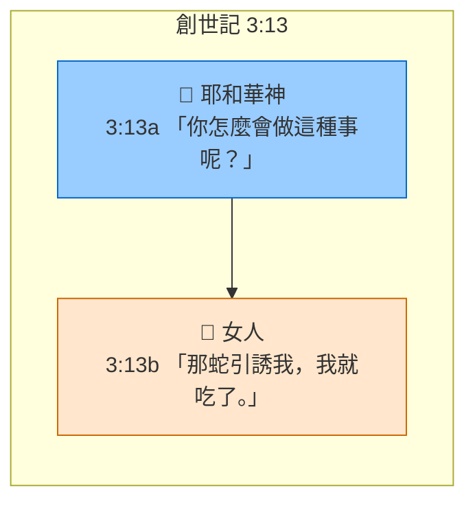

---

#### 第四段：神對蛇的宣判（14–15）

| 節數 | 說話者 | 經文原文 |
|------|--------|----------|
| 14–15 | 👑 耶和華神 | 「你既做了這事，就必受詛咒，比一切的牲畜和野獸更重。你必用肚子行走，終生吃土。我要使你和女人彼此為仇，你的後裔和女人的後裔也彼此為仇。他要傷你的頭，你要傷他的腳跟。」 |

---

#### 第五段：神對女人的宣判（16）

| 節數 | 說話者 | 經文原文 |
|------|--------|----------|
| 16 | 👑 耶和華神 | 「我必多多加增你懷胎的痛苦，你生兒女時必多受痛苦。你必戀慕你丈夫，他必管轄你。」 |

---

#### 第六段：神對亞當的宣判（17–19）

| 節數 | 說話者 | 經文原文 |
|------|--------|----------|
| 17–19 | 👑 耶和華神 | 「你既聽從你妻子的話，吃了那樹上所出的，就是我吩咐你不可吃的，土地必因你的緣故受詛咒；你必終生勞苦才能從土地得吃的。土地必給你長出荊棘和蒺藜來；你也要吃田間的五穀菜蔬。你必汗流滿面才有食物可吃，直到你歸了土地，因為你是從土地而出的。你本是塵土，仍要歸回塵土。」 |

---

#### 第七段：神的內部說話（22）

| 節數 | 說話者 | 經文原文 | 備註 |
|------|--------|----------|------|
| 22 | 👑 耶和華神 | 「看哪，那人已經像我們中間的一個，知道善惡，現在恐怕他又伸手摘生命樹所出的來吃，就永遠活著。」 | ⚠️ 「我們」指涉對象經文未明（不詳） |

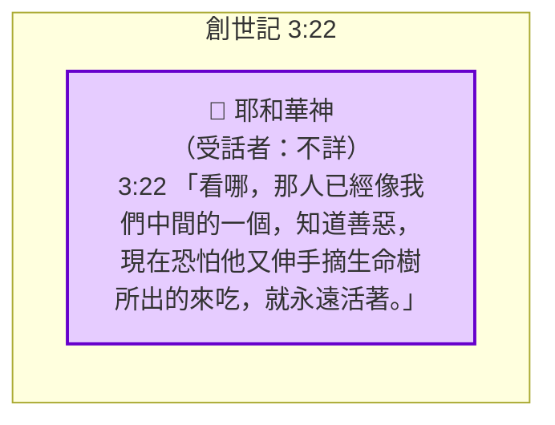

---

#### 第八段：神的行動（23–24）- 非對話，敘事記錄

| 節數 | 經文原文 | 類型 |
|------|----------|------|
| 23 | 「耶和華神就驅逐他出伊甸園，使他耕種土地，他原是從土地裏被取出來的。」 | 敘事（行動描述） |
| 24 | 「耶和華神把那人趕出去，就在伊甸園東邊安設基路伯和發出火焰轉動的劍，把守生命樹的道路。」 | 敘事（行動描述） |

---

### 對話結構總圖（附經文節數）

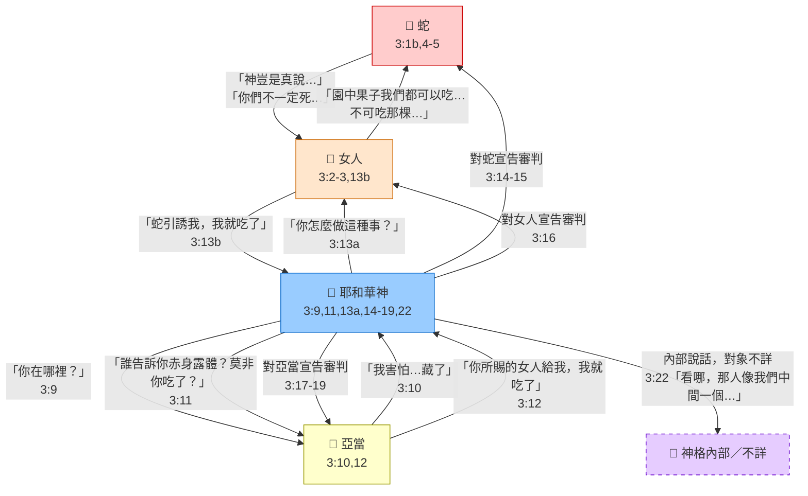

---

## 1. 結構分析圖（敘事流程，附經文範圍）

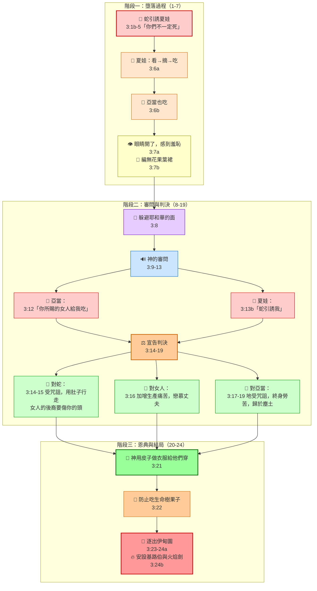

---

## 2. 問題應答樹（附經文依據）

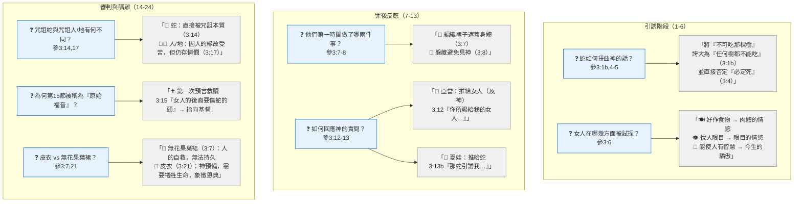

---

## 3. 主題歸納（心智圖，附經文索引）

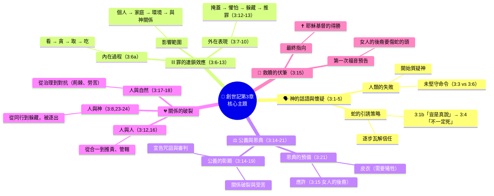

---

## 4. 時序線圖（事件脈絡，附經文）

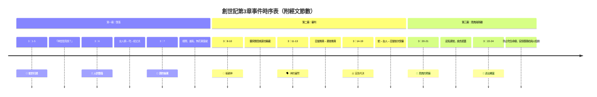

---

## 5. 關鍵詞串聯（附經文出處）

| 順序 | 關鍵詞／短語 | 意涵 | 經文 |
|------|--------------|------|------|
| 1 | 「神豈是真說…」 | 懷疑的種子 | 3:1b |
| 2 | 「摘下來吃了」 | 行動 | 3:6 |
| 3 | 「我在園中聽見…害怕…藏了」 | 罪後的懼怕與疏離 | 3:8,10 |
| 4 | 「你所賜給我、與我一起的女人」 | 卸責 | 3:12 |
| 5 | 「他要傷你的頭／你要傷他的腳跟」 | 已定勝局（應許） | 3:15 |
| 6 | 「皮子作的衣服」 | 需要流血的替代 | 3:21 |
| 7 | 「基路伯…火焰劍」 | 聖潔的阻隔 | 3:24 |

```mermaid
flowchart LR
    A["3:1b「神豈是真說…」<br>⚠️ 懷疑的種子"] 
    A --> B["3:6「摘下來吃了」<br>✋ 行動"]
    B --> C["3:8,10「我在園中聽見…害怕…藏了」<br>😨 懼怕與疏離"]
    C --> D["3:12「你所賜給我、與我一起的女人」<br>📤 卸責"]
    D --> E["3:15「他要傷你的頭／你要傷他的腳跟」<br>🏆 已定勝局（應許）"]
    E --> F["3:21「皮子作的衣服」<br>💝 需要流血的替代"]
    F --> G["3:24「基路伯…火焰劍」<br>🚫 聖潔的阻隔"]

    style A fill:#ffcccc,stroke:#cc0000,stroke-width:2px
    style B fill:#ffe6cc,stroke:#cc6600,stroke-width:2px
    style C fill:#ffffcc,stroke:#999900,stroke-width:2px
    style D fill:#e6ccff,stroke:#6600cc,stroke-width:2px
    style E fill:#ccffcc,stroke:#009900,stroke-width:2px
    style F fill:#99ff99,stroke:#006600,stroke-width:2px
    style G fill:#ffcc99,stroke:#cc6600,stroke-width:2px
```

---

## 6. 應用建議（按目的選擇）

| 你的目標 | 建議採用方法 | 對應圖表 |
|----------|--------------|----------|
| 📖 詳細研經、寫筆記 | 結構分析圖 + 主題歸納 | 第1節、第3節 |
| 👥 小組帶領或查經討論 | 問題應答樹 | 第2節 |
| 📢 背誦或講述故事 | 時序線 + 關鍵詞串聯 | 第4節、第5節 |
| 📝 編寫講章或論文 | 主題歸納 | 第3節 |
| 💭 反省靈命應用 | 角色帶入反思 | 下方 📌 |

---

## 📌 角色帶入反思（生命應用）

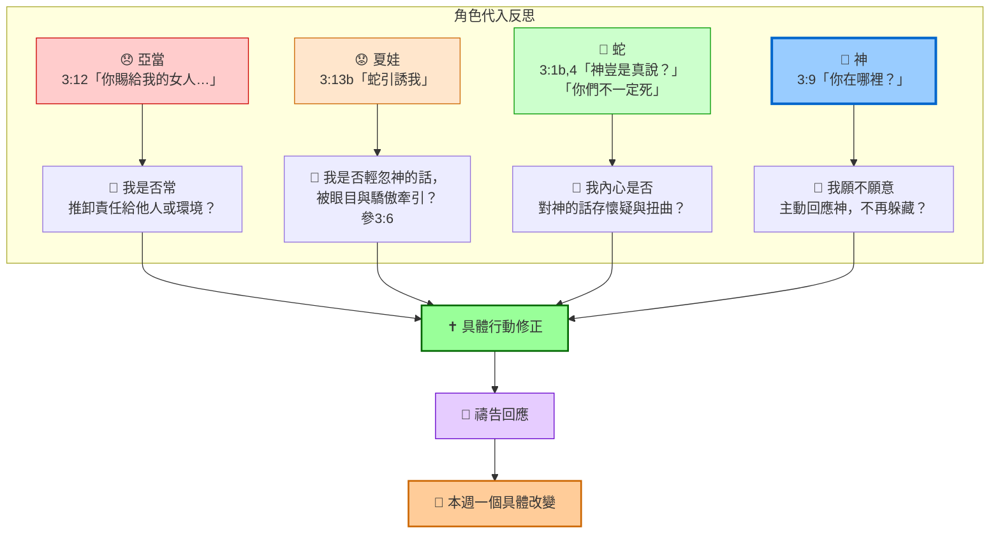

---

## 附錄：經文對照總表

| 節數 | 事件／對話概要 | 角色 |
|------|----------------|------|
| 1a | 敘事：蛇比一切走獸更狡猾 | 敘事者 |
| 1b | 蛇問女人：神豈是真說不可吃任何樹上的果子？ | 🐍 蛇 |
| 2–3 | 女人回答：園中果子都可吃，唯獨中間那棵不可吃也不可摸 | 👩 女人 |
| 4–5 | 蛇反駁：不一定死，吃了眼睛會開，如神知道善惡 | 🐍 蛇 |
| 6a | 女人見果子好作食物、悅目、可喜愛、有智慧，就摘下吃了 | 👩 女人 |
| 6b | 女人給丈夫，丈夫也吃了 | 👨 亞當 |
| 7 | 二人眼睛開了，知赤身露體，編無花果葉裙 | 👨👩 |
| 8 | 聽見神聲音，藏在園中樹木裡躲避 | 👨👩 |
| 9 | 神呼喚亞當：你在哪裡？ | 👑 神 |
| 10 | 亞當回答：聽見聲音害怕，因赤身露體而躲藏 | 👨 亞當 |
| 11 | 神問：誰告訴你赤身露體？莫非你吃了那樹的果子？ | 👑 神 |
| 12 | 亞當回答：你所賜的女人給我，我就吃了 | 👨 亞當 |
| 13a | 神問女人：你怎麼會做這種事？ | 👑 神 |
| 13b | 女人回答：蛇引誘我，我就吃了 | 👩 女人 |
| 14–15 | 神對蛇的判決：受咒詛、用肚子行走、與女人為仇、後裔彼此為仇、傷頭與腳跟 | 👑 神 |
| 16 | 神對女人的判決：加增生產痛苦、戀慕丈夫、被管轄 | 👑 神 |
| 17–19 | 神對亞當的判決：地受咒詛、終身勞苦、歸於塵土 | 👑 神 |
| 20 | 亞當給妻子起名夏娃（眾生之母） | 👨 亞當 |
| 21 | 神用獸皮做衣服給他們穿 | 👑 神 |
| 22 | 神內部說話：那人像我們中間一個，恐怕他吃生命樹果子永遠活著 | 👑 神 |
| 23 | 神驅逐亞當出伊甸園，耕種土地 | 敘事者 |
| 24 | 在伊甸園東邊安設基路伯與火焰劍，把守生命樹道路 | 敘事者 |
