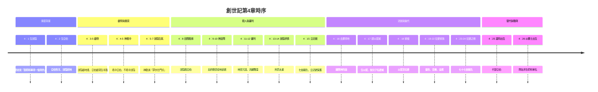
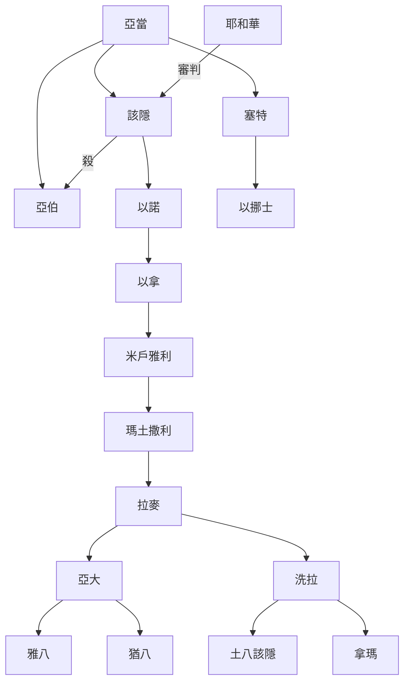
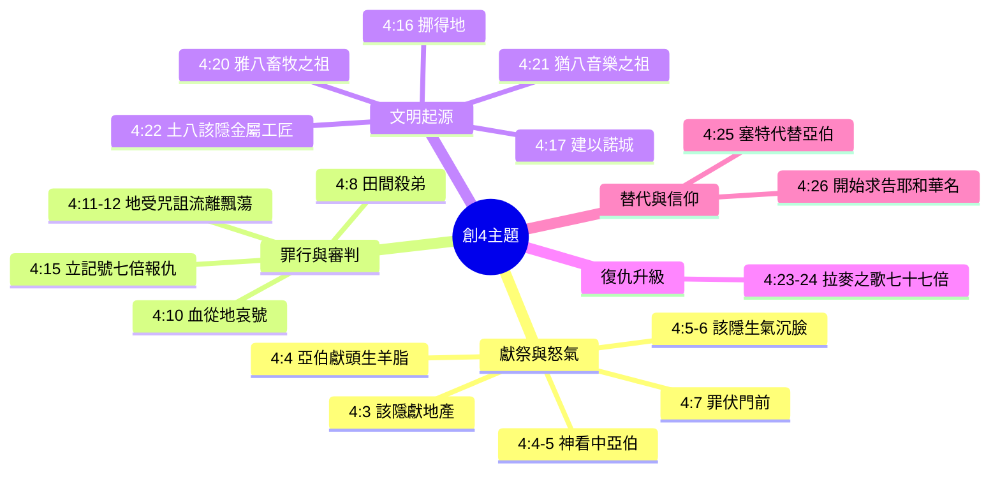
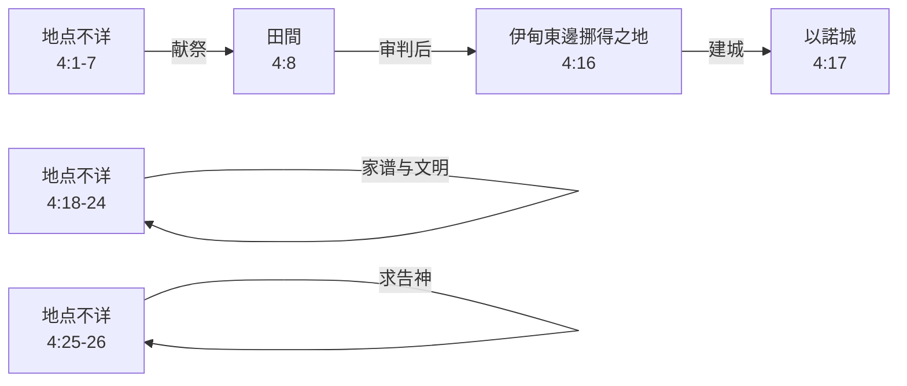

# 創世記第4章 多重方法整理報告（嚴謹經文對比版）

## 0. 經文與整理對照總表（逐節對應，不詳處標註）

| 經文 | 角色 | 地點 | 事件 | 主題歸屬 |
| :--- | :--- | :--- | :--- | :--- |
| 4:1 | 亞當、夏娃、該隱 | （不詳） | 該隱出生，夏娃說「靠耶和華得一個男的」 | 家庭背景 |
| 4:2 | 亞當、夏娃、亞伯 | （不詳） | 亞伯出生；亞伯牧羊，該隱耕地 | 家庭背景 |
| 4:3-5 | 該隱、亞伯、耶和華 | （不詳） | 該隱獻地產，亞伯獻頭生羊脂；神看中亞伯 | 獻祭與怒氣 |
| 4:6-7 | 耶和華、該隱 | （不詳） | 神勸誡：「罪就伏在門前」 | 獻祭與怒氣 |
| 4:8 | 該隱、亞伯 | 田間 | 該隱起來殺亞伯 | 罪行與審判 |
| 4:9 | 耶和華、該隱 | （不詳） | 神追問，該隱說「不知道」 | 罪行與審判 |
| 4:10-12 | 耶和華、該隱 | （不詳） | 血的哀號；地受咒詛；該隱流離飄蕩 | 罪行與審判 |
| 4:13-14 | 該隱、耶和華 | （不詳） | 該隱說懲罰太重，怕被殺 | 罪行與審判 |
| 4:15 | 耶和華、該隱 | （不詳） | 神說凡殺該隱的遭報七倍；立記號 | 罪行與審判 |
| 4:16 | 該隱 | 伊甸東邊挪得之地 | 離開耶和華的面，住在挪得之地 | 流放與後代 |
| 4:17 | 該隱、妻子、以諾 | 挪得之地 | 該隱與妻子同房，生以諾；建城，按兒子名稱為以諾 | 流放與後代 |
| 4:18 | 以諾、以拿、米戶雅利、瑪土撒利、拉麥 | （不詳） | 家譜：以諾生以拿，以拿生米戶雅利，米戶雅利生瑪土撒利，瑪土撒利生拉麥 | 流放與後代 |
| 4:19 | 拉麥、亞大、洗拉 | （不詳） | 拉麥娶兩個妻子：亞大、洗拉 | 文明起源 |
| 4:20 | 亞大、雅八 | （不詳） | 亞大生雅八；雅八是住帳棚、牧養牲畜之人的祖師 | 文明起源 |
| 4:21 | 猶八 | （不詳） | 雅八的兄弟猶八；他是彈琴吹簫之人的祖師 | 文明起源 |
| 4:22 | 洗拉、土八該隱、拿瑪 | （不詳） | 洗拉生土八該隱；他是打造銅鐵器具的工匠；土八該隱的妹妹是拿瑪 | 文明起源 |
| 4:23-24 | 拉麥、亞大、洗拉 | （不詳） | 拉麥對妻子說：殺我的遭報七十七倍 | 復仇升級 |
| 4:25 | 亞當、夏娃、塞特 | （不詳） | 亞當與妻子同房，生塞特，說「神立另一個子嗣代替亞伯」 | 替代與信仰 |
| 4:26 | 塞特、以挪士 | （不詳） | 塞特生以挪士；那時候人開始求告耶和華的名 | 替代與信仰 |

---

## 1. 敘事時序整理

| 經文 | 時間 | 地點 | 角色 | 事件 |
| :--- | :--- | :--- | :--- | :--- |
| 4:1-2 | （不詳） | （不詳） | 亞當、夏娃、該隱、亞伯 | 該隱與亞伯出生 |
| 4:3-7 | 過了一些日子 | （不詳） | 該隱、亞伯、耶和華 | 獻祭，神看中亞伯，勸誡該隱 |
| 4:8 | 獻祭後 | 田間 | 該隱、亞伯 | 該隱殺亞伯 |
| 4:9-15 | （不詳） | （不詳） | 該隱、耶和華 | 審判，該隱求情，立記號 |
| 4:16 | 審判後 | 伊甸東邊挪得之地 | 該隱 | 離開神的面，住挪得地 |
| 4:17 | （不詳） | 挪得之地 | 該隱、妻子、以諾 | 生以諾，建以諾城 |
| 4:18 | （不詳） | （不詳） | 以諾、以拿、米戶雅利、瑪土撒利、拉麥 | 家譜傳承 |
| 4:19-22 | （不詳） | （不詳） | 拉麥、亞大、洗拉等 | 文明始祖出現 |
| 4:23-24 | （不詳） | （不詳） | 拉麥、亞大、洗拉 | 拉麥之歌 |
| 4:25-26 | （不詳） | （不詳） | 亞當、夏娃、塞特、以挪士 | 塞特生以挪士，求告神 |

---

## 2. 角色關係整理

| 角色 | 經文 | 關係 / 特徵 | 事件 |
| :--- | :--- | :--- | :--- |
| 亞當 | 4:1,2,25 | 人類始祖 | 生該隱、亞伯、塞特 |
| 夏娃 | 4:1,2,25 | 人類始母 | 生該隱、亞伯、塞特 |
| 該隱 | 4:1-17 | 亞當長子，耕地 | 獻祭被拒，殺亞伯(4:8)，受審判，住挪得地，建以諾城(4:17) |
| 亞伯 | 4:2-8 | 亞當次子，牧羊 | 獻祭蒙悅納(4:4)，被該隱殺(4:8) |
| 耶和華 | 4:4-7,9-15 | 神 | 看中亞伯(4:4)，勸誡該隱(4:6-7)，審判該隱(4:10-12)，立記號(4:15) |
| 塞特 | 4:25-26 | 亞當第三子 | 代替亞伯(4:25)，生以挪士(4:26) |
| 以諾 | 4:17-18 | 該隱之子 | 該隱按他名建城(4:17) |
| 以拿 | 4:18 | 以諾之子 | 家譜中一員 |
| 米戶雅利 | 4:18 | 以拿之子 | 家譜中一員 |
| 瑪土撒利 | 4:18 | 米戶雅利之子 | 家譜中一員 |
| 拉麥 | 4:18-24 | 瑪土撒利之子 | 娶亞大、洗拉(4:19)，作拉麥之歌(4:23-24) |
| 亞大 | 4:19-20 | 拉麥妻子 | 生雅八、猶八 |
| 洗拉 | 4:19,22 | 拉麥妻子 | 生土八該隱、拿瑪 |
| 雅八 | 4:20 | 亞大之子 | 住帳棚、牧養牲畜之祖師 |
| 猶八 | 4:21 | 亞大之子 | 彈琴吹簫之祖師 |
| 土八該隱 | 4:22 | 洗拉之子 | 打造銅鐵器具的工匠 |
| 拿瑪 | 4:22 | 洗拉之女 | 土八該隱的妹妹 |
| 以挪士 | 4:26 | 塞特之子 | 那時候人開始求告耶和華名 |

---

## 3. 主題整理

| 主題 | 經文 | 核心事件 |
| :--- | :--- | :--- |
| 獻祭與怒氣 | 4:3-7 | 該隱與亞伯獻祭，神看中亞伯，勸誡該隱 |
| 罪行與審判 | 4:8-15 | 該隱殺亞伯，地咒詛，流放，立記號 |
| 文明起源 | 4:16-22 | 建城、畜牧、音樂、金屬 |
| 復仇升級 | 4:23-24 | 拉麥之歌：七倍→七十七倍 |
| 替代與信仰 | 4:25-26 | 塞特生以挪士，人開始求告耶和華名 |

---

## 4. 地理與空間整理

| 地點 | 經文 | 事件 | 角色 | 備註 |
| :--- | :--- | :--- | :--- | :--- |
| （不詳） | 4:1-7 | 出生、獻祭、勸誡 | 亞當、夏娃、該隱、亞伯、耶和華 | 經文未記載地點 |
| 田間 | 4:8 | 該隱殺亞伯 | 該隱、亞伯 | |
| （不詳） | 4:9-15 | 審判、立記號 | 該隱、耶和華 | 經文未記載地點 |
| 伊甸東邊挪得之地 | 4:16-17 | 該隱居住、建城 | 該隱、妻子、以諾 | |
| 以諾城 | 4:17 | 該隱所建的城 | 該隱 | 後代是否居住於此（不詳） |
| （不詳） | 4:18-24 | 家譜、文明發展、拉麥之歌 | 拉麥家族 | 經文未記載地點 |
| （不詳） | 4:25-26 | 塞特生以挪士、求告神 | 亞當、夏娃、塞特、以挪士 | 經文未記載地點 |

---

## 5. 結論

創世記第4章記錄了人類第一樁謀殺案，並展現了以下重點：

| 重點 | 經文 | 說明 |
| :--- | :--- | :--- |
| 獻祭與內心的關係 | 4:4-7 | 神看重人過於供物 |
| 罪的主動性 | 4:7 | 「罪就伏在門前」 |
| 神的公義與憐憫 | 4:10-15 | 審判＋記號保護 |
| 文明的起源 | 4:17-22 | 城鎮、畜牧、音樂、金屬 |
| 復仇的升級 | 4:23-24 | 七倍→七十七倍 |
| 信仰的替代與復興 | 4:25-26 | 人開始求告耶和華的名 |

**關於地點的說明**：經文明確記載的地點僅有「田間」（4:8）、「伊甸東邊挪得之地」（4:16）、「以諾城」（4:17）。其餘事件（出生、獻祭、審判、家譜、拉麥之歌、塞特家族）的地點，經文均未說明，故標註為「（不詳）」。
