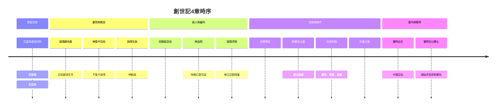
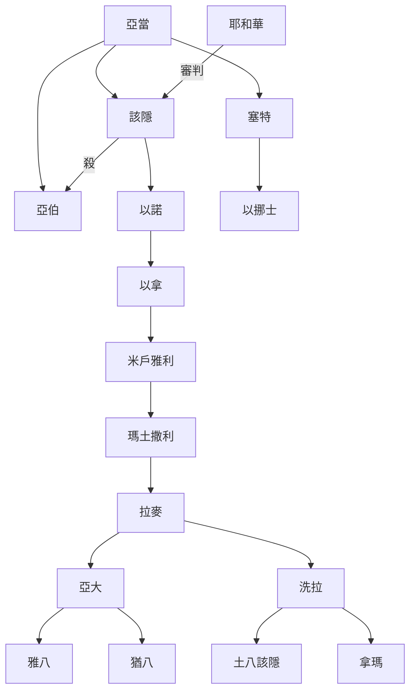
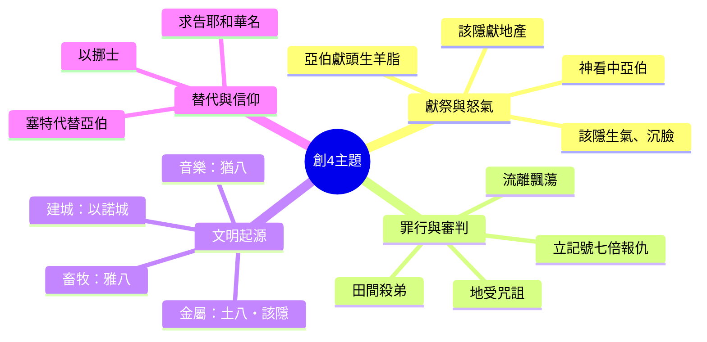
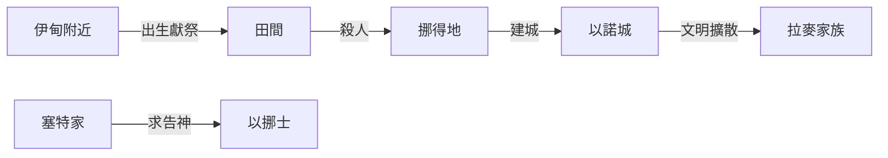

# 創世記第4章 多重方法整理報告

## 1. 敘事時序整理

| 時間 | 地點 | 角色 | 事件 |
|------|------|------|------|
| 最早 | 伊甸附近 | 亞當、夏娃、該隱、亞伯 | 該隱與亞伯出生 |
| 過了些日子 | 獻祭處 | 該隱、亞伯、耶和華 | 獻祭，神看中亞伯 |
| 獻祭後 | 田間 | 該隱、亞伯 | 該隱殺亞伯 |
| 審判時 | 神面前 | 該隱、耶和華 | 審判，立記號 |
| 流放後 | 挪得地 | 該隱、妻子 | 生以諾，建城 |
| 數代後 | 拉麥家 | 拉麥、亞大、洗拉 | 文明始祖出現 |
| 亞伯死後 | 亞當家 | 亞當、夏娃、塞特 | 塞特生以挪士，求告神 |

## 2. 角色關係整理

| 角色 | 關係 / 特徵 | 事件 |
|------|-------------|------|
| 亞當、夏娃 | 父母 | 生該隱、亞伯、塞特 |
| 該隱 | 長子，耕地 | 獻祭被拒，殺弟，流放，建城 |
| 亞伯 | 次子，牧羊 | 獻祭蒙悅納，被殺 |
| 耶和華 | 神 | 看中亞伯，審判該隱，立記號 |
| 塞特 | 代替亞伯 | 生以挪士，開啟求告神 |
| 拉麥 | 該隱後代 | 復仇之歌，文明始祖之父 |

## 3. 主題整理

| 主題 | 事件 |
|------|------|
| 獻祭與怒氣 | 該隱與亞伯獻祭，神看中亞伯 |
| 罪行與審判 | 該隱殺亞伯，地開口咒詛 |
| 文明起源 | 畜牧、音樂、金屬、建城 |
| 替代與信仰 | 塞特生以挪士，求告神名 |

## 4. 地理與空間整理

| 地點 | 事件 | 角色 |
|------|------|------|
| 伊甸附近 | 出生、獻祭、勸誡 | 亞當、該隱、亞伯、耶和華 |
| 田間 | 殺亞伯 | 該隱、亞伯 |
| 挪得地 | 流放、娶妻、生子、建城 | 該隱、妻子、以諾 |
| 以諾城 | 文明發展 | 拉麥家族 |
| 塞特家 | 代替亞伯、求告神 | 塞特、以挪士 |

## 結論

創世記第4章不僅記錄了人類第一樁謀殺案，也展現了：
- 獻祭與內心的關係（神看重人過於供物）
- 罪的主動性（罪伏在門前）
- 神的公義與憐憫（審判＋記號保護）
- 文明的起源與神的保守（即使在被咒詛的後代中仍有文化發展）
- 信仰的替代與復興（塞特代替亞伯，人開始求告耶和華）

透過時序、角色、主題、地理四種整理方法，可以更立體地理解這段經文。
