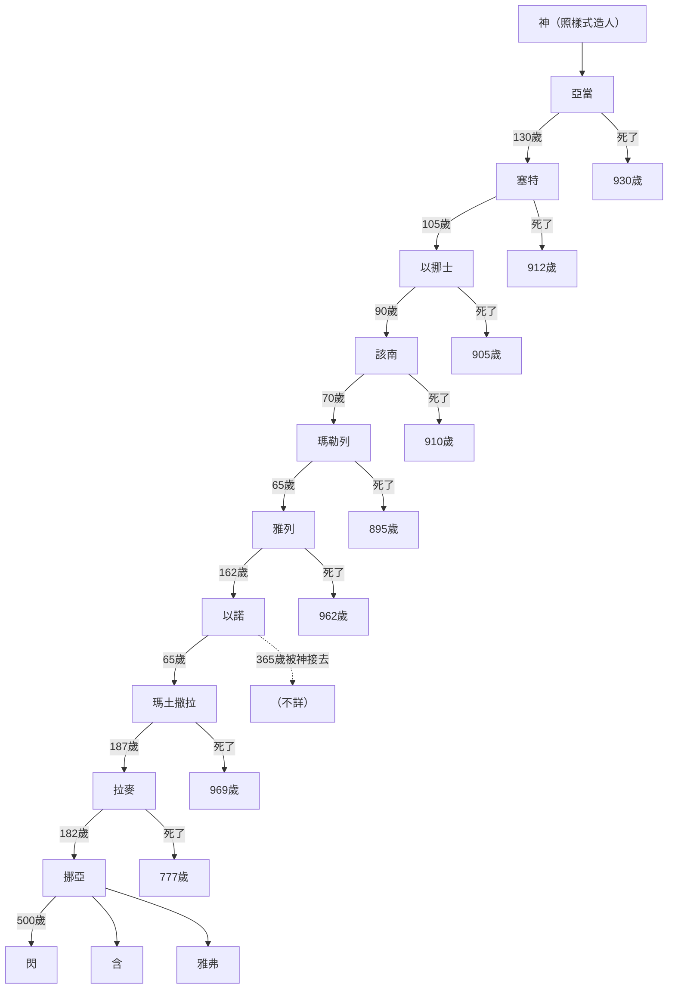
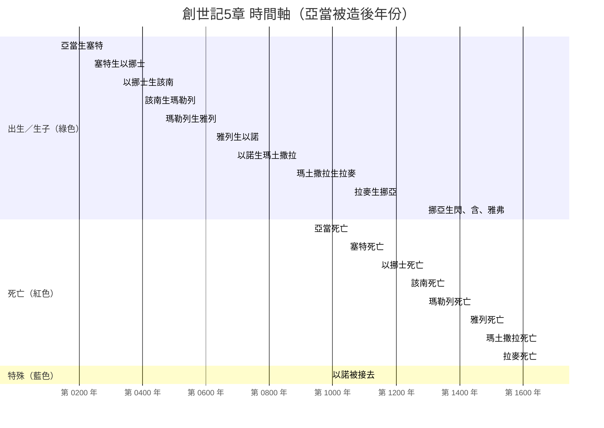

# 創世記第5章 嚴謹整理（對比經文版）

## 時間
- 從創造到挪亞生子：約 **1056** 年（相對時間，按經文數字累加）
- 明確記錄的生子年齡：130, 105, 90, 70, 65, 162, 65, 187, 182, 500
- 以諾被接去：365 歲（其中 **300 年** 與神同行）

## 地點
- **（不詳）** —— 全章未提及任何地名

## 角色
- 神、亞當、塞特、以挪士、該南、瑪勒列、雅列、以諾、瑪土撒拉、拉麥、挪亞、閃、含、雅弗

---

## 事件（逐節對照經文）

| 事件序 | 經文節 | 角色 | 事件內容（嚴謹對照經文） |
|--------|--------|------|--------------------------|
| 1 | 5:1-2 | 神 | 照自己的樣式造人，造男造女，賜福稱他們為「人」 |
| 2 | 5:3 | 亞當 | 130 歲生塞特（形像樣式和自己相似） |
| 3 | 5:4-5 | 亞當 | 生塞特後又活 **800 年**，生兒育女，共活 **930 歲** → **死了** |
| 4 | 5:6 | 塞特 | 105 歲生以挪士 |
| 5 | 5:7-8 | 塞特 | 生以挪士後又活 **807 年**，生兒育女，共活 **912 歲** → **死了** |
| 6 | 5:9 | 以挪士 | 90 歲生該南 |
| 7 | 5:10-11 | 以挪士 | 生該南後又活 **815 年**，生兒育女，共活 **905 歲** → **死了** |
| 8 | 5:12 | 該南 | 70 歲生瑪勒列 |
| 9 | 5:13-14 | 該南 | 生瑪勒列後又活 **840 年**，生兒育女，共活 **910 歲** → **死了** |
| 10 | 5:15 | 瑪勒列 | 65 歲生雅列 |
| 11 | 5:16-17 | 瑪勒列 | 生雅列後又活 **830 年**，生兒育女，共活 **895 歲** → **死了** |
| 12 | 5:18 | 雅列 | 162 歲生以諾 |
| 13 | 5:19-20 | 雅列 | 生以諾後又活 **800 年**，生兒育女，共活 **962 歲** → **死了** |
| 14 | 5:21 | 以諾 | 65 歲生瑪土撒拉 |
| 15 | 5:22 | 以諾 | 生瑪土撒拉後 **與神同行 300 年**，並且生兒育女 |
| 16 | 5:23-24 | 以諾 | 共活 **365 歲**，**神把他接去，他就不在了**（沒有「死了」） |
| 17 | 5:25 | 瑪土撒拉 | 187 歲生拉麥 |
| 18 | 5:26-27 | 瑪土撒拉 | 生拉麥後又活 **782 年**，生兒育女，共活 **969 歲** → **死了** |
| 19 | 5:28-29 | 拉麥 | 182 歲生挪亞，預言：「在耶和華所詛咒的地上，這個兒子必使我們從工作和手中的勞苦得到安慰」 |
| 20 | 5:30-31 | 拉麥 | 生挪亞後又活 **595 年**，生兒育女，共活 **777 歲** → **死了** |
| 21 | 5:32 | 挪亞 | 500 歲生 **閃、含、雅弗** |

---

## 經文對比嚴謹表（完整更正版）—— 含「亞當後年份」

| 人物 | 經文節 | 亞當後年份 | 生子年齡 | 生子對象 | 生子後年數 / 同行年數 | 總壽命 | 死亡？ | 與神同行 | 被接去 | 地點 |
|------|--------|------------|----------|----------|------------------------|--------|--------|----------|--------|------|
| 亞當 | 5:3-5 | 0－930 | 130 | 塞特 | 800 | 930 | 是 | 否 | 否 | （不詳） |
| 塞特 | 5:6-8 | 130－1042 | 105 | 以挪士 | 807 | 912 | 是 | 否 | 否 | （不詳） |
| 以挪士 | 5:9-11 | 235－1140 | 90 | 該南 | 815 | 905 | 是 | 否 | 否 | （不詳） |
| 該南 | 5:12-14 | 325－1235 | 70 | 瑪勒列 | 840 | 910 | 是 | 否 | 否 | （不詳） |
| 瑪勒列 | 5:15-17 | 395－1290 | 65 | 雅列 | 830 | 895 | 是 | 否 | 否 | （不詳） |
| 雅列 | 5:18-20 | 460－1422 | 162 | 以諾 | 800 | 962 | 是 | 否 | 否 | （不詳） |
| 以諾 | 5:21-24 | 622－987 | 65 | 瑪土撒拉 | **300（同行）** | 365 | **否** | **是（300年）** | **是** | （不詳） |
| 瑪土撒拉 | 5:25-27 | 687－1656 | 187 | 拉麥 | 782 | 969 | 是 | 否 | 否 | （不詳） |
| 拉麥 | 5:28-31 | 874－1656 | 182 | 挪亞 | 595 | 777 | 是 | 否 | 否 | （不詳） |
| 挪亞 | 5:32 | 1056－（不詳） | 500 | 閃、含、雅弗 | （不詳） | （不詳） | （不詳） | 否 | 否 | （不詳） |

> **年份計算說明**（以亞當被造為元年 0）：
> - 亞當：0–930
> - 塞特：130（生）– 130+807 = 1042（死）
> - 以挪士：235（生）– 235+815 = 1140（死）
> - 該南：325（生）– 325+840 = 1235（死）
> - 瑪勒列：395（生）– 395+830 = 1290（死）
> - 雅列：460（生）– 460+800 = 1422（死）
> - 以諾：622（生）– 622+300 = 987（被接去）
> - 瑪土撒拉：687（生）– 687+782 = 1656（死）
> - 拉麥：874（生）– 874+595 = 1656（死）
> - 挪亞：1056（生）– 本章未記死亡年份

> ⚠️ **更正說明**：
> - 以諾的「生子後年數」為 **300 年**（與神同行），不是普通生兒育女。
> - 挪亞的總壽命與死亡與否，本章 **未記載**。
> - 所有人物地點均為 **（不詳）**。

---

## Mermaid 世代圖（嚴謹對照經文）

---

## Mermaid 時間軸（相對年份，嚴謹對比）

> 以諾被接去年份計算：687（瑪土撒拉出生） + 300（與神同行） = 987

---

## 時間順序簡表（綠出生／紅死亡／藍特殊）

| 亞當後年份 | 事件 | 類型 |
|------------|------|------|
| 0 | 神造亞當 | 🟢 出生 |
| 130 | 亞當生塞特 | 🟢 生子 |
| 235 | 塞特生以挪士 | 🟢 生子 |
| 325 | 以挪士生該南 | 🟢 生子 |
| 395 | 該南生瑪勒列 | 🟢 生子 |
| 460 | 瑪勒列生雅列 | 🟢 生子 |
| 622 | 雅列生以諾 | 🟢 生子 |
| 687 | 以諾生瑪土撒拉 | 🟢 生子 |
| 874 | 瑪土撒拉生拉麥 | 🟢 生子 |
| 930 | 亞當死亡 | 🔴 死亡 |
| 987 | 以諾被接去 | 🔵 特殊 |
| 1042 | 塞特死亡 | 🔴 死亡 |
| 1056 | 拉麥生挪亞 | 🟢 生子 |
| 1140 | 以挪士死亡 | 🔴 死亡 |
| 1235 | 該南死亡 | 🔴 死亡 |
| 1290 | 瑪勒列死亡 | 🔴 死亡 |
| 1422 | 雅列死亡 | 🔴 死亡 |
| 1656 | 瑪土撒拉死亡 | 🔴 死亡 |
| 1656 | 拉麥死亡 | 🔴 死亡 |
| 1556（約） | 挪亞生閃、含、雅弗 | 🟢 生子 |

> 挪亞生三子的年份本章未明確記載，約在 1556 年之後（按後文推算）。

---

## 結論

1. **除以諾外**，所有 patriarchs 經文都明確記載「就死了」。
2. **以諾**是第一個不經死亡被接去的人，且明確「與神同行 300 年」。
3. **拉麥預言**挪亞帶來「從工作和勞苦得安慰」，對應神對地的咒詛（創 3:17-19）。
4. 全章 **無任何地名**，所有地點一律標註 **（不詳）**。
5. **挪亞的總壽命與死亡**在本章 **未記載**，屬於「不詳」。
6. 絕對年代無法確定，只能建立 **相對時間軸**（以亞當被造為元年）。
