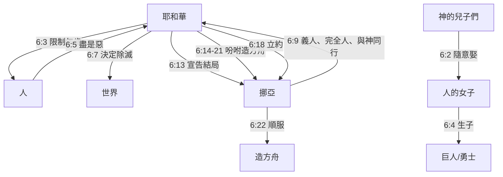
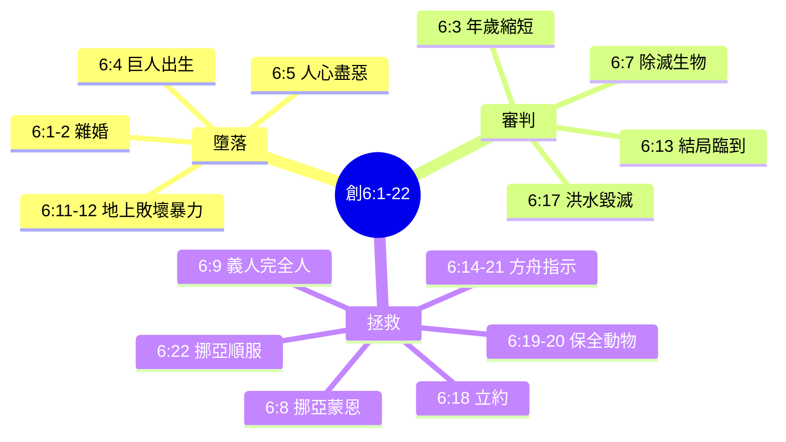

# 創世記 6:1-22 多方法整理與嚴謹經文對比

## 一、建議的整理方法

1. **敘事時序法**：按經文順序還原事件發展。
2. **角色行動分析法**：聚焦各角色（神、人、神的兒子們、挪亞）的行動與回應。
3. **主題歸納法**：按「墮落」、「審判」、「拯救」三大主題歸類。
4. **列表對比法**：抽出時間、地點、角色、事件，與經文逐節對比。

---

## 二、方法1：敘事時序法

### Mermaid 時序圖

```mermaid
timeline
    title 創世記 6:1-22 敘事時序
    section 6:1-4
        人增多，生女兒
        : 神的兒子們娶人的女子<br>神的靈不再永遠住人裡面<br>人年歲120年<br>巨人、英勇士出現
    section 6:5-7
        神見人罪大惡極
        : 神後悔造人<br>決定除滅人和動物
    section 6:8-10
        挪亞蒙恩
        : 挪亞是義人、完全人<br>與神同行
    section 6:11-13
        地上敗壞、暴力
        : 神告知挪亞結局已到<br>要毀滅地和血肉之軀
    section 6:14-21
        神吩咐造方舟
        : 尺寸、材料、結構<br>帶家人、動物、食物
    section 6:22
        挪亞順服
        : 凡神吩咐的都照做
```

經文對比整理

經文 事件 關鍵字
6:1-2 人增多，神的兒子們娶人的女子為妻 人的女子美貌
6:3 神定人年歲120年，靈不永遠住 屬乎血氣
6:4 巨人、上古勇士出現 交合生子
6:5-6 人終日盡惡，神後悔憂傷 罪大惡極
6:7 神決定除滅人、獸、爬行動物、飛鳥 除滅
6:8 挪亞蒙恩 恩典
6:9 挪亞義人、完全人、與神同行 義人
6:10 挪亞三子：閃、含、雅弗 後代
6:11-12 地敗壞、充滿暴力，凡血肉之軀行為敗壞 敗壞、暴力
6:13 神宣告結局臨到，要毀滅地和一切 毀滅
6:14-16 造方舟規定：歌斐木、瀝青、尺寸300x50x30肘、三層 方舟
6:17 洪水氾濫，毀滅天下血肉之軀 洪水
6:18 與挪亞立約：他與家人進方舟 立約
6:19-20 帶動物一公一母，各從其類 保全生命
6:21 帶各樣食物作糧食 儲存食物
6:22 挪亞照做 順服

---

三、方法2：角色行動分析法

Mermaid 角色關係圖



角色行動對比表

角色 經文 行動/狀態 經文對比備註
人 6:1 增多、生女兒 不明確指「所有人」
神的兒子們 6:2 看見美貌，隨意娶 身份（不詳）
人的女子 6:2,4 被娶、交合生子 
耶和華 6:3 靈不永遠住，定120年 「住」原文或作「爭鬥」（不詳）
耶和華 6:6-7 後悔、憂傷、決定除滅 以人描述神
挪亞 6:8-9 蒙恩、義人、完全人、與神同行 完全人（不詳指無罪）
挪亞 6:22 照神吩咐去做 
神 6:13-21 宣告結局，指示造方舟 6:13後用「神」非「耶和華」

---

四、方法3：主題歸納法

Mermaid 主題結構圖



主題 vs 經文對比

主題 包含經文 關鍵內容 不肯定處
墮落 6:1-2,4-5,11-12 雜婚、巨人、盡惡、暴力 「神的兒子們」身份（不詳）
審判 6:3,7,13,17 120年、除滅、洪水 120年是否緩刑期（不詳）
拯救 6:8-9,14-21,22 挪亞蒙恩、方舟、立約 「完全人」非無罪（不詳）

---

五、方法4：列表對比法（時間、地點、角色、事件）

Mermaid 時間軸與事件對比

```mermaid
gantt
    title 創6:1-22 時間與事件對比
    dateFormat HH:mm
    axisFormat %H:%M
    
    section 人增多
    人開始增多生女兒 :a1, 00:00, 1h
    神的兒子們娶妻 :a2, after a1, 1h
    
    section 神的回應
    定人120年 :b1, 00:00, 2h
    神後悔憂傷 :b2, after a2, 1h
    決定除滅 :b3, after b2, 1h
    
    section 挪亞
    挪亞蒙恩 :c1, after b1, 1h
    吩咐造方舟 :c2, after b3, 2h
    挪亞順服 :c3, after c2, 1h
```



列表對比表（與嚴謹經文對比）

項目 經文出處 內容 嚴謹對比說明
時間 6:1 當人開始在地上增多、生女兒的時候 模糊時間，不詳年代
地點 6:1,7,13 地上（不詳具體地點） 原文 אֲדָמָה 指土地
角色 6:2 神的兒子們 身份（不詳）：天使？塞特後裔？
角色 6:4 巨人、古代勇士 נְפִילִים 譯「巨人」或「墮落者」（不詳）
角色 6:8-9 挪亞 義人、完全人、與神同行
事件 6:3 年歲120年 可能是人的剩餘年限或洪水前緩衝期（不詳）
事件 6:6 神後悔 原文 נָחַם 可作「遺憾」、「安慰」（不詳）
事件 6:14 歌斐木 樹種（不詳）可能為柏木
事件 6:15 方舟尺寸 1肘 ≈ 45-52 cm（不詳）
事件 6:16 天窗、門、三層 結構清楚
事件 6:18 立約 第一個與挪亞的約
事件 6:19-20 動物一對 7:2 潔淨動物七對，此處只提一對（不詳矛盾）
事件 6:22 挪亞照做 模範順服

---

六、嚴謹經文對比版（結論表）

主題 經文 確定內容 不肯定/待考處
雜婚 6:1-2 人增多，有「神的兒子們」娶人的女子 「神的兒子們」身份（不詳）
年歲限制 6:3 年歲120年 120年是壽命上限或洪水倒數？（不詳）
巨人 6:4 有巨人、上古勇士 נְפִילִים 準確意義（不詳）
神後悔 6:6-7 神因人的罪憂傷，決定除滅 「後悔」是擬人化修辭
挪亞 6:8-9 蒙恩、義人、完全人、與神同行 「完全人」非無罪（不詳）
敗壞暴力 6:11-13 遍地敗壞、暴力，神宣告結局 
方舟命令 6:14-21 詳細尺寸、材料、帶動物與食物 歌斐木、肘長度（不詳）
動物數量 6:19-20 每樣一對 對比7:2潔淨七對，有出入（不詳）
挪亞回應 6:22 凡神吩咐的都照做 

---

總結

本章呈現三個核心張力：

1. 墮落的普遍性：除挪亞外，全地敗壞暴力。
2. 審判的確定性：洪水除滅一切血肉之軀。
3. 拯救的恩典性：神主動與挪亞立約，賜下方舟藍圖。

經文中的「神的兒子們」、「巨人」、「120年」、「動物數量」等細節，原文或背景信息不足，已標示為「（不詳）」，需倚靠更廣上下文或傳統詮釋輔助判斷。