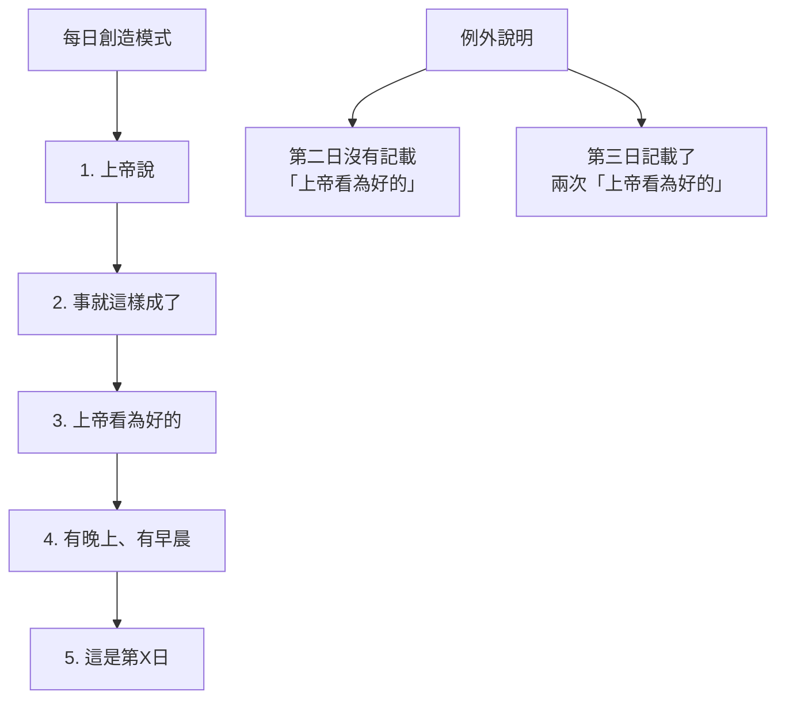
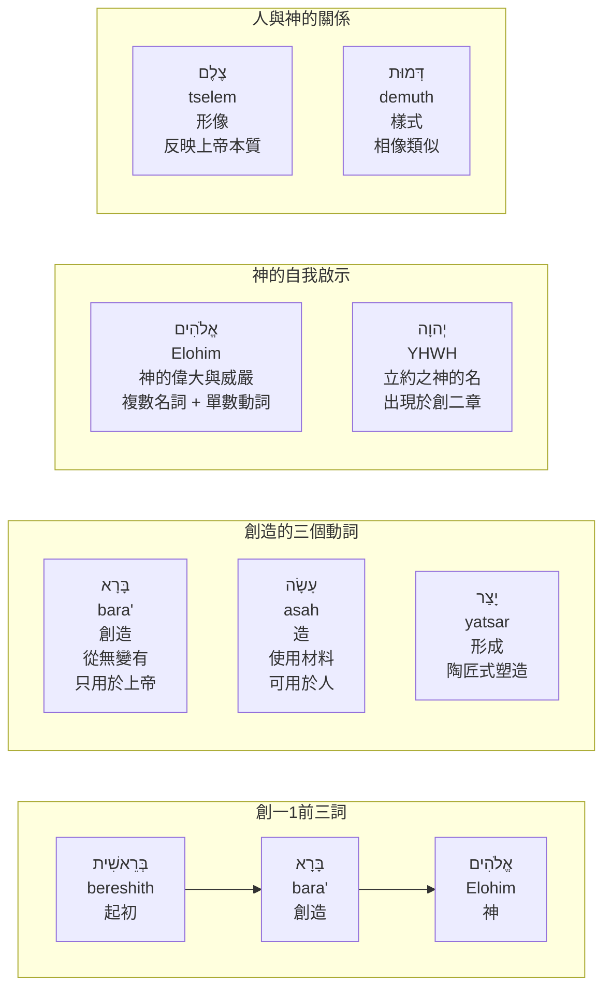
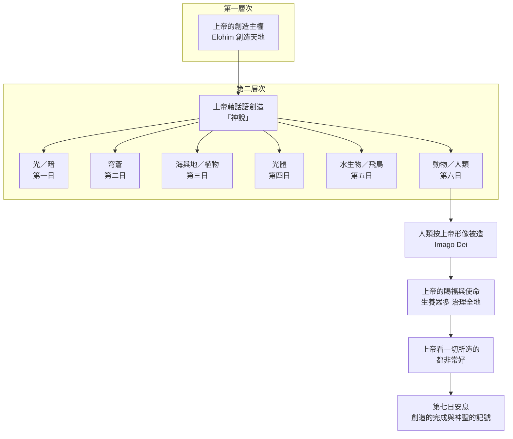
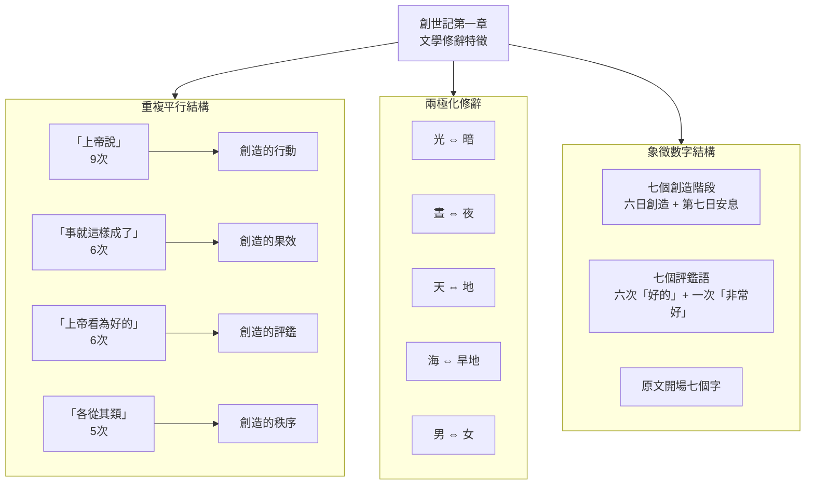
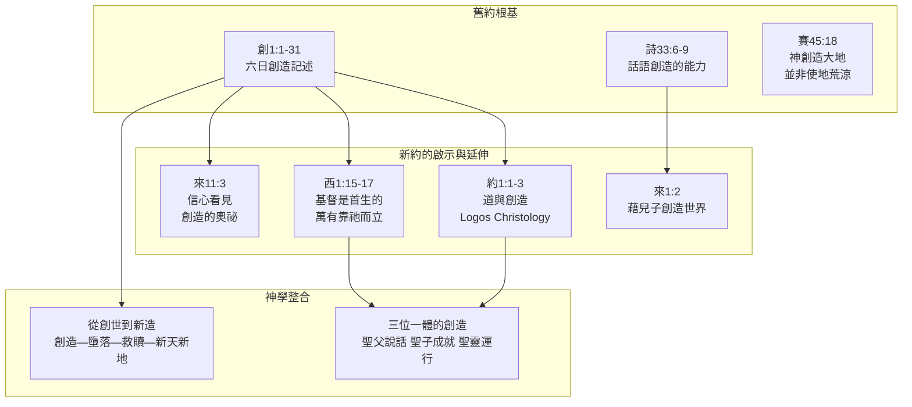

# 創世記 1：1-31 綜合研經整理報告

**經文範圍**：創世記第1章第1節至第31節  
**經文版本**：和合本修訂版（RCUV）  
**立場**：福音派基督教


## 報告摘要

本報告針對創世記第一章的創造記述，採用多種研經方法進行系統性整理。創世記第一章是聖經六十六卷之首卷，堪稱救恩的種苗、真理的根基。全章包含31節經文，記述上帝在六日之內從混沌中建立有序的受造世界，並在第六日按自己的形像造人，以完成整個創造工作。以下將依次按照八個方法進行詳盡整理。


## 方法一：經文結構分析法（六日創造結構與平行對應）

### 1.1 方法建議

結構分析法著重於觀察經文的文學結構、重複模式及平行對應。創世記第一章展現出高度嚴謹的文學結構，六日創造可分為兩組，每組三天，彼此形成精確的平行對應。每一日都遵循相同的基本模式：**上帝的命令 → 事就這樣成就 → 上帝看為好的 → 有晚上有早晨 → 計數日數**。

### 1.2 六日創造結構整理

**第一組（第1-3日）** ：分開的工程——建立形式和疆界  
**第二組（第4-6日）** ：填滿的工程——在形式中安置居民

| 對應組 | 第一日／第四日 | 第二日／第五日 | 第三日／第六日 |
|--------|---------------|---------------|---------------|
| 第一組（分開） | 光暗分開 | 上下水分開 | 陸地與海洋分開 |
| 第二組（填滿） | 光體（管晝夜） | 水中生物與飛鳥 | 地上動物與人類 |

六日的創造分成了對應的第一日至第三日與第四日至第六日：第一日與第四日對應、第二日與第五日對應、第三日與第六日對應。以下是詳細的對照表：

**第一日（第3-5節）與第四日（第14-19節）之對應**：

| 項目 | 第一日 | 第四日 |
|------|--------|--------|
| 創造內容 | 上帝說：「要有光」，就有了光 | 上帝造兩個大光體，大的管晝、小的管夜，又造星辰 |
| 功能 | 把光和暗分開 | 管理晝夜，分別光暗 |
| 對應意義 | 創造光本身 | 創造管理光的光體 |

**第二日（第6-8節）與第五日（第20-23節）之對應**：

| 項目 | 第二日 | 第五日 |
|------|--------|--------|
| 創造內容 | 造穹蒼，把穹蒼以下和以上的水分開 | 水滋生各樣生物；鳥飛在地面以上、天空之中 |
| 功能 | 建立空間（天空） | 在天空和水域中充滿生命 |
| 對應意義 | 創造空間 | 以居民填滿空間 |

**第三日（第9-13節）與第六日（第24-31節）之對應**：

| 項目 | 第三日 | 第六日 |
|------|--------|--------|
| 創造內容 | 旱地露出、植物生長 | 地上走獸、牲畜、爬行動物，以及人類 |
| 功能 | 土地出現，長出植物（食物來源） | 陸地生物出現，人類被賦予管理職責 |
| 對應意義 | 創造土地和植物 | 以陸地動物和人類填滿土地 |

### 1.3 每一日的創造模式



### 1.4 經文關鍵名詞解釋

| 名詞 | 出現經節 | 解釋 |
|------|----------|------|
| 各從其類 | 第11、12、21、24、25節 | 每項創造都是「各從其類」分得很清楚，不會混雜或混亂 |
| 上帝看為好的 | 第4、10、12、18、21、25、31節 | 顯示上帝對自己創造的自我評鑑，除了第二天因還沒有全部完成，因此沒有說「好」之外，其餘每天創造後都有 |
| 有晚上，有早晨 | 第5、8、13、19、23、31節 | 形容上帝創造的秩序，每個創造日都有完整的周期 |
| 賜福 | 第22、28節 | 上帝賜福給生物，使之繁殖增多，延續生命 |


## 方法二：原文（希伯來文）文法與語言學分析法

### 2.1 方法建議

原文分析法研究希伯來原文的詞彙選擇、文法結構與修辭手法，以深入理解經文的精確含義。創世記第一章的希伯來文運用極具深度，多個關鍵詞彙蘊含深刻的神學意義。

### 2.2 關鍵原文詞彙分析

**【創一1】「起初，上帝創造天地。」**

- **「起初」（בְּרֵאשִׁית， bereshith）** ：主要意思是指一連串事物的「首先」、「第一」。傳統上譯為「起初」或「太初」，由聖經的其他經文與所有古譯本（例如七十士譯本）都可以看出這個字譯為「太初」比較妥當。
- **「創造」（בָּרָא， bara'）** ：在舊約出現了四十四次，每一次都描寫神造出了「簇新」的東西，是前所未有的（參民16:30的「新事」）。此詞專指神的作為，從來不指人的活動。創造就是從無變有。
- **「神」（אֱלֹהִים， Elohim）** ：為複數名詞，也許隱含聖經後來清楚啟示的三位一體的奧秘（太三16；二十八19），但此處為加強意義的用法，表示神的偉大與華麗，稱為「華麗的多數」（the plural of majesty）。此字雖為多數，但動詞則為單數，指出神是宇宙間唯一的主宰。

**【創一2】「地是空虛混沌，深淵上面一片黑暗；上帝的靈運行在水面上。」**

- **「空虛混沌」（תֹּהוּ וָבֹהוּ， tohu wabohu）** ：這兩個希伯來詞彙押韻，具有相似的「荒廢」和「空虛」之意，是稱為「重言法」（hendiadys）的修辭手法，用兩個詞語一同表達同一概念。
- **「上帝的靈」（רוּחַ אֱלֹהִים， ruach Elohim）** ：這是聖經裡首次提起神的靈，被描述為「運行」（覆翼）的靈。靈的覆翼指明創世記一章不僅是神創造的記載，乃是生命的記載。「運行」原文也有「覆翼」或「翼護」的意思，神看顧、保護祂手造的一切。
- **「深淵」（תְּהוֹם， tehom）** ：原文與巴比倫創世史詩《埃努瑪埃利什》中的「提亞瑪特」（Tiamat）在詞源上有關聯。在以色列文化中，「大水」、「海」都是威脅生命的力量。因此，在創造開始的第一件事，就是上帝先運行祂的「靈」在「水面上」，將這種威脅生命的力量控制住或降服。

**【創一3-5】「上帝說：要有光，就有了光。……這是第一日。」**

- **上帝「說」（אָמַר， amar）** ：上帝的話成為創造工具。詩三十三篇9節宣告說：「祂說有就有，命立就立」。希伯來書十一章3節也說：「我們因著信，就知道諸世界是藉神的話造成的」。
- **要「有」光（הָיָה， hayah）** ：此詞有「產生」、「存在」、「出現」的意思，與第一節的「創造」（bara'）涵意不同。
- **「稱」光為晝** ：「稱」是給人或事物一個名字，表示主權。

**【創一26-27】「我們要照着我們的形像……造人。」**

- **「我們」** ：可能是「一種尊貴的多數」用法，也可能是表達上帝與天使（以「天上議會」的角度發言）。
- **「形像」（צֶלֶם， tselem）** ：原文就是「像」，此字也用來表示「偶像」，意思是「模子」、「模型」。當然，這裡不是講神有什麼「形狀」，而是指「人類生命反應出上帝的本質」。
- **「樣式」（דְּמוּת， demuth）** ：「相像」、「類似」。

### 2.3 Mermaid：原文關鍵詞彙關係圖




## 方法三：古代近東背景比較法

### 3.1 方法建議

對明白創世記第一部分最有幫助的背景材料，是古代近東的神話文學。美索不達米亞和埃及的神話，都在「世界」和「人類受造」的題目上，提供了大量有關當代觀點的材料。比較古代近東文學和聖經記載的歧異，能幫助我們體會以色列文化和聖經信仰的獨特之處。

### 3.2 創世記載的比較

| 比較項目 | 巴比倫《埃努瑪埃利什》史詩 | 埃及創世神話 | 創世記第一章 |
|----------|--------------------------|-------------|-------------|
| 創造的起點 | 混沌和水，神祇從中產生 | 混沌和水，從中產生神靈、戰爭 | 上帝創造天地，不是自然而有 |
| 創造的方式 | 諸神爭鬥、戰爭 | 多種神話，涉及戰爭和衝突 | 上帝說話創造，平靜有序 |
| 人類的地位 | 人類被造作為神的僕人 | 人類被造（不詳） | 人類按上帝形像被造，被賦予治理的使命 |
| 神的性質 | 多神、彼此衝突 | 多神 | 獨一真神，超越萬有 |
| 創造的本質 | 宇宙在戰爭的循環中被創造 | （不詳） | 宇宙不是在戰爭中形成，而是平和地通過對話中形成 |

### 3.3 關鍵差異分析

創世記的記載與其他創世神話截然不同：

1. **沒有暴力和衝突**：創世記1章沒有出現暴力和衝突，上帝是不會與人與神發生衝突的。
2. **神藉話語創造**：與美索不達米亞「創世是與宇宙性神祇的誕生有關」的觀念相對比，以色列相信世界是藉神話語造成的。
3. **人類的崇高地位**：人類雖然是由塵土所造，但按照神的形像被造，而非被造作為諸神的奴僕。
4. **創造的美好性**：與古代近東神話中創造常與暴力相伴不同，創世記反覆強調「上帝看為好的」，最終「都非常好」。

雖然人類（一）由泥土（二）按神祇形像被造，都是古代近東常見的概念。然而以色列卻在這個觀念之上，加插了獨特的意義，將它轉移到截然不同的層次。

### 3.4 經文具體比較

**關於「海」的概念**：
以色列周邊的民族看海是「神」，但在創世記中，海是被造物，而且接受上帝的命名（臣服於上帝的主權）。這在當時的古代近東文化中是極為獨特的宣告。

**關於「安息」的概念**：
第七日「安息日」成了一個鮮明的表記，要表明天地是神獨自的創造，是祂的奇工。整個宇宙就是一個舞台，表述「諸天述說神的榮耀，穹蒼傳揚祂的手段」（詩十九1）。

```mermaid
flowchart LR
    subgraph 古代近東創世神話
        direction TB
        A1[混沌之水提亞瑪特] --> A2[諸神爭鬥]
        A2 --> A3[建立秩序\n暴力與衝突]
        A3 --> A4[人類被造\n為神服務]
    end
    
    subgraph 創世記第一章
        direction TB
        B1[上帝在混沌之上\n運行/覆翼] --> B2[「上帝說」\n話語創造]
        B2 --> B3[「上帝看為好的」\n和平與秩序]
        B3 --> B4[人類按神形像被造\n被賜福與授權管理]
    end
    
    style A2 fill：#ffcccc
    style A3 fill：#ffcccc
    style B2 fill：#ccffcc
    style B3 fill：#ccffcc
```


## 方法四：神學主題分析法

### 4.1 方法建議

神學主題分析法從整本聖經的救贖歷史視角，識別創世記第一章所揭示的核心神學主題，並探討這些主題對基督徒信仰和生活的意義。

### 4.2 核心神學主題

**【主題一】創造主上帝的獨一性與主權**

聖經用莊嚴、華美且挾雷霆萬鈞之力的一句話——「起初，上帝創造天地」——宣告神是萬物的創造主。一句話概述了創造者、被造物和偉大的創造作為，不循人的哲理去論證。神是唯一的非受造者且是永恆的，祂造作了除自身之外的萬物並維繫他們的存在。

- 天地不是自然而有，乃是自有永有的真神所創造。
- 祂用自己權能的話語從虛空中創造了萬物。

**【主題二】從無變有的創造（Creatio Ex Nihilo）**

創造這個詞既指神起初從虛無中造出萬物的行為（創1:1），以及神隨後為受造物造出各種結構的行為（創1:2-2:3）。雖然「創造」這詞本身並不明確包括「從無變有」的意思，但聖經從沒有指上帝是用某物造出另一物，創世記的上下文也提到上帝只用祂的話創造，所以意思是指上帝是從什麼都沒有的情況中創造出這個宇宙世界。

**【主題三】上帝話語的創造大能**

創世記六日創造中的每一日都以「神說」這句話開頭。上帝用「命令」來創造宇宙萬物（參考第3節、第6-7節、第9節、第11節、第14節、第20節、第24節、第30節）。上帝創造萬物沒有材料，唯一的就是祂的話（命令）。

新約經文更進一步啟示：

- 約翰福音一章1-3節：「太初有道……萬物是藉著祂造的」
- 歌羅西書一章16節：「因為萬有都是靠祂造的，無論是天上的，地上的；能看見的，不能看見的……一概都是藉著祂造的，又是為祂造的」
- 希伯來書一章2節：上帝藉著祂兒子創造諸世界

**【主題四】上帝的形像與人的尊嚴（Imago Dei）**

只有造人的時候，是用上帝的「形像」來創造，且是同時造「男」、「女」，主要目的，是要人參與上帝的工作，好管理一切受造之物。

人有神的形像，有理性，有道德責任感；人有神的樣式，在靈性上能和神心意相通，順從祂的旨意。人犯罪墮落後，靈性上與神的交通斷絕，不再似神；但人按神形像受造的地位未變，須藉著神的救贖重造成為新人（弗4：24；西3：10）。

**【主題五】賜福與使命**

上帝創造動、植物之後，就會賜福給這些生物，上帝的賜福是使之延續生命。本章使用不同的詞彙來表達：

- 用「有產五穀的，也有結果子的」來形容植物繁衍生命
- 用「繁殖」來形容動物（參考第20節、第22節、第24節）
- 用「生養眾多」形容人類（參考第28節）

上帝賜福給人類的使命包括：

1. **生養眾多，遍滿這地**——延續生命
2. **治理和管理全地**——管家職分
3. **以植物為食物**——起初的創造秩序中沒有人與動物互相殘殺（第29-30節），直到洪水之後才有全面性的改變

### 4.3 Mermaid：神學主題層次圖



### 4.4 評鑑句式統計

創世記第一章有五次提到「上帝看為好的」（第4、10、12、18、21、25節，總共六次）。唯獨在31節，詳細道出上帝「看一切所造」後，都「非常好」。

| 節數 | 表述 | 備註 |
|------|------|------|
| 1:4 | 上帝看光是好的 | 第一日 |
| 1:10 | 上帝看為好的 | 第三日（乾地與海） |
| 1:12 | 上帝看為好的 | 第三日（植物） |
| 1:18 | 上帝看為好的 | 第四日 |
| 1:21 | 上帝看為好的 | 第五日 |
| 1:25 | 上帝看為好的 | 第六日（動物） |
| 1:31 | 上帝看一切所造的，看哪，都非常好 | 第六日（總結） |


## 方法五：文學修辭與鑑別分析法

### 5.1 方法建議

文學修辭與鑑別分析法專注於經文的文學技巧、修辭手法、敘事結構和語言模式，以揭示作者如何透過文學形式傳達神學信息。

### 5.2 主要文學修辭特徵

**(1)「兩極化」修辭學**

在希伯來文中沒有一個字可以表達「宇宙」的觀念，得要藉助「兩極化」的修辭學方式來表達。創世記第一章反覆使用成對的對立概念來描述整個受造界的範圍：

- 光與暗
- 晝與夜
- 天與地
- 海與旱地
- 太陽與月亮
- 男與女

藉著這些對立配對的總和，希伯來作者表達了受造界的全部。

**(2)重複平行結構**

經文使用多個重複的平行結構來強化信息的權威性和詩意：

| 重複句式 | 出現位置 | 次數 |
|----------|----------|------|
| 「上帝說」 | 第3、6、9、11、14、20、24、26、29節 | 9次 |
| 「事就這樣成了」 | 第7、9、11、15、24、30節 | 6次 |
| 「各從其類」 | 第11、12、21、24、25節 | 5次 |
| 「上帝看爲好的」 | 第4、10、12、18、21、25節 | 6次 |

**(3)象徵性數字「七」**

希伯來人的想法中，「七」是表示完全而圓滿的意思。創世記第一章展現出與「七」相關的結構：

- 七個評鑑句式（六次「上帝看爲好的」加上一次「都非常好」）
- 七個創造日（六日創造＋第七日安息）
- 「天」（שָׁמַיִם， shamayim）一詞的出現模式（不詳）

**(4)強有力的開場白**

創世記1:1在原文中僅有七個字：

1.  בְּרֵאשִׁית（起初）
2.  בָּרָא（創造）
3.  אֱלֹהִים（上帝）
4.  אֵת（直接受詞記號）
5.  הַשָּׁמַיִם（諸天）
6.  וְאֵת（和，直接受詞記號）
7.  הָאָרֶץ（地）

這七個希伯來文字詞構成了聖經最著名的開場白，其簡潔與宏大令人驚嘆。

### 5.3 Mermaid：文學修辭特徵圖




## 方法六：嚴謹經文對比版——多譯本比較分析

### 6.1 方法建議

嚴謹經文對比法將RCUV與其他重要中文譯本進行逐節比較，辨識差異之處，並對不確定的部分標註「（不詳）」。

### 6.2 關鍵經節比較表

| 節數 | RCUV（和合本修訂版） | 和合本（神版） | 新譯本 | 當代譯本 |
|------|---------------------|---------------|--------|----------|
| 1 | 起初，**上帝**創造天地 | 起初，**神**創造天地 | 起初，**神**創造天地 | 太初，**上帝**創造了天地 |
| 2 | 地是空虛混沌，**深淵上面**一片黑暗 | 地是空虛混沌，**淵面**黑暗 | 地是空虛混沌；**深淵上一片黑暗** | 大地空虛混沌，**黑暗籠罩著深淵** |
| 5 | 稱暗為「夜」。有晚上，有早晨，這是**第一日** | 稱暗為「夜」。有晚上，有早晨，這是**頭一日** | 稱暗為「夜」。有晚上，有早晨；這是**第一日** | 稱黑暗為夜。晚上過去，早晨到來，這是**第一日** |
| 6 | **穹蒼** | **空氣** | **穹蒼** | **穹蒼** |
| 14 | 作記號，定**季節**、日子、年份 | （不詳） | 定**節令**、日子、年歲 | 定**節令**、日子和年歲 |
| 16 | 於是**上帝**造了兩個大光體 | 於是**神**造了兩個大光 | （不詳） | （不詳） |
| 20 | 滋生眾多有**生命之物** | （不詳） | 滋生**有生命的活物** | 滋生出**各種動物** |
| 21 | **大魚** | （不詳） | **大魚** | **巨大的海獸** |
| 24 | **爬行動物** | **昆蟲** | **昆蟲** | **爬蟲類** |
| 26 | 我們要照着我們的**形像**，按着我們的**樣式**造人 | 我們要照著我們的**形像**，按著我們的**樣式**造人 | 我們要照著我們的**形象**，按著我們的**樣式**造人 | 我們要照著我們的**形像**，按著我們的**樣式**造人 |
| 27 | 他創造了他們，**有男有女** | 並且造男造女 | 他創造了他們；**有男有女** | 他造了男人和女人 |
| 31 | 上帝看一切所造的，看哪，都**非常好** | 神看著一切所造的都**甚好** | 神看他所造的一切都**很好** | 上帝看了祂所創造的一切，**非常美好** |

### 6.3 差異註釋

1. **上帝 vs 神**：RCUV使用「上帝」，和合本神版使用「神」，這是不同翻譯傳統的慣用差異。RCUV版本中也同時有「神版」的版本，使用「神」字。

2. **第一日 vs 頭一日**：RCUV和新譯本使用「第一日」，和合本使用「頭一日」。兩者意義相同。

3. **爬行動物 vs 昆蟲**：第24節的原文「רֶמֶשׂ」（remes）指的是「爬行生物」，並不一定是「昆蟲」。RCUV的翻譯「爬行動物」較為準確。

4. **非常好 vs 甚好**：第31節的評鑑句式是最終的總結。RCUV譯為「非常好」，更強調上帝創造的完全美好。

5. **形像與樣式**：各譯本對第26節「צֶלֶם」（tselem）和「דְּמוּת」（demuth）的翻譯較為一致，都譯為「形像」和「樣式」。

### 6.4 不確定點（不詳）

以下部分在現有資料中未能完全確認，標註為「（不詳）」：

| 經節 | 不確定的問題 | 說明 |
|------|-------------|------|
| 1:1 | 「起初」是否應譯作「當」（when） | 少數觀點認為應譯為「當」，因巴比倫創世神話用「當」開頭。但大多數學者採用「起初」的翻譯 |
| 1:2 | 「深淵」與巴比倫「提亞瑪特」的關係 | 原文「תְּהוֹם」與Tiamat詞源相關，但聖經對其的處理與異教神話有本質不同 |
| 1:6 | 穹蒼以上之水的本質 | 對古代宇宙觀中「天上的水」的理解，現代讀者難以確知 |
| 1:26 | 「我們」的確切指涉 | 可能是「尊貴的多數」，或「天上議會」，或三位一體的暗示 |
| 1:27 | 「形像」與「樣式」的具體區別 | 兩者不易明顯區分 |


## 方法七：經文對比與和諧一致分析

### 7.1 方法建議

經文對比法關注創世記第一章的記述如何與聖經其他經卷保持和諧一致，特別是在創造的主題上。這種方法幫助我們看到聖經信息的內在統一性。

### 7.2 創世記第一章與新約經文的聯繫

**（1）約翰福音第一章**

約翰福音第一章清楚地將創世記第一章的「起初」與道成肉身的基督聯繫起來：

- 約1：1-3：「太初有道……萬物是藉著祂造的；凡被造的，沒有一樣不是藉著祂造的。」
- 約1：4：「生命在祂裡面，這生命就是人的光」——呼應創1：3的「要有光」
- 約1：14：「道成了肉身，住在我們中間」——創造主親自進入受造界

創世記1:1-3和約翰福音1:1-3的平行關係表明，創造世界的「上帝說」，在新約中被啟示為聖子——永恆的道。

**（2）歌羅西書第一章**

歌羅西書1:16-17提供了關於基督在創造中角色的最完整陳述：

> 「因為萬有都是靠祂造的，無論是天上的，地上的；能看見的，不能看見的；或是有位的，主治的，執政的，掌權的；一概都是藉著祂造的，又是為祂造的。祂在萬有之先；萬有也靠祂而立。」

```
創1:1 起初，上帝創造天地。
約1:1-3 太初有道……萬物是藉著祂造的。
西1:16 萬有都是靠祂造的，又是為祂造的。
來1:2 藉著祂兒子創造諸世界。
```

**（3）希伯來書第十一章**

希伯來書11:3：「我們因著信，就知道諸世界是藉神的話造成的；這樣，所看見的，並不是從顯然之物造出來的。」這節經文直接引用創世記第一章的核心信息——上帝藉話語創造，且從無變有。

**（4）詩篇**

詩篇33:6：「諸天藉耶和華的命而造；萬象藉祂口中的氣而成。」  
詩篇33:9：「因為祂說有，就有；命立，就立。」

這些經文回顧並讚美創世記第一章所記載的創造大工。

### 7.3 創世記第一章與第二章的關係

創世記第一和第二章記載了兩個創造的記述。釋經學家指出它們源自司祭典（Priestly writer 1:1-2:4a）和雅威典（Yahwist 2:4b-2:25）。這兩個記述並無矛盾：

- 第一章：宏觀、有序、以「神」（Elohim）稱呼上帝，強調結構與分類
- 第二章：聚焦人類、敘事性更強、以「耶和華神」（YHWH Elohim）稱呼上帝，強調關係與安息

兩個創造記述都同意：上帝創造了宇宙，且上帝豐盛地賜福給祂的創造物。

### 7.4 Mermaid：聖經中創造主題的和諧一致




## 方法八：綜合神學信息總結

### 8.1 核心信息提煉

創世記第一章以31節經文建立了聖經世界觀的五大根基：

**（1）上帝是萬有的創造主和唯一主宰**

聖經第一個詞彙「起初」告訴我們，人間的一切事物都有起點。只有坐在寶座上超越時間的至高神是無始無終的。神是聖經第一句話的主詞，這個字在創世記第一章中出現了三十五次，與全段經節數目相同。

**（2）創造是和平、有序和美好的**

上帝從混沌中建立秩序。在創造開始的第一件事，就是上帝先運行祂的「靈」在「水面上」，將混亂的力量降服，之後才開始奇妙的創造。創造的高潮是「上帝看一切所造的，看哪，都非常好」（1:31）。

**（3）人類具有獨特的尊嚴和使命**

人是唯一按上帝「形像」和「樣式」被造的受造物。人有神的形像，有理性，有道德責任感；人有神的樣式，在靈性上能和神心意相通。人類受造的目的包括：生養眾多、遍滿地面、治理和管理全地。人類不是受造物的主人，而是上帝的管家。

**（4）上帝話語的能力是創造的媒介**

上帝用「命令」來創造宇宙萬物，上帝創造萬物沒有材料，唯一的就是祂的話（命令）。這一真理在新約中進一步啟示——創造世界的「道」就是耶穌基督（約1:1-3）。

**（5）創造的秩序指向安息的應許**

第七日是創造的完成和神聖的記號。神將第七日「定為聖日」，因祂在完成了創造之工後安息了。上帝把第七日「定為聖日」，也就是把這一日劃分出來，作為祂創造旨意的記號和表明。

### 8.2 應用與反思

1. **敬拜的對象**：創世記第一章呼召我們將敬拜單單歸給創造主上帝，而不是受造之物。

2. **管家職分**：人類作為上帝的管家，有責任以關愛和尊重的態度治理全地。管治(radah)不是關於使用而是照顧——像牧羊人以關心去管治羊群。

3. **人的尊嚴**：無論人的種族、性別或社會地位如何，每一個人都是按上帝的形像所造，具有與生俱來的尊嚴和價值。

4. **安息的節奏**：六日創造、第七日安息的模式為人類的工作與休息提供了神聖的榜樣。那一星期中有一日休息，是人類生存所必需的，正如性（一27-28）和食物（一29）一樣。

5. **盼望的根源**：那位創造天地的主——也是救贖的主。新天新地的應許（啟21:1-4）追溯至創世記第一章的創造敘事，帶來終極的盼望和安慰。


## 附錄：創世記1：1-31 RCUV經文全文

| 日數 | 經節 | 創造內容摘要 |
|------|------|-------------|
| 第一日 | 1:1-5 | 起初上帝創造天地；光暗分開；稱光為晝、暗為夜 |
| 第二日 | 1:6-8 | 造穹蒼，將上下水分開；稱穹蒼為天 |
| 第三日 | 1:9-13 | 旱地露出、水分聚集；地生出植物（含種子的五穀菜蔬和會結果子的樹） |
| 第四日 | 1:14-19 | 造光體：大的管晝、小的管夜，又造星辰 |
| 第五日 | 1:20-23 | 水滋生各樣活動的生物；造大魚和飛鳥，賜福給牠們 |
| 第六日 | 1:24-31 | 造地上的走獸、牲畜、爬行動物；照著上帝的形像造男造女；賜福給人類；以植物為食物 |
| （第七日） | 第2章1-3節 | 天地萬物都造齊了；上帝歇了祂一切創造的工，賜福給第七日，定為聖日 |


**報告完成日期**：2026年4月29日  
**資料來源**：CBOL註釋資料、啟導本聖經註釋、九龍城浸信會講章、Gospel Herald、GotQuestions.org、The Gospel Coalition等福音派研經資源