# 創世記第 2 章「綜合研經整理報告」

> 嚴謹經文對比版 | 福音派立場

## 📖 經文對照表（RCUV／原文嚴謹對比）

本章經文根據 RCUV（和合本修訂版）對照希伯來原文關鍵詞、其他主要譯本及原文釋義整理如下。

| RCUV 節數 | RCUV 經文 | 原文關鍵詞／神名 | 嚴謹對比註解 |
|---|---|---|---|
| 1 | 天地萬物都造齊了。 | 萬物 (host) | 希伯來文「萬物」可指眾星（尼九 6）或天使（王上二十二 19），此處大概僅指「神所創造的萬物」。 |
| 2 | 到第七日，上帝已經完成了造物之工，就在第七日安息了，歇了他所做一切的工。 | 安息 (shabbat) | 希伯來文 **שָׁבַת (shabbat)** 意為「停止」，並非因為疲憊而歇息，而是完成創造大工後的停止。「安息日」一詞由此延伸。 |
| 3 | 上帝賜福給第七日，將它分別為聖，因為在這日，上帝安息了，歇了他所做一切創造的工。 | 分別為聖 (qiddesh) | 希伯來文 **קִדֵּשׁ (qiddesh)** 意為「使之聖潔」、「分別出來歸給上帝」。上帝使這日與其他日子不同。 |
| 4 | 這就是天地創造的來歷。在耶和華上帝造地和天的時候， | 來歷 (toledot)／耶和華 (YHWH) | 1. **來歷 [SH 8435]**：字源為「生產」（SH 3205），傳統譯作「世代記略」，此處引介下文（2:4–4:26）。 2. **耶和華 (YHWH)**：上帝立約的專有名稱，發音失傳，學界多認為讀作「Yahweh 雅威」。本章從第 4 節起首次使用「耶和華上帝」（YHWH Elohim）之複合名稱。 |
| 5 | 地上還沒有田野的草木，田間的菜蔬還沒有長出來，因為耶和華上帝還沒有降雨在地上，也沒有人耕種土地。 | 草木／菜蔬 | 希伯來文區分「種植類植物」(siach) 與「野生植物」('esev)，表明植物需要人的耕作才能生長。這是創造秩序中「人與土地相互依存」的重要原則。 |
| 6 | 但是，有霧氣從地上騰，滋潤整個土地的表面。 | 霧氣 (ed) | 「霧氣」或譯「地下水湧流」。希伯來文 **אֵד ('ed)** 描述一種從地底上騰滋潤全地的水源系統。 |
| 7 | 耶和華上帝用地上的塵土造人，將生命之氣吹進他的鼻孔，這人就成了有靈的活人。 | 造 (yatsar)／活人 (nephesh chayyah) | 1. **造（SH 3335）**：陶匠用泥土塑形之意。希伯來文「亞當（adam）」與「土地（adamah）」同字根，音義雙關。 2. **有靈的活人 [SH 5315+2416]**：直譯「活的靈魂」（living soul），此詞也用於動物（創一21,24），人與動物的分別在於人照上帝形像所造。 |
| 8 | 耶和華上帝在東方的伊甸栽了一個園子，把所造的人安置在那裏。 | 伊甸 (Eden) | 「伊甸」字根含義（不詳）：一說源於希伯來文「快樂、喜悅」；一說源於亞喀得文「平原」；一說源於烏迦列文「水源充足的土地」。 |
| 9 | 耶和華上帝使各樣的樹從土地裏長出來…園子當中有生命樹和知善惡的樹。 | 知善惡的樹 | 原文「善惡知識的樹」。果子象徵人以自我為善惡標準，脫離上帝的權威。 |
| 10–14 | 有一條河從伊甸流出來…分為比遜、基訓、底格里斯、幼發拉底四道。 | 四河 | 底格里斯與幼發拉底河可考；比遜與基訓位置（不詳），可能是洪水後河道改變或古地名湮滅。 |
| 15 | 耶和華上帝把那人安置在伊甸園，讓他耕耘看管。 | 耕耘看管 | 原文 `‘avad`（耕耘／事奉）與 `shamar`（看守／遵守），暗示工作本身就是對上帝的事奉。 |
| 16–17 | 「園中各樣樹上所出的，你可以隨意吃，只是知善惡的樹所出的，你不可吃，因為你吃它的日子必定死！」 | 必定死 | 原文強調語氣。包含靈性死亡（與上帝隔絕）及肉體死亡。 |
| 18 | 「那人單獨一個不好，我要為他造一個配偶幫助他。」 | 幫助 (ezer) | 希伯來文 **עֵזֶר (ezer)** 在舊約中 21 次出現，多用於描述上帝對人的幫助，絕非指「次要的助手」。 |
| 19–20 | 耶和華上帝用泥土造了…走獸…飛鳥…那人就給…起了名。 | 起名 | 起名在古代近東象徵權柄與治理。此事發生在女人被造之前。 |
| 21–22 | 耶和華上帝使他沉睡…取下他的一根肋骨…用那肋骨造了一個女人。 | 肋骨 (tsela) | 希伯來文 **צֵלָע (tsela)** 在別處可譯「旁邊」，此處指肋骨（含周圍的肉）。新約視此為真實歷史事件。 |
| 23 | 「這正是我骨中的骨，肉中的肉，可以稱她為女人，因為她是從男人身上取出來的。」 | 女人 (ishshah) | 希伯來文 **אִשָּׁה ('ishshah)** 與「男人」**אִישׁ ('ish)** 字音相近，反映「女人從男人而出」的事實。 |
| 24 | 因此，人要離開父母，與妻子結合，二人成為一體。 | 成為一體 | 婚姻的定義：一男一女、一夫一妻、一生一世。耶穌在新約引用此節（可十 7–9），確立婚姻的永恆性。 |
| 25 | 當時夫妻二人赤身露體，並不覺得羞恥。 | 不覺得羞恥 | 這是墮落前「無罪狀態」的描述。罪進入世界後，羞恥感隨即出現（創三 7）。 |

## 一、建議整理的方法（5 種研經方法）

本章研經報告採用以下五種互補的方法進行分析：

```mermaid
graph TD
    A[創世記第 2 章<br>綜合研經方法] --> B[方法一<br>文本結構分析]
    A --> C[方法二<br>原文詞彙研究]
    A --> D[方法三<br>神學主題歸納]
    A --> E[方法四<br>考古歷史考證]
    A --> F[方法五<br>預表與解經]

    B --> B1[兩個創造記錄的關係]
    B --> B2[章節段落結構]
    B --> B3[「來歷/托勒多」作為文學標記]

    C --> C1[關鍵希伯來動詞<br>bara/ asah/ yatsar]
    C --> C2[「耶和華上帝」神名轉換]
    C --> C3[人/土地文字遊戲<br>adam/ adamah]
    C --> C4[ezer「幫助」的真正含義]

    D --> D1[安息的神學意義]
    D --> D2[人：塵土＋上帝的氣息]
    D --> D3[工作與治理的神聖性]
    D --> D4[婚姻的神聖設立]

    E --> E1[伊甸園地理位置考證]
    E --> E2[四河之考古與地理]
    E --> E3[洪水前後地形變遷]

    F --> F1[亞當預表基督<br>（羅五 14；林前十五 45）]
    F --> F2[夏娃預表教會<br>（弗五 22–32）]
    F --> F3[「沉睡」預表基督之死]

    style A fill:#2d5a27,stroke:#333,stroke-width:4px,color:#fff
    style B fill:#45a049,stroke:#333,stroke-width:2px,color:#fff
    style C fill:#45a049,stroke:#333,stroke-width:2px,color:#fff
    style D fill:#45a049,stroke:#333,stroke-width:2px,color:#fff
    style E fill:#45a049,stroke:#333,stroke-width:2px,color:#fff
    style F fill:#45a049,stroke:#333,stroke-width:2px,color:#fff
```

## 二、方法一：文本結構分析

### 2.1 兩個創造記錄的關係（創一 1–二 3 vs 創二 4–25）

創世記第二章第 4 節下至 25 節常被稱為「第二個創造記錄」。與第一章相比，二者並非矛盾，而是以 **「互補平行」** 的文學手法呈現同一個創造事件的不同視角：

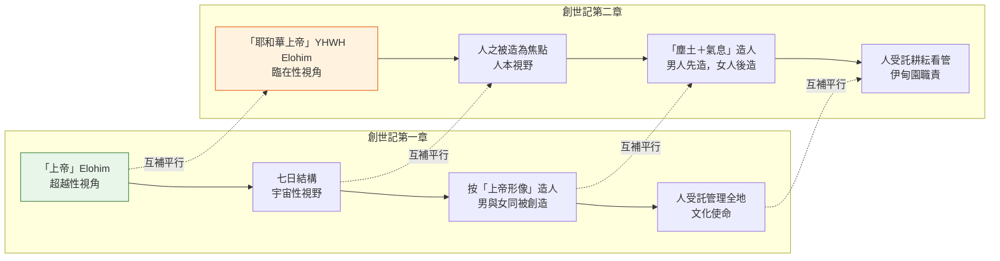

**福音派核心立場**：兩個創造記錄是同一歷史事件的不同角度記述，作者（傳統認為摩西）使用不同來源／不同寫作風格，但絕非矛盾。「第三章的墮落必須建基於第二章的創造，兩者構成一致的救贖歷史敘事」。

### 2.2 第二章結構分段

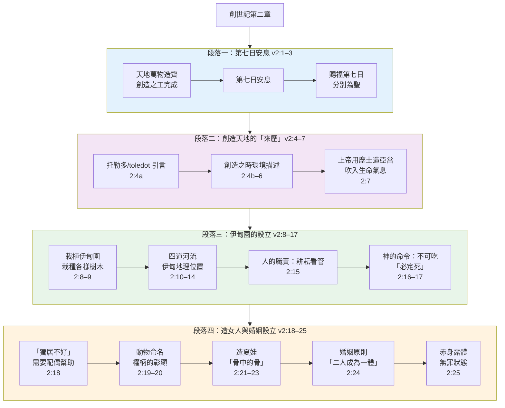

### 2.3 「來歷」（תּוֹלְדֹת / toledot）作為創世記的結構標記

創世記第二章第 4 節的 **「來歷」**（希伯來文 **תּוֹלְדֹת**, toledot）是整卷創世記的重要文學結構標記，全書共出現 13 次，每一段「來歷」引言引介一個新的段落。重要觀察：

| 位置 | 原文（ḥ） | 功能 |
|---|---|---|
| 創二 4 | 「天地創造的來歷」 | 引介 2:4–4:26，記錄從創造到墮落、審判的發展 |
| 創五 1 | 「亞當的後代記在下面」 | 引介家譜 |
| 創六 9 | 「挪亞的後代記在下面」 | 引介洪水故事 |

**文本結構核心要點**：

- 創二 4 的「來歷」不是第一章創造記錄的總結，而是第二章及以下內容的 **標題／引言**。
- 這段「來歷」引介的內容（2:4–4:26）不是另一個創造記錄，而是追溯 **從創造經過墮落到審判的歷史軌跡**。
- 創一 1–二 3 與創二 4–25 是 **同一創造事件的兩個互補視角**，後者以前者為基礎。

## 三、方法二：原文詞彙研究

### 3.1 創世記中的三個「創造」動詞

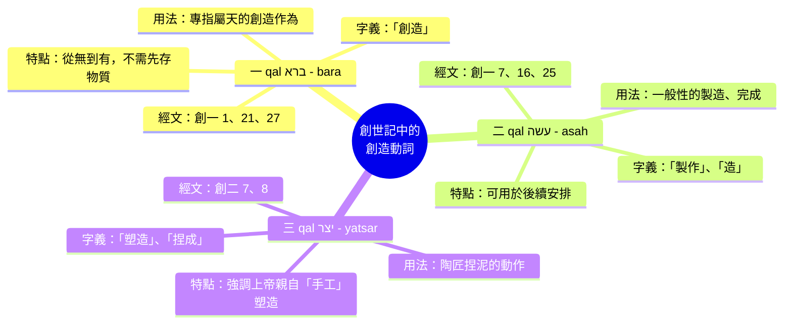

> **CBOL 註釋**：創世記使用了三個不同的「創造」原文詞彙。SH 1254 (bara) 字意為「型塑，製作，創造」，都指屬天的作為，在創一使用於 1:1、21、27。此用語本身並不排除已有物質的使用，但創 1:1 表示上帝的創造是從無開始的。

### 3.2 「耶和華上帝」（YHWH Elohim）神名轉換的意義

創世記第二章第 4 節是 **「耶和華」（YHWH）** 名稱在聖經中的首次出現。關鍵觀察：

| 章節 | 使用的神名 | 神學意義 |
|---|---|---|
| 創一 1–二 3 | **Elohim（上帝）** | 凸顯上帝超越性的創造大能 |
| 創二 4 起 | **YHWH Elohim（耶和華上帝）** | 凸顯上帝與人立約、親密臨在的關係 |

- **「耶和華」（YHWH）** 是獨一真神的立約專有名稱，字根與動詞「存在」相關（出三 14「我是自有永有的」）。真正發音（不詳），學界多認為是「Yahweh 雅威」。
- **「耶和華上帝」** 此複合名稱在 2:4–3:24 共出現 21 次，強調創造萬物的上帝正是與人立約、施行救贖的上帝。
- **福音派立場**：神名的轉換不是不同文獻來源的矛盾證據，而是同一作者在同一敘事中有意運用神學修辭——先用 Elohim 凸顯創造的威嚴，後用 YHWH Elohim 凸顯創造主與人的親密關係。

### 3.3 「人／亞當」（אָדָם）與「土地」（אֲדָמָה）的文字遊戲

這是創世記第二章最重要的希伯來文學技巧之一：

| 希伯來文 | 發音 | 中文翻譯 | 關係 |
|---|---|---|---|
| **אָדָם** | adam | 人／亞當（紅土） | 陽性名詞 |
| **אֲדָמָה** | adamah | 土地／塵土 | 陰性名詞 |

> 「耶和華上帝用 **地上的塵土（adamah）** 造 **人（adam）**」

**神學意義**：

1. **本質上的關聯**：人受造與土地密不可分——人是從土地而出的受造之物。
2. **謙卑的基礎**：保羅在林前十五 47 引申此意：「頭一個人是出於地，是用塵土造的」。
3. **職責的連結**：人受託「耕耘、看管」土地，人要對土地負責。人與上帝的關係、人與土地的關係交織在一起。
4. **福音派立場**：這不僅是文學修辭，更揭示了人性本質的重要神學真理——人既是塵土所造（有物質有限性），又承受了上帝的生命之氣（有超越性），構成聖經人觀的張力結構。

### 3.4 「有靈的活人」（נֶפֶשׁ חַיָּה / nephesh chayyah）

| 經節 | 原文 | 中文 | 註解 |
|---|---|---|---|
| 創二 7 | נֶפֶשׁ חַיָּה | 有靈的活人／活的靈魂 | 直譯「活的靈魂」 |
| 創一 21,24 | נֶפֶשׁ חַיָּה | 有生命的動物 | 同一詞組用於動物 |

**關鍵神學區別**：

- 動物也被稱為 **נֶפֶשׁ חַיָּה**「活的靈魂」，但聖經從未說動物是「照上帝的形像」造的，也未說動物要向上帝交帳。
- 人與動物共用 **nephesh** 一詞表明：人是「有身體的靈魂」也是「有靈魂的身體」**整體性**的人觀，反對二元論將靈魂與身體割裂。
- 人超越動物的根本原因不在於擁有某種「不朽的靈魂」，而在於人是 **照上帝的形像** 被造（創一 26–27）。第二章從「塵土＋氣息」的角度補充說明人的來源，第一章從「形像」角度說明人的尊貴。

### 3.5 「幫助」（עֵזֶר / ezer）的真正含義——顛覆性的神學詞彙

| 希伯來文 | 發音 | 中文 | 舊約中使用情況 |
|---|---|---|---|
| **עֵזֶר** | ezer | 幫助／幫助者 | 全舊約出現 21 次 |

> 創二 18：「那人單獨一個不好，我要為他造一個配偶 **幫助** 他。」

**重要的神學觀察**：

- **עֵזֶר (ezer)** 在舊約中最常用來描述上帝對人的幫助（如詩篇中的「上帝是我們的避難所和力量，是我們患難中隨時的幫助」）。
- 此詞 **絕對不含有「次要的」、「附屬的」、「次等的」** 含義。
- 相反地，ezer 強調的是「補足所缺乏的」、「有能力的援助者」。

**福音派立場**：

夏娃作為「幫助者」不是地位低下的標誌，而是 **角色互補、彼此成全** 的標誌。正如一位解經家所言：如果聖經用同一個詞（ezer）來形容上帝對人的幫助，那麼這個詞不可能貶低夏娃的地位。創世記第二章對女人的描述，不是要建立「男性優越」的等級制度，而是要建立「平等互補」的夥伴關係。

## 四、方法三：神學主題歸納

### 4.1 安息的神學意義（創二 1–3）

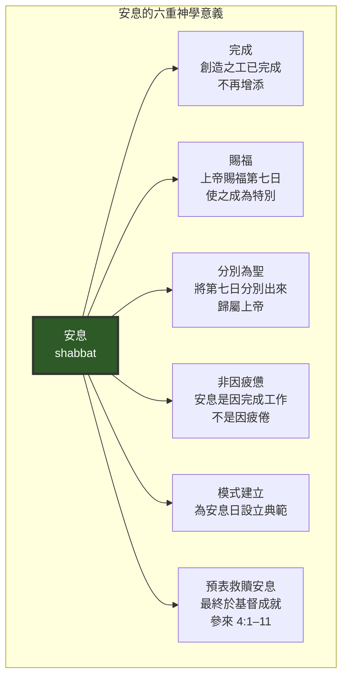

**福音派核心立場**：

- 上帝的安息 **不是因為疲倦**（賽四十 28 說上帝「並不疲乏，也不困倦」），而是因為創造之工 **已經完成**，不再需要增添。
- 四誡中引用創世記第二章作為守安息日的根據（出二十 11），表明安息日是創造秩序的內在組成部分。
- 希伯來書（四 1–11）進一步將安息解釋為 **上帝救贖工作的預表**——人因信進入基督裡的安息。耶穌也說「我父作事直到如今，我也作事」（約五 17），表明上帝的護理之工從未停止。
- **福音派立場**：安息日的設立不是出於文化相對性，而是根植於創造本身的秩序。因此，安息原則對所有時代的所有人都有規範性意義（雖然具體的守日形式在聖經中有發展）。

### 4.2 人的三層本質（創二 7）

創世記第二章第 7 節揭示人的構成：

| 構成要素 | 來源 | 聖經根據 | 神學意義 |
|---|---|---|---|
| 塵土（身體） | 地上的塵土 | 創二 7「用地上的塵土造人」 | 人與受造世界的連結；有限性 |
| 生命氣息（靈） | 上帝的鼻孔 | 創二 7「將生命之氣吹進他的鼻孔」 | 人與上帝的直接連結 |
| 活的靈魂（整體） | 兩者結合 | 創二 7「成了有靈的活人」 | 人是完整的「靈魂體」整體 |

**福音派立場**：

> 「人的身體是從細小的塵土形成的（人和土的希伯來文很相似；比較林前十五 47），但人的生命卻是從神的呼氣而成。『有靈的活人』直譯作活的靈魂。這短語也用來指動物（一 21、24）。人與動物的分別在於人類是按神的形像來造的。」

- 此處揭示人的 **二重來源**：地上的塵土（物質來源）和上帝的氣息（生命來源）。
- 人的尊嚴不在於不朽的靈魂，而在於兩者結合後構成的 **完整人性** 以及 **上帝形像** 的賦予。
- **福音派立場**：這經文直接抵制任何貶低身體的諾斯底主義二元論，也抵制任何否定靈魂超越性的唯物主義。基督教人類學必須保持塵土與氣息、有限性與超越性的平衡。

### 4.3 工作與治理的神聖性（創二 15，19–20）

創世記第二章賦予人三項神聖職責：

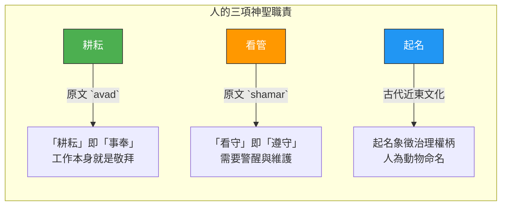

**關鍵觀察**：

1. **耕耘 = 事奉**：希伯來文 `avad` 兼具 **「工作」與「敬拜」** 雙重含義——人的日常工作本身就是對上帝的事奉。
2. **伊甸園不是休閒場所**：上帝創造人之後立即賦予使命——「耕耘看管」。工作是上帝賜予的尊嚴，而不是罪的咒詛（咒詛是工作的艱辛，不是工作本身）。
3. **「文化使命」的基礎**：神學家常稱創一 28 的命令為「文化使命」——人有責任開發大地潛能，建立文明。
4. **從伊甸園到全地**：亞當和夏娃被呼召將伊甸園的模式推展到全地——將整個地球變為上帝的園子。
5. **人類是上帝的園丁**：人類的本質身份是「園丁」——受託管理、維護、發展上帝所創造的世界。

### 4.4 婚姻的神聖設立（創二 18–25）

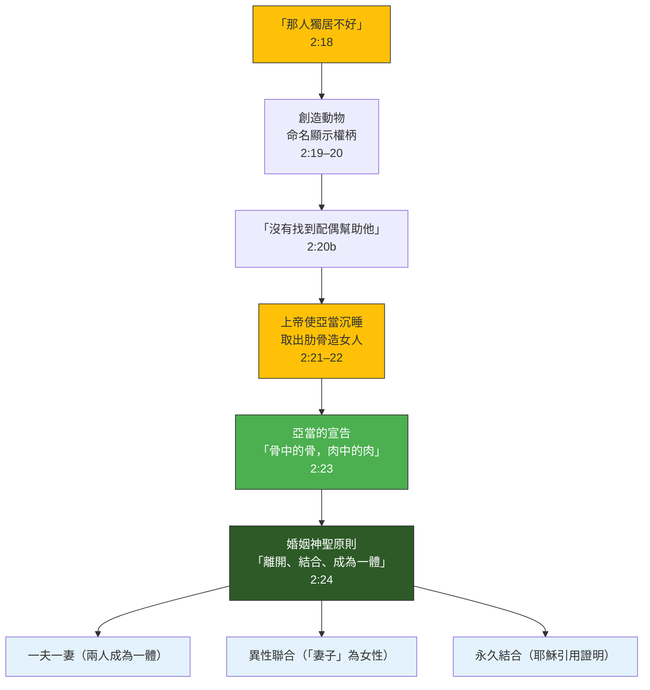

**創二 24 的三項婚姻神聖原則**（耶穌在太十九 4–6 引用並確認）：

| 原則 | 內容 | 聖經根據 |
|---|---|---|
| **離開** | 人應脫離對父母的依賴，建立新的核心家庭 | 創二 24「人要離開父母」 |
| **結合** | 與妻子在盟約中「結合/連合」 | 創二 24「與妻子結合」 |
| **成為一體** | 反映夫妻在肉體、情感、靈性上的完全合一 | 創二 24「二人成為一體」 |

**福音派核心立場**：

- 婚姻由上帝親自設立，不是人類文化的產物。
- 婚姻的定義是 **一男一女、一夫一妻、一生一世** 的盟約關係。
- 耶穌引用創二 24 時補充「上帝所配合的，人不可分開」（可十 9），確立婚姻的永久性（除淫亂緣故外，太十九 9）。
- 保羅在以弗所書五 22–33 引用創二 24，並將其應用在基督與教會的關係上——婚姻是「極大的奧祕」。

### 4.5 神學主題總結對照表

| 神學主題 | 經文出處 | 核心信息 | 福音派立場 |
|---|---|---|---|
| 安息（Sabbath Rest） | 2:1–3 | 創造完成，上帝安息；人效法上帝進入安息 | 安息日根植於創造秩序，預表基督裡的救贖安息 |
| 人的尊貴與有限 | 2:7 | 塵土＋上帝的氣息 = 人 | 人既有塵土的有限性，又有氣息的超越性 |
| 工作（Work） | 2:15 | 耕耘看管是上帝賜予的使命 | 工作本身是敬拜，墮落前已有工作 |
| 婚姻（Marriage） | 2:24 | 一男一女、一夫一妻、一生一世的盟約 | 上帝設立，基督確認，不得更改 |
| 人的孤獨與關係 | 2:18 | 「那人獨居不好」 | 人被造是為關係——人與上帝、人與人 |
| 順服與考驗 | 2:16–17 | 禁果命令：順服帶來生命，悖逆帶來死亡 | 神給人自由意志，人須為自己的選擇負責 |
| 伊甸園（Eden） | 2:8–15 | 上帝預備完美的環境 | 伊甸是真實地點（不詳），受苦不是神的本意 |

## 五、方法四：考古歷史考證

### 5.1 伊甸園與四河的地理考證

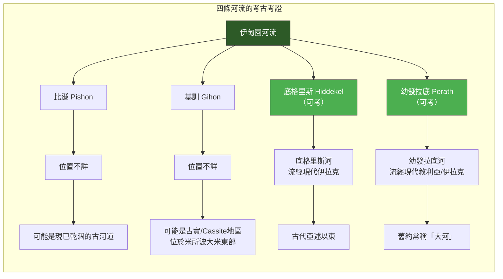

**重要觀察**：

- 底格里斯河與幼發拉底河至今存在於中東地區， **考古與歷史學可以確認**，這兩條河流的名稱在數千年間保持延續。
- 比遜與基訓的確切位置 **（不詳）** ，學者提出多種假設（包括波斯灣附近、亞美尼亞地區、以及洪水後地形改變等）。
- 洪水（創六–九）的全球性災難可能已徹底改變原有地形地貌，這是後世難以追蹤伊甸園確切位置的主要原因。

### 5.2 創世記第二章的地理可靠性的考古支持

**命名傳統的延續**：

| 河流名稱 | 古代名稱 | 現代名稱 | 名稱延續證據 |
|---|---|---|---|
| 底格里斯 | Idiglat（亞喀得文） | Tigris | 亞述王提革拉毗列色一世的碑文 |
| 幼發拉底 | Purattu（楔形文字） | Euphrates/al-Furāt | 埃及行禮詛咒經文（約主前 1850 年） |

> Genesis 2:14 grounds the Garden of Eden in a real landscape by naming four waterways … The survival of Hiddekel/Tigris and Euphrates across languages and empires testifies that the Genesis description is tied to concrete, enduring geography.

**福音派立場**：

- 聖經對地理的描述 **不是神話性的發明**，而是基於古代近東真實的地理知識。
- 四河名稱跨越數千年仍可追溯，證實創世記作者的歷史可靠度。
- 伊甸園是否曾被考古學「證實」位置 **（不詳）** ，但這不影響其歷史真實性——洪水前的地形可能已經無法恢復。

### 5.3 農業考古與創二 5 的印證

創二 5 記載在人類被造之前，田間的植物尚未長出來，因為沒有人耕種。

**考古發現**：

- 主前 7000 年左右，生活在伊拉克東北部地區的人們已種植小麥、大麥及各種豆類。
- 卡托·胡玉克（Çatal Höyük）古城年代可追溯至約主前 8000 年，發現糧倉、研缽、磨石等農業設施。
- 耶利哥城發掘證明農民主前數千年已種植豆科作物。

**福音派立場**：創二 5 的記述與考古發現並不矛盾，它準確地反映了「耕種農業」需要人的主動參與——植物可以野生生長，但耕種的農作物需要人工。這節經文不是科學錯誤，而是精確的農業觀察。

### 5.4 洪水與伊甸園位置之爭

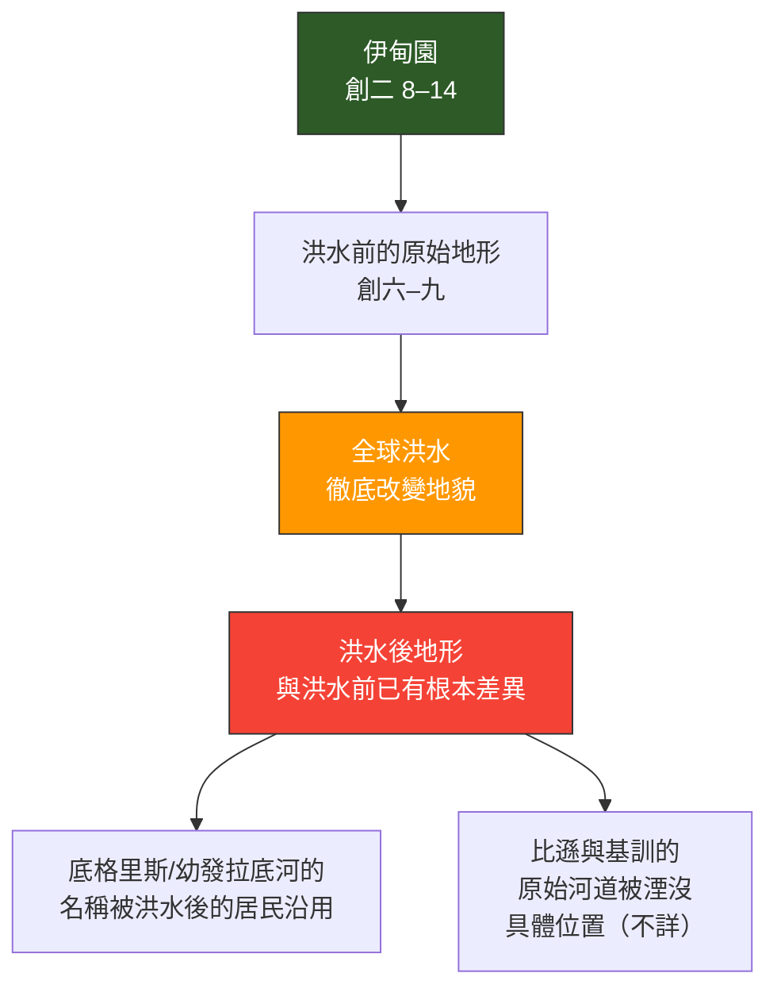

**洪水後遺留的問題**：

- 若接受全球洪水的歷史真實性，洪水後的河道結構與洪水前可能已有根本改變。
- 底格里斯與幼發拉底河的名稱能夠延續下來，可能是因為洪水後的居民將古代名稱沿用於洪水後的主要水道。
- 比遜與基訓的位置無法確定 **（不詳）** ，正是因為洪水後的河道已無法與洪水前的原始河道對應。

## 六、方法五：預表與解經

### 6.1 預表解經圖解

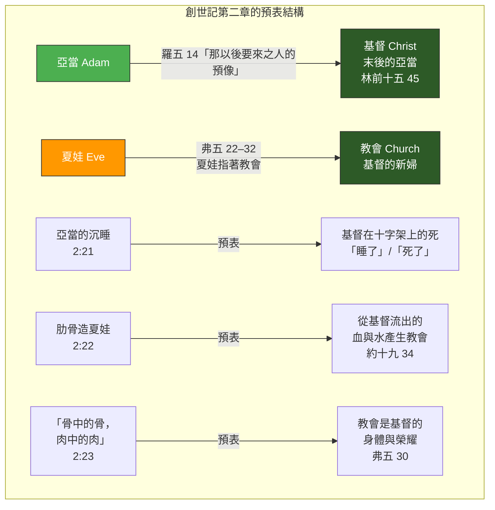

### 6.2 亞當預表基督

| 比較 | 亞當 | 基督（末後的亞當） | 聖經根據 |
|---|---|---|---|
| 身分 | 首先的人 | 第二個人／末後的亞當 | 林前十五 45–47 |
| 來源 | 出於地，用塵土所造 | 出於天 | 林前十五 47 |
| 行動 | 帶來死亡（因悖逆） | 帶來生命（因順服） | 羅五 12–19 |
| 對人類的影響 | 眾人都死了 | 眾人都要復活 | 林前十五 22 |

> 倪柝聲：「在創世記二章，神仔細的題起創造女人的事。到以弗所五章，就說夏娃是指著教會說的。由此可見神永遠的旨意，一部分是藉著基督成功的，另一部分是藉著教會成功的。」

### 6.3 夏娃預表教會

| 比較 | 夏娃（創二 18–23） | 教會（弗五 22–32） |
|---|---|---|
| 來源 | 從亞當的肋骨而出 | 從基督的傷肋（血與水）而出 |
| 關係 | 「幫助者／配偶」 | 基督的幫助者／新婦 |
| 合一 | 「骨中的骨，肉中的肉」 | 基督的身體與榮耀 |
| 目的 | 與亞當一同治理 | 與基督一同掌權 |
| 被造時間 | 亞當之後 | 基督復活升天後（五旬節） |

> 倪柝聲：「神造亞當預表基督，神又造夏娃預表教會。神的目的不只需要基督來成功，並且也需要教會來成功。」

### 6.4 「沉睡」的預表神學

亞當在上帝使他 **沉睡（創二 21）** 時，肋骨被取出用以造夏娃。新約神學將此理解為 **基督之死的預表**：

- **亞當的沉睡** → 預表 → **基督在十字架上的死**（「睡了」在聖經中常用以指信徒的死）
- **從亞當的肋旁取出肋骨** → 預表 → **從基督的肋旁流出血和水**（約十九 34）
- **造出夏娃** → 預表 → **教會從基督的犧牲中誕生**

### 6.5 預表解經的平衡與限制

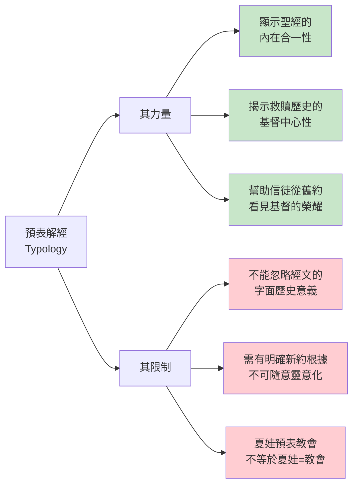

**福音派核心立場**：

創世記第二章的預表解經（typology）是 **建立在明確的新約基礎** 之上（羅五 14；林前十五 45–49；弗五 22–32）。新約作者在聖靈的默示下，揭示舊約中隱藏的基督與救贖的預表意義。然而，預表不能取代經文的字面歷史意義：

- 亞當是真實的歷史人物，不僅僅是基督的「文學預表」。
- 夏娃是真實的歷史女性，不僅僅是教會的「文學預表」。
- 預表是 **歷史事件本身的超越性意義**，不是將經文靈意化。

> 倪柝聲提醒：「我們在這裡所注意的，不是基督的工作，乃是教會在這個工作裡，當站在甚麼地位上。」預表解經不是要取代歷史解經，而是要揭示神在歷史事件中所預備的更深的救贖意義。

## 七、綜合結論（福音派立場摘要）

### 7.1 關於創造記錄

創世記第一章與第二章不是矛盾的兩個創造記錄，而是同一歷史事件的 **兩個互補視角**——第一章以「超越性」的筆觸從宇宙的角度描述創造的全貌，第二章以「臨在性」的筆觸從人的角度聚焦伊甸園和人的被造。兩者皆為真實歷史記錄，共同構成一致的救贖歷史敘事。

### 7.2 關於人的本質

人的構成包含「地上的塵土」和「上帝的氣息」——這表明人既有物質世界的有限性（塵土），又有屬靈存在的超越性（氣息）。人的尊嚴不在於不朽的靈魂，而在於上帝親自呼氣進入人裡面，並且人是照上帝形像而造（創一 26–27）。養生與靈命、物質與精神在聖經人觀中不可分割。

### 7.3 關於婚姻

婚姻由上帝親自設立，創二 24 所啟示的三項原則是神聖、永恆且普世的：人要離開父母（建立新家庭）、與妻子連合（盟約的承諾）、二人成為一體（全人的合一）。耶穌在新約引用並確認了這些原則（太十九 4–6）。教會必須按照聖經的標準宣講婚姻——一男一女、一夫一妻、一生一世。

### 7.4 關於工作與使命

工作不是罪的咒詛，而是上帝在創造之初就賦予人的神聖使命。創二 15 的「耕耘看管」既揭示工作的尊嚴（耕耘 = 事奉），也揭示人的管理責任（看管 = 治理）。這是「文化使命」的基礎——人受託開發大地的潛能、建立文明、榮耀上帝。

### 7.5 關於預表與基督

新約作者在聖靈默示下揭示，創世記第二章包含基督與教會的深層預表。亞當是「末後的亞當」——基督的預像（羅五 14）。夏娃在神永遠的旨意中預表教會（弗五 22–32）。亞當的沉睡預表基督的死，從亞當肋旁取出肋骨造夏娃預表基督的肋旁流出水與血而產生教會。這些預表顯示聖經的內在合一與基督中心的救贖歷史。

### 7.6 關於歷史可靠性

聖經對地理（伊甸園四河）的描述不是神話性的發明，而是基於古代近東真實的地理知識——底格里斯與幼發拉底兩大河的名稱在數千年間延續不斷，有考古與文獻佐證。創世記作者對農業起源的描述準確地反映「耕種農業需要人參與」的事實。因此，從福音派立場而言，創世記第二章應被接受為 **真實、可靠、無謬的歷史記錄**。

---

> **報告完畢**｜研經方法：文本結構分析、原文詞彙研究、神學主題歸納、考古歷史考證、預表解經｜立場：基督教福音派