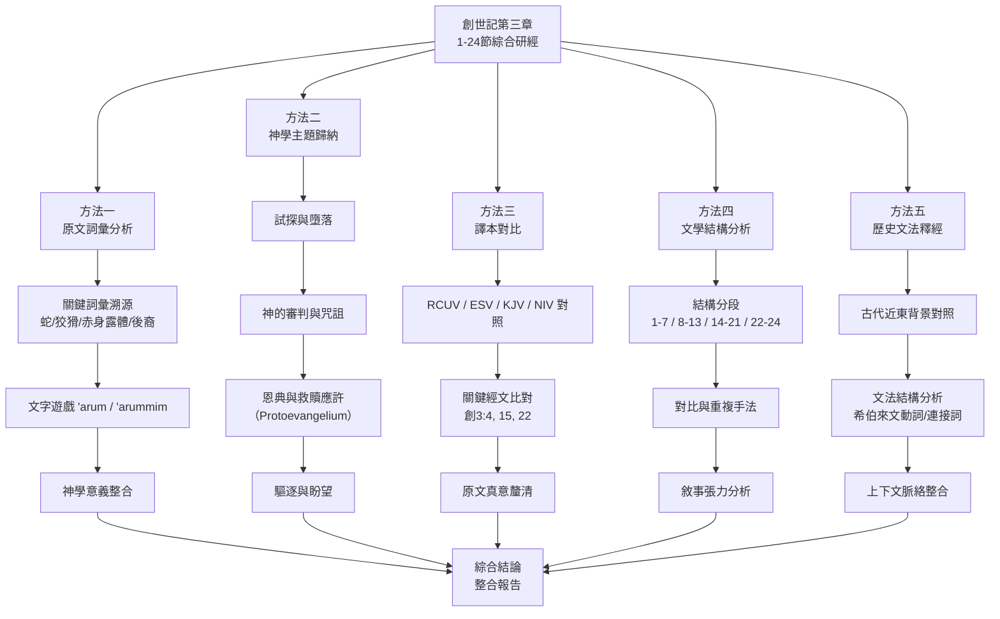
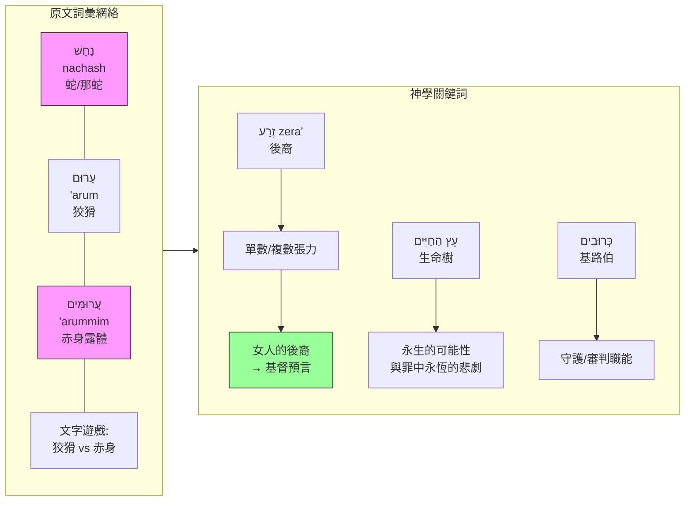
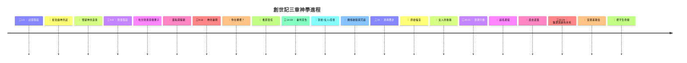
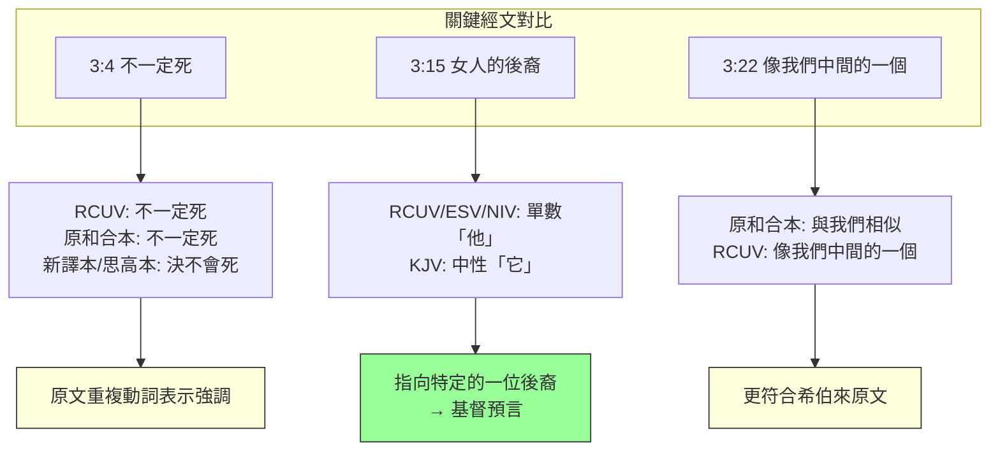
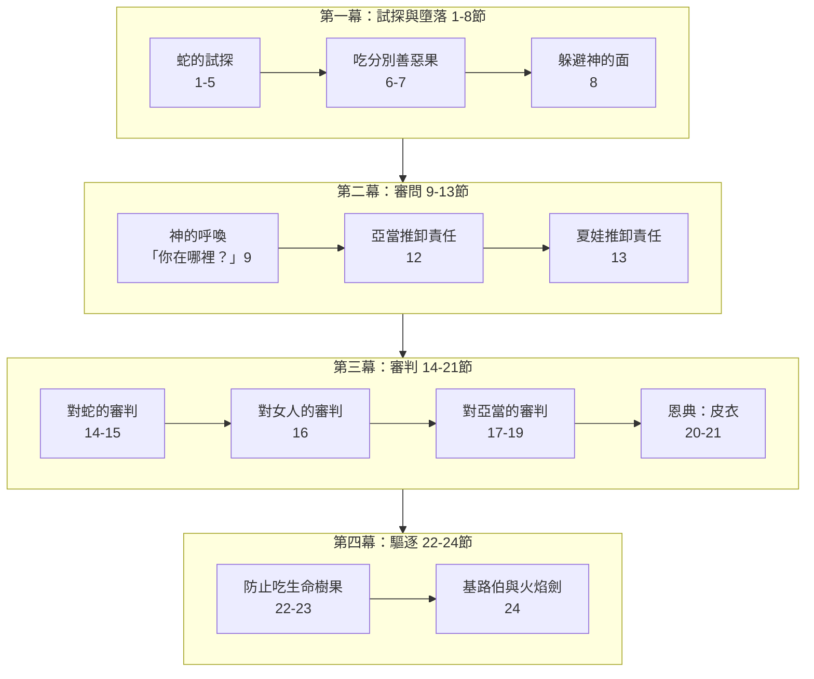
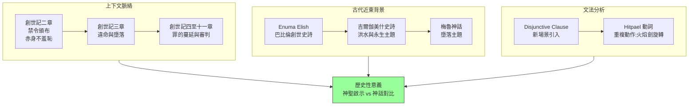

# 創世記三章一至二十四節綜合研經整理報告

## 研經方法建議

在進行創世記三章一至二十四節的綜合研經之前，建議採用以下五種研經方法，以確保從不同角度全面理解這段關鍵經文：

1. **原文詞彙分析法**：追溯希伯來原文關鍵詞彙的涵義、文字遊戲及神學意義
2. **神學主題歸納法**：歸納經文中呈現的核心神學主題，包括墮落、審判、恩典與救贖應許
3. **譯本對比法**：比較不同中文及英文譯本的翻譯差異，洞察原文真意
4. **文學結構分析法**：分析經文的敘事結構、對比手法及修辭技巧
5. **歷史文法釋經法**：結合歷史背景、文法分析及上下文脈絡作嚴謹釋經

以下是五種研經方法的流程圖示：

---

## 方法一：原文詞彙分析法

### 分析建議

從希伯來原文入手，追溯關鍵詞彙的原始涵義，特別注意文字遊戲和詞彙關聯，這些往往是理解經文深層信息的線索。

### 整理結果

#### 1.1 蛇（נָחָשׁ / nachash）

希伯來文נָחָשׁ（nachash）原文前有冠詞，表示是特定的「**那蛇**」，而不是一般的蛇類。此字根（נָחַשׁ）也有「占卜」的意思。新約聖經明確指出這蛇背後的勢力就是撒但（啟示錄十二章九節、二十章二節）。

#### 1.2 狡猾／精明（עָרוּם / 'arum）

עָרוּם（'arum）在希伯來文中可作正面用法（如箴言十四章八節的「精明」），也可作負面用法（如約伯記五章十二節）。此詞與創世記二章二十五節的「赤身露體」（עֲרוּמִּים / 'arummim）**構成精妙的文字遊戲**——亞當和夏娃是「赤身」（裸露、沒有防備）的，蛇卻是「狡猾」（善於欺騙、算計）的。

#### 1.3 赤身露體（עָרוֹם / arom 及 עֲרוּמִּים / 'arummim）

創世記二章二十五節記載「當時夫妻二人赤身露體，並不羞恥」，用了עֲרוּמִּים（'arummim）。到了三章七節，吃了果子之後，「他們二人的眼睛就開了，知道自己赤身露體」，同一組詞語出現了，但意義完全改變——此前是純真無羞恥的赤身，此後是帶著羞恥與恐懼的赤身。文字遊戲將「蛇的狡猾」與「人類的赤身」（不詳）串聯起來，暗示人類因蛇的狡猾而陷入赤身羞恥的狀態。

#### 1.4 後裔（זֶרַע / zera'）

創世記三章十五節的「後裔」原文זֶרַע（zera'）可指單數「一個後裔」，也可指複數「眾後裔」。**福音派傳統一貫理解此處的「女人的後裔」為單數，預指基督**——祂要傷蛇的頭（致命一擊），而蛇要傷祂的腳跟（非致命的傷害，預表十字架的苦難）。

#### 1.5 生命樹（עֵץ הַחַיִּים / 'etz hachayyim）

「生命樹」的希伯來原文直譯為「生命的樹」。第22節用「恐怕……」的句式（אֵין לְהוֹצִיא）說明神驅逐人的原因：不是出於嫉妒，而是因人在罪中若永遠活著，將落入永恆的悲慘狀態（即第二次的死）。

#### 1.6 基路伯（כְּרוּבִים / keruvim）與火焰轉動的劍（לַהַט הַחֶרֶב הַמִּתְהַפֶּכֶת / lahat hacherev hamit'hapechet）

基路伯是屬靈世界的活物，環繞神寶座，執行守護的職責。「火焰轉動的劍」原文為「刀的火焰，那旋轉的」（Hitpael分詞表示重複動作）——描繪劍在不斷旋轉，防備任何人接近生命樹。

### 經文對比與加強

| 原文詞彙 | RCUV翻譯 | 原文音譯 | 神學含義 |
|---|---|---|---|
| נָחָשׁ（NACHASH） | 蛇 | nachash | 特定的「那蛇」，後被識別為撒但 |
| עָרוּם（'ARUM） | 狡猾 | 'arum | 與「赤身」（'arummim）形成文字遊戲 |
| זֶרַע（ZERA'） | 後裔 | zera' | 可指單數，預表基督 |
| כְּרוּבִים（KERUVIM） | 基路伯 | keruvim | 守護類別的天使 |

### Mermaid 流程圖

---

## 方法二：神學主題歸納法

### 分析建議

將經文按神學主題歸類，梳理從試探、墮落、審判到救贖應許的完整神學脈絡。

### 整理結果

#### 2.1 試探的性質與策略（三1-5）

蛇的試探策略有三個層次：
- **扭曲神的話**：將「不可吃分別善惡樹的果子」扭曲為「不可吃園中任何樹上的果子」，誇大神命令的嚴格性
- **直接否定神的話**：「你們不一定死」，公然對抗神的明確警告
- **暗示神的動機不良**：暗示神保留好處不給人類，說「你們吃的日子眼睛就開了，你們就像上帝一樣知道善惡」

#### 2.2 墮落的步驟（三6-8）

人的墮落有三個步驟（參約翰壹書二章十六節）：
- **眼目的情慾**：「女人見那棵樹好作食物，又悅人的眼目」——肉體層面的吸引力
- **今生的驕傲**：「那樹令人喜愛，能使人有智慧」——想與神同等的驕傲
- **順從慾望行動**：「她就摘下果子吃了，又給了與她一起的丈夫，他也吃了」——行動落實

#### 2.3 審判的三重宣告（三14-19）

| 受審對象 | 審判內容 | 神學意義 |
|---|---|---|
| 蛇 | 終生吃土、用肚子行走、與女人彼此為仇 | 撒但的最終失敗 |
| 女人 | 加增懷胎痛苦、戀慕丈夫、丈夫管轄 | 家庭關係的扭曲 |
| 亞當 | 土地受咒詛、終生勞苦、歸回塵土 | 工作與死亡的臨到 |

#### 2.4 救贖的應許——原始福音（Protoevangelium）（三15）

三章十五節被稱為「**原始福音**」（Protoevangelium）——聖經中第一個救贖應許。福音派傳統認為：
- 「女人的後裔」指**耶穌基督**（由童女馬利亞所生）
- 「傷你的頭」指基督藉著十字架**徹底擊敗撒但**
- 「傷他的腳跟」指基督在十字架上**受苦**（非致命傷）

#### 2.5 神的恩典作為（三21）

「耶和華上帝用獸皮做衣服給亞當和他的妻子穿」——第一件皮衣需要**殺牲流血**才能製作，預表**贖罪需要流血的代價**。這是神主動施行的恩典，覆蓋人類的羞恥。

#### 2.6 驅逐與攔阻（三22-24）

神驅逐人出伊甸園的理由是：「恐怕他又伸手摘生命樹所出的來吃，就永遠活著」。**驅逐既是刑罰，也是恩典**——若人在罪中永遠活著，將落入永遠的痛苦（第二次的死）。基路伯與火焰劍安置在東邊，把守生命樹的道路。

### 經文對比與加強

---

## 方法三：譯本對比法

### 分析建議

比較不同譯本的翻譯差異，特別注意關鍵經文的翻譯，以便更精確地理解原文真意。

### 整理結果

#### 3.1 三章四節：「你們不一定死」的翻譯差異

| 譯本 | 翻譯 | 語氣強度 |
|---|---|---|
| RCUV（和合本修訂版） | 你們不一定死 | 中性 |
| 原和合本 | 你們不一定死 | 中性 |
| 新譯本 | 你們決不會死 | 強調否定 |
| 思高本 | 你們決不會死 | 強調否定 |
| 呂振中譯本 | 你一定不會死 | 強調否定 |
| REB（修訂英語聖經） | Of course you will not die | 強烈否定 |
| NAB（新美國聖經） | You certainly will not die | 強烈否定 |

希伯來原文由三個詞組成：H3808（不）+ 兩個H4191（死），通過重複動詞來表達強調「肯定不會死」。部分學者在原文標準化版本中認爲RCUV在此處未能充分反映原文的強調語氣（不詳）。

#### 3.2 三章十五節：「他」與「他們」

| 譯本 | 後裔的翻譯 | 性別／數量 |
|---|---|---|
| RCUV | 他要傷你的頭 | 單數陽性 |
| ESV | he shall bruise your head | 單數陽性 |
| KJV | it shall bruise thy head | 中性單數 |
| NIV | he will crush your head | 單數陽性 |

單數陽性代名詞「他」指向一位特定的後裔，這與福音派對**基督的預言性解釋**（不詳，有釋經支持）。

#### 3.3 三章二十二節：RCUV與原和合本的重要修訂

RCUV將原和合本「那人已經與我們相似，能知道善惡」修訂為「**看哪，那人已經像我們中間的一個，知道善惡**」。這一修訂更符合原文「像我們中間的一個」（不詳，有文本基礎），也可理解為暗示神格中的一位——聖子基督。

#### 3.4 三章八節：「涼風」的希伯來文原意

「天起了涼風」的希伯來原文可理解為「在日間的風中」或「在白晝的靈中行走」（不詳，有語義爭議）。

### 經文對比與加強

---

## 方法四：文學結構分析法

### 分析建議

按敘事結構分段，分析經文中的對比、重複與修辭手法。

### 整理結果

#### 4.1 整體結構（按傳統基督教文學史引述，參馬太·亨利注釋）

根據歷史釋經傳統，本章可分爲七個段落：

| 段落 | 經節 | 主題 | 關鍵事件 |
|---|---|---|---|
| I | 1-5 | 無罪者受試探 | 蛇與女人的對話 |
| II | 6-8 | 受試探者犯罪 | 吃果子、眼開、遮掩 |
| III | 9-10 | 犯罪者被提審 | 耶和華呼喚「你在哪裡？」 |
| IV | 11-13 | 定罪 | 審問亞當與夏娃 |
| V | 14-19 | 宣判 | 對蛇、女人、亞當的咒詛 |
| VI | 20-21 | 緩刑與恩典 | 起名夏娃、皮衣遮蓋 |
| VII | 22-24 | 部分執行刑罰 | 驅逐出伊甸園 |

#### 4.2 關鍵對比手法

| 比對項目 | 創世記第二章（墮落前） | 創世記第三章（墮落後） |
|---|---|---|
| 赤身露體 | 不羞恥（2:25） | 羞恥，用無花果葉遮蓋（3:7） |
| 與神的關係 | 親密同行（3:8a） | 躲避神的面（3:8b） |
| 人的回應 | 無需為自己辯護 | 推卸責任（3:12-13） |
| 土地 | 滋養人的祝福 | 長出荊棘蒺藜的咒詛（3:18） |
| 生命 | 永生潛能 | 死亡臨到（3:19） |

#### 4.3 重複修辭

- **「你在哪裡？」（三9）** ——神的主動尋回，不是因無知而問，而是為了讓人正視自己的處境
- **「誰告訴你……？」（三11）** ——神的追問顯明人已經獲得了不該有的知識
- **「你既做了這事……」（三14）** ——宣告咒詛的公式句式
- **三處審判以「耶和華上帝對……說」起首**：對蛇（14節）、對女人（16節）、對亞當（17節）

### Mermaid 結構圖

---

## 方法五：歷史文法釋經法

### 分析建議

結合作者的時代背景、古代近東文學平行文獻、文法結構及上下文脈絡進行綜合釋經。

### 整理結果

#### 5.1 歷史背景：古代近東的平行文獻

創世記的創造及墮落敘事在古代近東文化中並非孤立。美索不達米亞的創世史詩《埃努瑪埃利什》（Enuma Elish）及有關人類受造的記載，為理解創世記提供了重要的文化背景。創世記第三章與其他古代傳統：

- 與梅魯神話中從完美狀態墮落的敘述有相似結構（不詳）
- 潘朵拉故事以「希望」結尾，一如創世記三章十五節的救贖應許（不詳）
- 兩河流域亦有「生命之樹」概念，與創世記中的生命樹和分別善惡樹形成**對照而非雷同**

#### 5.2 關鍵文法分析

**希伯來文動詞的時態與語態**：
- 三章一節的 disjunctive clause（連接詞+主語+謂語）標誌著新場景和新角色的引入
- 三章二十四節的וַיְגָרֶשׁ（驅逐）完成式，接續וַיַּשְׁכֵּן（安設），描述一系列已完成的神聖行動
- Hitpael 強化主動語態「תִּתְהַפֵּךְ」（旋轉）表達重複動作——「火焰轉動的劍」不斷旋轉，保護生命樹

#### 5.3 上下文連貫性

創世記第三章與上下文的連貫：

- **前言（第二章）** ：禁命令的頒布（二16-17），夫妻赤身露體不羞恥（二25）
- **第三章**：禁命令的違反與後果
- **後續（第四至十一章）** ：罪惡的蔓延——該隱殺亞伯（四章）、拉麥的暴力（四23-24）、洪水審判（六至九章）、巴別塔（十一章）

#### 5.4 伊甸園的歷史性問題

從福音派立場看，創世記三章一至七節的記載是**歷史性的**，而非寓意或神話。根據聖經內證和聖經外證，有以下理由：

1. 記載是平鋪直敘的事實，沒有非歷史性的暗示或暗喻
2. 聖經其他作者視創世記為真實歷史並詳加引證
3. 主耶穌承認其歷史性並加以引證（約翰福音八章四十四節）
4. 使徒保羅將墮落視為歷史事實（羅馬書五章十二至十九節）

伊甸園作為一個真實的地理位置，因大洪水及地質變遷已不可考。

### Mermaid 背景關聯圖

---

## 綜合結論

創世記三章一至二十四節是聖經神學的基石之一。從本次研經可以得出以下幾個重要結論：

1. **墮落的真實性**：從歷史文法與原文分析，墮落應被視為真實發生的歷史事件，而非寓言之作。這是理解全本聖經救贖敘事的起點。

2. **罪的根源**：墮落的根本在於不信——人選擇相信蛇的話而非神的話。試探的策略從扭曲神的話語開始，最終引向對神的公然背叛。

3. **神的公義與恩典並行**：神宣告咒詛（體現公義）的同時，立即賜下救贖應許（體現恩典）。三章十五節的「原始福音」貫穿整本聖經，指向最終在基督裡的成全。

4. **人類關係的四重斷裂**：人與神的關係（躲避）、人與自己的關係（羞恥）、人與他人的關係（推卸責任）、人與自然的關係（土地受咒詛）全面破裂。

5. **驅逐中的憐憫**：神驅逐人離開伊甸園及生命樹，既是刑罰也是憐憫——避免人在罪中永遠活著。這預示了神最終要在新天新地中恢復生命樹，賜給蒙救贖的人吃（啟示錄二十二章二節）。

6. **指向基督**：從原文詞彙分析到神學主題歸納，創世記三章的每一處都在指向那位將要來的「女人的後裔」——耶穌基督。祂是第二個亞當，藉著十字架的死擊碎撒但的頭，並為所有信靠祂的人打開通往生命樹的道路。

正如《海德堡要理問答》所說：我們原本的愁苦，以及我們如何得救，都從創世記第三章開始得到解釋。研讀這章經文，就是研讀人類問題的根源與神救贖計劃的起點。