# 創世記第4章（RCUV）綜合研經整理報告


## 報告摘要

本報告以歸納式研經法為主軸，輔以敘事分析、字詞研究、神學主題歸納、文學結構分析、歷史文化背景考察及新約印證等多種研經方法，對創世記4：1–26（RCUV）進行系統性整理。全卷記載了人類墮落後的第一宗謀殺案，同時展現了神的公義與憐憫、罪惡的蔓延與神的救贖恩典。

> **註** 本報告採用「嚴謹經文對比版」：原文出處為**RCUV和合本修訂版（2010）**。對照譯本包括KJV、ESV、NET、NIV。若某項資料未能確定來源，將以「（不詳）」標示。


## 📖 第一章　經文展示（創世記 4：1–26 RCUV）

> 1 那人和他妻子夏娃同房，夏娃就懷孕，生了該隱，她說：「我靠耶和華得了一個男的。」 2 她又生了該隱的弟弟亞伯。亞伯是牧羊的；該隱是耕地的。 3 過了一些日子，該隱拿地裏的出產為供物獻給耶和華； 4 亞伯也把他羊群中頭生的和羊的脂肪獻上。耶和華看中了亞伯和他的供物， 5 卻看不中該隱和他的供物。該隱就非常生氣，沉下臉來。 6 耶和華對該隱說：「你為甚麼生氣呢？你為甚麼沉下臉來呢？ 7 你若做得對，豈不仰起頭來嗎？你若做得不對，罪就伏在門前。它想要控制你，你卻要制伏它。」 8 該隱與他弟弟亞伯說話。二人正在田間時，該隱起來攻擊他弟弟亞伯，把他殺了。 9 耶和華對該隱說：「你弟弟亞伯在哪裏？」他說：「我不知道！我豈是看守我弟弟的嗎？」 10 耶和華說：「你做了甚麼事呢？你弟弟血的聲音從地裏向我哀號。 11 現在你必從這地受詛咒，這地開了口，從你手裏接受你弟弟的血。 12 你耕種土地，它不再給你效力；你必流離飄蕩在地上。」 13 該隱對耶和華說：「我的懲罰太重，過於我所能承當的。 14 看哪，今日你趕我離開這塊土地，不能見你的面；我必流離飄蕩在地上，凡遇見我的必殺我。」 15 耶和華對他說：「既然如此，凡殺該隱的，必遭報七倍。」耶和華就給該隱立一個記號，免得人遇見他就殺他。 16 於是該隱離開了耶和華的面，去住在伊甸東邊挪得之地。 17 該隱與妻子同房，她就懷孕，生了以諾。該隱建造一座城，就照他兒子的名字稱那城為以諾。 18 以諾生以拿，以拿生米戶雅利，米戶雅利生瑪土撒利，瑪土撒利生拉麥。 19 拉麥娶了兩個妻子：一個名叫亞大，一個名叫洗拉。 20 亞大生雅八；雅八是住帳棚、牧養牲畜之人的祖師。 21 雅八的兄弟名叫猶八；他是所有彈琴吹簫之人的祖師。 22 洗拉又生了土八‧該隱；他是打造各樣銅器鐵器的工匠。土八‧該隱的妹妹是拿瑪。 23 拉麥對他兩個妻子說：亞大、洗拉啊，聽我的聲音；拉麥的妻子啊，側耳聽我的言語：大人傷我，我把他殺了；小孩損我，我把他害了。 24 若殺該隱，遭報七倍，殺拉麥的，必遭報七十七倍。 25 亞當又與妻子同房，她就生了一個兒子，給他起名叫塞特，說：「上帝給我立了另一個子嗣代替亞伯，因為該隱殺了他。」 26 塞特也生了一個兒子，起名叫以挪士。那時候，人開始求告耶和華的名。


## 🔍 第二章　綜合研經方法建議與流程

本報告採用**多重視角研經法**，共分七大方法：

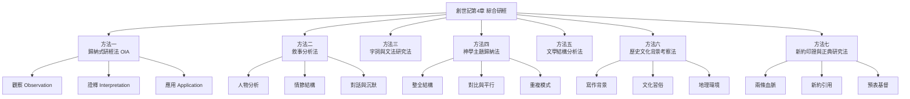


## 第一章　方法一：歸納式研經法（OIA）

### 概述

歸納式研經法是福音派教會的主流研經方法，開創於十九世紀末，又稱「OIA」法，即**觀察（Observation）、詮釋（Interpretation）和應用（Application）**。

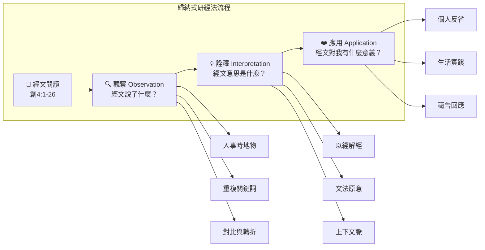


### 第一節　觀察（Observation）

#### ❶　人物
- **主要人物**：該隱（長子，農夫）、亞伯（次子，牧羊人）
- **神聖人物**：耶和華（對該隱說話、審問、懲罰、保護）
- **次要人物**：夏娃（母親）、亞當（父親）、該隱的妻子（姓名不詳）、以諾（該隱之子）、拉麥（該隱第六代孫）、亞大與洗拉（拉麥之妻）、雅八、猶八、土八‧該隱、拿瑪、塞特（亞當第三子）、以挪士（塞特之子）

#### ❷　時間
- 「過了一些日子」（4：3）
- 該隱殺亞伯後，經審判、放逐、結婚、生子、建城、繁衍數代
- 亞當在亞伯被殺後又生塞特（4：25）
- 「那時候，人開始求告耶和華的名」（4：26）

#### ❸　地點
- 田間（4：8）——該隱殺亞伯之處
- 伊甸東邊挪得之地（4：16）——該隱被放逐之地
- 以諾城（4：17）——人類第一座城

#### ❹　事件序列
```mermaid
timeline
    title 創世記第4章事件時序
    section 第一段 4:1-2
        該隱與亞伯誕生
        : 夏娃：「我靠耶和華得了一個男的」
        : 亞伯牧羊，該隱耕地
    section 第二段 4:3-5
        第一次獻祭
        : 該隱獻地裡出產
        : 亞伯獻頭生羊羔與脂油
        : 神悅納亞伯，拒絕該隱
    section 第三段 4:6-7
        神的警告
        : 神勸誡該隱
        : 「罪就伏在門前」
    section 第四段 4:8
        第一宗謀殺
        : 該隱在田間殺亞伯
    section 第五段 4:9-16
        神的審判與保護
        : 亞伯的血從地裡向神哀號
        : 該隱受咒詛，流離飄蕩
        : 神給該隱立記號保護他
    section 第六段 4:17-24
        該隱的後代與文明
        : 建城、畜牧、音樂、冶金
        : 拉麥的「復仇之歌」
    section 第七段 4:25-26
        敬虔的後裔
        : 塞特誕生
        : 人開始求告耶和華的名
```

#### ❺　關鍵詞／重複模式
| 關鍵詞彙 | 出現次數 | 意義與功能 |
|---------|---------|-----------|
| 該隱 | 14次 | 故事中心人物，名字與「獲得」相關 |
| 亞伯 | 9次 | 受害者，名字意為「虛空」 |
| 耶和華 | 11次 | 神的名，凸顯立約關係 |
| 獻／供物 | 5次 | 敬拜的核心行動 |
| 殺／殺害 | 5次 | 罪惡的高峰 |
| 地／土地 | 7次 | 咒詛的媒介 |
| 哀號／聲音 | 3次 | 公義的訴求 |
| 罪 | 2次 | 擬人化（伏在門前） |
| 知道／認識（同房） | 3次 | 夫妻關係與神人關係的雙關 |

#### ❻　經文結構
創世記第4章可清晰劃分為七個段落：
1. **4：1–2**　該隱與亞伯的誕生和職業
2. **4：3–5**　首次獻祭與神的不同回應
3. **4：6–7**　神對該隱的警告
4. **4：8**　該隱殺亞伯
5. **4：9–16**　神的審問、審判與保護
6. **4：17–24**　該隱後代與文明的發展
7. **4：25–26**　塞特的誕生與敬虔後裔的興起


### 第二節　詮釋（Interpretation）

#### ❶　核心問題與解答

**Q1：為何神悅納亞伯的供物而拒絕該隱的供物？**

> **詮釋** 經文本並未明說，但在神對該隱的警告中提示：「你若做得對，豈不仰起頭來嗎？」（4：7），暗示問題在於該隱的**行為與心態**。新約補充揭示：「亞伯因著信，獻祭與神，比該隱所獻的更美」（來11：4），且「該隱是屬那惡者」（約壹3：12）。再者，亞伯獻上「頭生的和脂油」——即最好的部分，該隱僅獻上「地裡的出產」——未強調最好的部分。福音派立場強調：**神先悅納人，再悅納供物**。該隱的問題根源於**不信的心和不正確的態度**，而非供物本身的類別。

**Q2：罪為何被描述為「伏在門前」？**

> **詮釋** 希伯來文 `chatta’ath` 可解作「罪」、「罪的刑罰」或「罪之祭」。此處罪被**擬人化**為一頭蹲伏在門前的野獸，伺機撲向人。神警告該隱，這猛獸「想要控制你」，但神賦予人責任與能力去「制伏它」——拒絕罪的轄制。這是聖經中**最早描繪屬靈爭戰**的經文之一。

**Q3：神為何給殺人犯該隱立記號保護他？**

> **詮釋** 看似矛盾的舉動，實則顯明神的憐憫與公義並存。神未免除該隱的刑罰（流離飄蕩），但禁止私刑報復（「凡殺該隱的，必遭報七倍」）。此舉同時防止罪惡在人類社會中如滾雪球般擴大，正如後來神為保護該隱而立記號。此外，該隱的記號不是為了羞辱，而是為了**保護**——表明神即使在審判中仍存留恩典。

**Q4：拉麥之歌（4：23–24）的意義為何？**

> **詮釋** 拉麥是聖經記載**第一個多妻者**，他向兩妻誇口復仇能力（「大人傷我，我把他殺了」），並歪曲神對該隱的保護（將七倍復仇膨脹為七十七倍）。拉麥之歌以詩歌體裁寫成（可能是最古老的希伯來詩歌），展現了罪惡的演進：從該隱的謀殺，到拉麥的**系統性暴力文化**。

#### ❷　人名／地名意義

按希伯來文原文字義整理：

| 名稱 | 希伯來文 | 意義 |
|------|---------|------|
| 該隱 | Qayin | 「得著」、「獲得」或「工匠」 |
| 亞伯 | Hebel | 「虛空」、「一口氣」 |
| 以諾 | Chanok | 「開始」、「奉獻」 |
| 以拿 | Irad | 「飛逝」 |
| 米戶雅利 | Mechujael| 「被神擊打」 |
| 瑪土撒利 | Methushael | 「屬於神的人」 |
| 拉麥 | Lemek | 「強而有力的」 |
| 亞大 | Adah | 「裝飾」 |
| 洗拉 | Zillah | 「影子」、「蔭蔽」 |
| 雅八 | Jabal | 「流動的」 |
| 猶八 | Jubal | （不詳，與「號角」同源） |
| 土八‧該隱 | Tuval-Qayin | （不詳，可能與「冶金者」相關） |
| 塞特 | Shet | 「立」、「代替」、「根基」 |
| 以挪士 | Enosh | 「軟弱的」、「必死的」 |
| 挪得 | Nod | 「流浪」、「飄蕩」 |

#### ❸　福音派立場的核心詮釋結論

**罪的本質與根源**：罪不是從環境來的，而是從人內心的不信與悖逆而來。夏娃被誘惑犯罪是一種情況（第3章），該隱則是**明知故犯、硬心抗拒**——連神親自勸誡都不能說服他脫離罪。罪已不再僅是外在行為，而是一種**內在勢力**——如猛獸般蹲伏在人心門前。

**敬拜的真諦**：神不看重祭物的多寡或種類，而看重**獻祭者的內心**。敬拜的焦點是神本身，而非人的表現。亞伯以信心獻上最好的，蒙神悅納；該隱以高傲的態度獻上出產，被神拒絕。

**神的屬性**：本卷充分展現神的**公義**（審判殺人犯該隱）、**憐憫**（給予警告與保護）與**恩典**（賜下塞特代替亞伯）。神並非遙遠的審判官，而是主動走近罪人，給予悔改機會的慈愛之神。


### 第三節　應用（Application）

- **反省內心的動機與心態**：我們是否像亞伯，以信心和感恩獻上最好的給神？還是像該隱，帶著不敬或勉強的態度敬拜？
- **防範罪的潛伏**：罪的勢力常在我們最不警覺時「蹲伏在門前」，需要靠主恩典制伏它，而非讓它支配我們的生活。
- **面對神的「為何」問題**：當神藉著聖靈或聖經向我們提問時，我們的回應如何？是像該隱心硬，還是像大衛一般認罪悔改？
- **拒絕報復文化**：拉麥的暴力誇耀與當代「以暴制暴」的心態相似。基督徒蒙召以善勝惡，而非陷入冤冤相報的循環。


## 第二章　方法二：敘事分析法

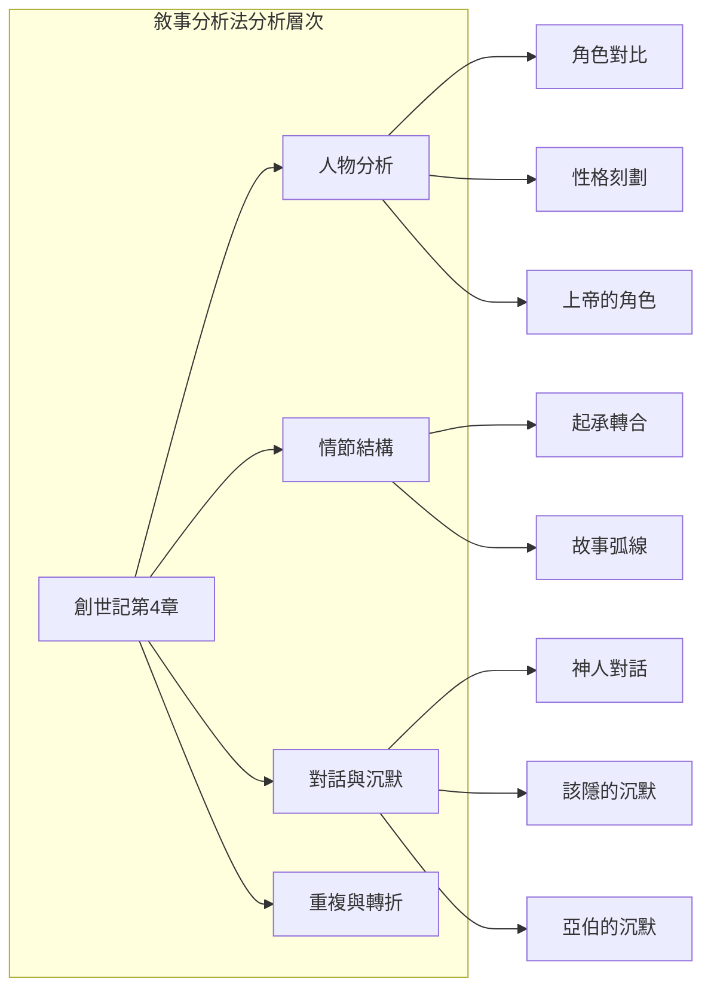


### 第一節　人物刻劃的對比與張力

| 對比維度 | 該隱 | 亞伯 |
|---------|------|------|
| 出生次序 | 長子（繼承權優勢） | 次子（繼承權劣勢） |
| 職業 | 耕地（農耕文明） | 牧羊（遊牧文明） |
| 獻祭態度 | 帶著憤怒與不情願 | 以信心獻上最好的 |
| 對罪的態度 | 抗拒神的勸誡、說謊 | （未知，因經文未記其回應，即沉默的見證） |
| 結局 | 存活，但受咒詛、流離 | 被殺，但血向神哀號，信心仍舊說話 |

神在本章中以**對話者、審判者、保護者、賜福者**四種角色出現——既公義地審判兇手，又慈愛地給予警告與保護。


### 第二節　情節分析

#### ❶　故事弧線（Story Arc）

**轉折點**：4：8 該隱殺亞伯——從兄弟共處到暴力相向，從敬拜場景到犯罪現場，敘事在此急轉直下。

**懸念與伏筆**：神為何拒絕該隱的供物？該隱會如何回應神的警告？這些懸念推動讀者追問神的心意與人的責任。

**敘事缺口（Narrative Gaps）**：經文刻意留下未說明的空白——神如何讓該隱知道祂的悅納或拒絕？亞伯在田間是否說了些什麼？該隱的妻子從哪裡來？這些缺口引導讀者深入思考，而非停留在故事表面。

#### ❷　對話與沉默的文學功能

**耶和華的六個提問**：
- 「你為甚麼生氣呢？」（4：6）
- 「你為甚麼沉下臉來呢？」（4：6）
- 「你弟弟亞伯在哪裏？」（4：9）
- 「你做了甚麼事呢？」（4：10）

提問的修辭功能並非神不知情，而是為了——讓該隱**自省**、**給予認罪的機會**、**凸顯該隱的硬心**。

**該隱的兩次回答**：
- 第一次：「我不知道！我豈是看守我弟弟的嗎？」（4：9）——公然對神說謊、推卸責任
- 第二次：「我的懲罰太重……」（4：13–14）——抱怨刑罰過重，仍未真正悔改

**亞伯的沉默**：亞伯在整個敘事中不曾說一句話。他的沉默（不詳）是一種極具力量的文學手法——**靜默的見證**比言語更有力，他的血從地裡向神「說話」，指向神必為無辜者伸張公義的核心信念。


### 第三節　神學信息提煉

本卷凸顯的核心神學信息包括：
- 罪已從個人行為（亞當違命）擴散為**人際暴力（謀殺）**
- 敬拜的關鍵在於**內在信心**，而非外在形式
- 神的**公義與憐憫並存**——審判罪惡，卻不消滅罪人
- 神以提問的方式向人說話，**尊重人的自由意志**
- 即使罪惡蔓延，神仍為敬虔的後裔預備**救恩的延續**


## 第三章　方法三：字詞與文法研究法

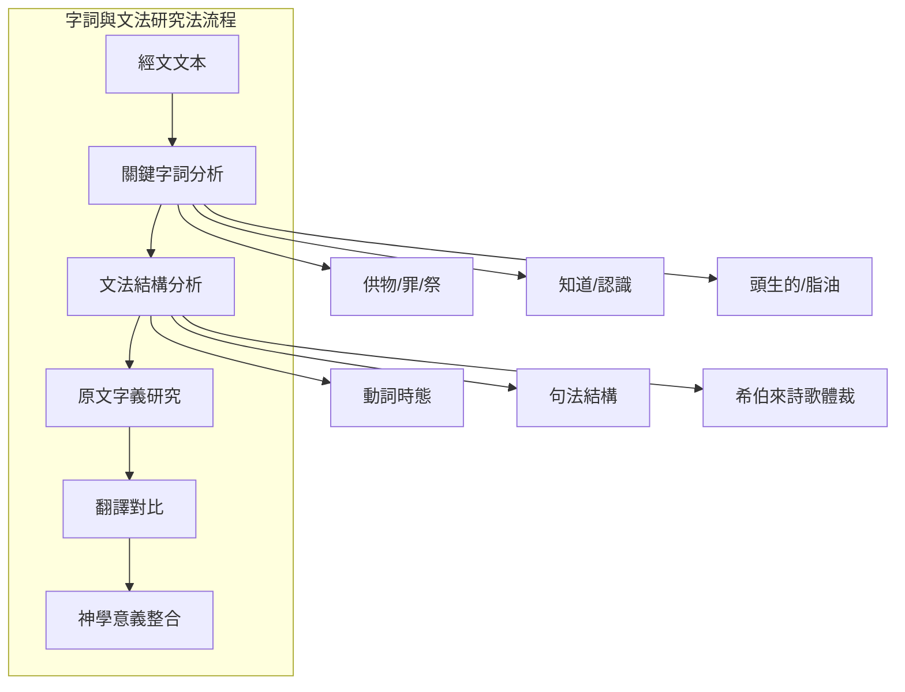


### 第一節　嚴謹經文對比版（RCUV為基準）

> **方法說明**：以下列表詳細比較中文RCUV與多種英文譯本的經文。經文中的中文特色詞彙（如「供物」），在各譯本的英文對照中使用不同的翻譯原則是正常的現象，並不代表某個譯本「正確」或「錯誤」。合參各版本能幫助我們更深入理解原文的豐富含義。

#### 4：1–2　該隱與亞伯的誕生

> RCUV　那人和他妻子夏娃同房，夏娃就懷孕，生了該隱，她說：「我靠耶和華得了一個男的。」

| 譯本 | 經文對照 |
|------|---------|
| KJV | And Adam knew Eve his wife; and she conceived, and bare Cain, and said, I have gotten a man from the LORD. |
| ESV | Now Adam knew Eve his wife, and she conceived and bore Cain, saying, “I have gotten a man with the help of the LORD.” |
| NET | Now the man had marital relations with his wife Eve, and she became pregnant and gave birth to Cain. Then she said, “I have created a man just as the LORD did!” |
| NIV | Adam made love to his wife Eve, and she became pregnant and gave birth to Cain. She said, “With the help of the LORD I have brought forth a man.” |

#### 4：3–5　首次獻祭

> RCUV　過了一些日子，該隱拿地裏的出產為供物獻給耶和華；亞伯也把他羊群中頭生的和羊的脂肪獻上。耶和華看中了亞伯和他的供物，卻看不中該隱和他的供物。

| 譯本 | 經文對照 |
|------|---------|
| KJV | And in process of time it came to pass, that Cain brought of the fruit of the ground an offering unto the LORD. And Abel, he also brought of the firstlings of his flock and of the fat thereof. And the LORD had respect unto Abel and to his offering: But unto Cain and to his offering he had not respect. |
| ESV | In the course of time Cain brought to the LORD an offering of the fruit of the ground, and Abel also brought of the firstborn of his flock and of their fat portions. And the LORD had regard for Abel and his offering, but for Cain and his offering he had no regard. |
| NET | At the designated time Cain brought some of the fruit of the ground for an offering to the LORD. But Abel brought some of the firstborn of his flock – even the fattest of them. And the LORD was pleased with Abel and his offering, but with Cain and his offering he was not pleased. |

#### 4：6–7　神警告該隱

> RCUV　耶和華對該隱說：「你為甚麼生氣呢？你為甚麼沉下臉來呢？你若做得對，豈不仰起頭來嗎？你若做得不對，罪就伏在門前。它想要控制你，你卻要制伏它。」

| 譯本 | 經文對照 |
|------|---------|
| KJV | And the LORD said unto Cain, Why art thou wroth? and why is thy countenance fallen? If thou doest well, shalt thou not be accepted? and if thou doest not well, sin lieth at the door. And unto thee shall be his desire, and thou shalt rule over him. |
| ESV | The LORD said to Cain, “Why are you angry, and why has your face fallen? If you do well, will you not be accepted? And if you do not do well, sin is crouching at the door. Its desire is for you, but you must rule over it.” |
| NET | Then the LORD said to Cain, “Why are you angry, and why is your expression downcast? Is it not true that if you do what is right, you will be fine? But if you do not do what is right, sin is crouching at the door. It desires to dominate you, but you must subdue it.” |

#### 4：8　謀殺

> RCUV　該隱與他弟弟亞伯說話。二人正在田間時，該隱起來攻擊他弟弟亞伯，把他殺了。

| 譯本 | 經文對照 |
|------|---------|
| KJV | And Cain talked with Abel his brother: and it came to pass, when they were in the field, that Cain rose up against Abel his brother, and slew him. |
| ESV | Cain spoke to Abel his brother. And when they were in the field, Cain rose up against his brother Abel and killed him. |
| NET | Cain said to his brother Abel, “Let’s go out to the field.” While they were in the field, Cain attacked his brother Abel and killed him. |

> **註** 「該隱與他弟弟亞伯說話」的內容，經文未記載。NET補充的 “Let’s go out to the field” 是對敘事空白的文理推測，並非直接經文。這處敘事空白極具意義——該隱可能誘騙亞伯到田間，暴露其預謀殺人的惡意。

#### 4：9–12　神的審判

> RCUV　耶和華對該隱說：「你弟弟亞伯在哪裏？」他說：「我不知道！我豈是看守我弟弟的嗎？」耶和華說：「你做了甚麼事呢？你弟弟血的聲音從地裏向我哀號。現在你必從這地受詛咒，這地開了口，從你手裏接受你弟弟的血。你耕種土地，它不再給你效力；你必流離飄蕩在地上。」

| 譯本 | 經文對照（摘要） |
|------|---------|
| KJV | And he said, I know not: Am I my brother’s keeper? And he said, What hast thou done? the voice of thy brother’s blood crieth unto me from the ground. |
| ESV | He said, “I do not know; am I my brother’s keeper?” And the LORD said, “What have you done? The voice of your brother’s blood is crying to me from the ground.” |
| NET | The LORD said, “What have you done? The voice of your brother’s blood is crying out to me from the ground!” |

#### 4：15　神的保護記號

> RCUV　耶和華就給該隱立一個記號，免得人遇見他就殺他。

| 譯本 | 經文對照 |
|------|---------|
| KJV | And the LORD set a mark upon Cain, lest any finding him should kill him. |
| ESV | And the LORD put a mark on Cain, lest any who found him should attack him. |
| NET | Then the LORD put a special mark on Cain so that no one who found him would strike him down. |


### 第二節　希伯來文關鍵字詞深入研究

#### ❶　「供物」（מִנְחָה / minchah）

希伯來文 `minchah` 是舊約中最常用的奉獻用詞之一，基本含義為「禮物」、「貢物」或「朝貢」，用在人的交往中是一種為朝貢或結盟所送的禮物；若作宗教儀式用語，它可以指動物，不過較常指穀類的獻祭（如利2：1）。`minchah` 本身並非問題所在——利未記第2章明確指示穀物（素祭）是可以獻給神的。問題不在於祭物的類別，而在於**獻祭者的心態和祭物的品質**。

#### ❷　「頭生的和脂油」（בְּכֹרוֹת / bechorot + חֵלֶב / chelev）

`bechorot`（頭生的／頭胎）指**第一胎**的雄性牲畜，象徵最好的、屬於神的部分。`chelev`（脂油）指牲畜的脂肪，被視為祭物中最好的部分──「上選」、「最好的部分」。亞伯所獻的是他所有中「最好的」。相反地，該隱只是獻上他所有中的一部分（未加以強調品質）。

#### ❸　罪（חַטָּאת / chatta'ath）

`chatta'ath` 有三種可能的解釋：
- （1）「罪」——指道德性的過犯
- （2）「罪的刑罰」——即罪的後果
- （3）「贖罪祭」——與利未記的獻祭制度相關

在創4：7中，罪被**擬人化**為一頭蹲伏在門前的猛獸，這個隱喻的原文 `rovets`（蹲伏）通常用於形容動物（如創29：2的羊群躺臥）。罪正如一頭野獸，潛伏在門口，隨時撲向人。

#### ❹　「知道／認識」（יָדַע / yada）

`yada`（同房，4：1、17、25）表現出**兩性真正的結合是在全然相知相交之中**，超越純粹肉體的層次。此字也用於描述神與人的關係（如耶和華「認識」摩西），使婚姻成為神人關係隱喻。


### 第三節　關鍵經文深入詮釋

#### 4：7的文本難題與詮釋

此節的希伯來文 `se'et` 傳統解釋為「被接納」、「高舉」或「仰起頭來」。希臘文七十士譯本誤解為儀式性的獻祭準則問題，而喪失了原文的隱喻層次。**福音派的立場**則肯定原文的直觀詮釋：神問該隱的問題表示只要他做得正確，他必會「被接納」或「仰起頭來」。`se'et` 與第4節「變了臉色」的 `naphal`（墮落／下沉）形成鮮明對比——一個是**提高（仰望）** ，一個是**墜落（下沉）** 。該隱的臉色「下沉」，正是因為他拒絕仰望神。

#### 4：10「血的聲音」的修辭意義

此處使用**極具張力的詩意語言**：「你弟弟血的聲音從地裏向我哀號。」「血」是複數形式 `damim`（多滴血），可能暗示**亞伯被害時所流的每一滴血都在控訴**。這個隱喻強化罪行嚴重，並確立了**神必定聽聞無辜者冤情**的神學信念。

#### 4：23–24拉麥之歌的詩歌分析

本段是希伯來文學中**最古老的詩歌之一**，其平行結構如下：

> 亞大、洗拉啊，**聽我的聲音**；（A）
> 拉麥的妻子啊，**側耳聽我的言語**：（A'）
> **大人**傷我，我把他**殺了**；（B）
> **小孩**損我，我把他**害了**；（B'）
> 若殺該隱，遭報**七倍**，（C）
> 殺拉麥的，必遭報**七十七倍**。（C'）

此詩歌使用「對句平行法」（synonymous parallelism），兩個句子表達相似的意義。拉麥將神的憐憫扭曲為自我誇耀的資本——神說殺該隱的「遭報七倍」，拉麥將這個保護扭曲擴張至「七十七倍」的報復性暴力。


## 第四章　方法四：神學主題歸納法

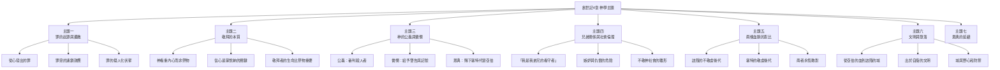


### 第一節　主題一：罪的起源、本質與擴散

創世記第3章的罪（不順服）在第4章中迅速升級為**謀殺**。夏娃是受誘騙犯罪，該隱則是連神都不能說服他脫離罪——罪的惡性循環因此啟動。此章的罪不再只是違反誡命的個別行為，而是已成為一種**內在勢力**，像猛獸蹲伏在門前。

該隱的罪行序列——嫉妒（4：5）→ 謀殺（4：8）→ 說謊（4：9）→ 抱怨（4：13–14）——展現了罪的**連鎖反應**。新約進一步指出：「不可像該隱；他是屬那惡者，殺了他的兄弟」（約壹3：12）。

> **福音派立場的詮釋**：罪從亞當一人入了世界，在該隱身上已顯明其毀滅性力量——不僅破壞人與神的關係，更**瓦解人與人的關係**。罪具有傳染性，從個人層面迅速擴散到社會層面，正如該隱的後代拉麥將暴力制度化。


### 第二節　主題二：敬拜的本質——信心與順服

創世記4：3–5提出了聖經中最早關於敬拜本質的教導。神悅納亞伯和他的供物的原因——雖然經文未直接說明，但神對該隱說「你若做得對，豈不仰起頭來嗎」（4：7）暗示**行為的正直與內心的正確**是蒙悅納的關鍵。

新約提供了權威性的詮釋：
- **希伯來書11：4**　「亞伯因著信，獻祭與神，比該隱所獻的更美，因此便得了稱義的見證」——信心是根本
- **約翰壹書3：12**　「不可像該隱；他是屬那惡者」——生命的本質決定敬拜的品質

> **福音派立場的詮釋**：神先悅納一個人，再悅納他所獻的祭。敬拜者**內在的信心與順服**比外在的祭物品質更為重要。該隱的態度問題表現在：（1）並非獻上最好的部分，僅是隨手拿出出產；（2）被拒絕後的反應是憤怒而非慚愧，顯露其內心剛硬。因此，敬拜不是一項可以與生活脫節的宗教活動，而是整個人向神**全然降服、以信心回應的表現**。


### 第三節　主題三：神的公義與憐憫並存

**公義的彰顯**：
- 神審判兇手，宣告咒詛
- 亞伯的血從地裡向神哀號，神必為無辜者伸張公義

**憐憫的流露**：
- 審判前先**提問警告**：「你為甚麼生氣？」（4：6）
- 審判後不是處死該隱，而是**放逐並給予保護記號**

> **福音派立場的詮釋**：神的刑罰中有恩典，懲罰中有慈愛。神給該隱記號除了是為了保護他，還隱含著神渴望罪人回轉的心意——即使是最嚴重的罪，神仍然提供活下去的機會和悔改的空間，因為神不願一人沉淪。這一平衡——神的公義未曾妥協，恩典也未曾缺席——為後續聖經的**救贖歷史**奠定了基本框架。


### 第四節　主題四：兄弟關係與社會倫理

該隱對神說：「我豈是看守我弟弟的嗎？」（4：9）這句話反諷地揭示了這位**兄長的冷酷與推諉責任**。事實上，每個人都是**弟兄的看守者**——對他人的福祉負有道德責任。

嫉妒如何轉化為謀殺？該隱的內心過程引人深思：他**對自己的失敗感到憤怒，卻把憤怒投射到弟弟身上**。這種心理機制在後世社會中的族群衝突、群體敵對、人際迫害中反覆重演。

> **福音派立場的詮釋**：神的設計中，人與人之間是互相守望的關係。該隱的謊言「我不知道」暴露罪的核心——當人與神的關係破裂時，人與人的關係也隨之破裂。該隱的回答句 `lo yada`（不知道）與第1節的 `yada`（認識／同房）形成尖銳對比：第1節是夫妻彼此認識（美好關係），第9節則是推卸對兄弟的責任（關係破裂）。


### 第五節　主題五＆六：兩條血脈、文明與墮落（4：17–24）

該隱的後代被記述發展出**人類早期文明**的四個主要面向：
- **城與建築**　該隱建以諾城——人類社會組織的開端
- **畜牧業**　雅八——住帳棚、畜牧之人的祖師
- **音樂與藝術**　猶八——彈琴吹簫之人的祖師
- **冶金與工藝**　土八‧該隱——銅器鐵器工匠

但這個物質文明同時伴隨著**靈性的黑暗**：
- 拉麥開創**多妻制**（4：19）
- 拉麥之歌顯露**復仇文化**與暴力自誇（4：23–24）
- 該隱的後代被描述為**不敬畏上帝**的文明

與此相對的是創世記4章結尾顯示的**救恩的曙光**：
- 亞當生**塞特**　名字意為「立」、「代替」、「根基」
- 塞特生**以挪士**　名字意為「軟弱的」、「必死的」——代表認識人的軟弱與有限
- 「那時候，人**開始求告耶和華的名**」（4：26）——敬虔的記號，標誌著與該隱文明完全不同的生命取向

> **福音派立場的詮釋**：該隱的文明是「失去神之後，人企圖以自己的努力建造安全感」——城取代了神的保護，畜牧確保生存，音樂滿足人心，武器實現防禦。這一切看似進步，實則是人在咒詛中用**自己的方式重建秩序**。然而，神沒有放棄人類——塞特一系承接神的救恩應許，成為將來彌賽亞譜系的起頭。《創世記》有意將該隱的後裔與塞特的後裔放在對照的位置，展現「罪的延續與恩典的延續」這兩條人類路線。


## 第五章　方法五：文學結構分析法

### 第一節　整體結構圖

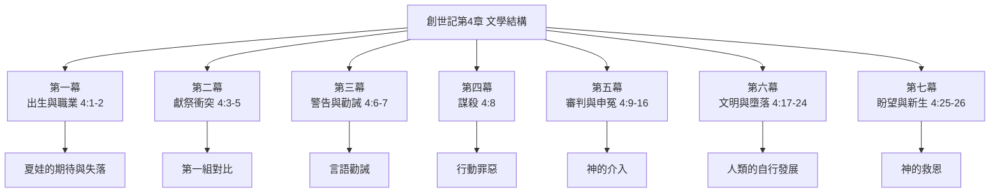


### 第二節　對比、平行與重複

| 對比項目 | 第一面 | 第二面 |
|---------|--------|--------|
| 職業 | 該隱——耕地 | 亞伯——牧羊 |
| 獻祭品質 | 地裡的出產（一般） | 頭生的和脂油（最好） |
| 神的回應 | 看不中該隱 | 看中亞伯 |
| 回應態度 | 憤怒、沉臉 | 經文無記載（不詳） |
| 對神的回答 | 說謊、推卸 | 沉默，但血哀號 |
| 該隱的後代（4：17–24） | 不敬虔、自誇暴力 | 塞特的後代（4：25–26）——求告主名 |

### 第三節　段落功能分析

**創4：1–2（開場）** 以盼望開始——夏娃以為得著所應許的後裔

**創4：3–16（核心）** 悲劇的起源、發展與後果——從獻祭衝突到謀殺審判

**創4：17–24（延伸）** 罪的社會性後果與文明中的墮落

**創4：25–26（結局）** 神的恩典與救恩的延續——從亞伯的血到「求告耶和華的名」

### 第四節　與創世記第2–3章的文學平行

根據文本整體性研究，創2–4章藉由以下要素互相關聯：
1. **人物延續**　亞當、夏娃、蛇、該隱、亞伯形成家族敘事
2. **主題平行**　亞當和該隱都面對「考驗」——且都失敗了
3. **罪的升級**　從違命到謀殺
4. **審判模式**　神質問 → 人推卸 → 宣告懲罰 → 仍賜恩典
5. **沉默與聲音的母題**　亞當推卸責任 → 該隱說謊；亞伯的血向神哀號 → 開啟新約「血所說的更美」（來12：24）


## 第六章　方法六：歷史文化背景考察法

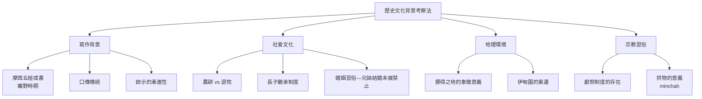


### 第一節　寫作背景（不詳）

學者對創世記第4章的寫作背景存在不同看法。傳統福音派觀點認為摩西在曠野時期（約主前15–13世紀）根據更早期的口傳與文字資料，在聖靈默示下編撰成書。此章包含多種文學體裁：1–16節為敘事散文，17–24節包含家譜與詩歌（23–24節為詩歌體裁）。這種文體多樣性反映摩西可能使用了不同的傳統資料，並在聖靈的引導下整合為一部**連貫的神學敘事**。


### 第二節　社會與文化背景

#### ❶　農耕與畜牧的衝突背景

該隱為農夫，亞伯為牧人。在古代近東，兩種生活方式的社群時有衝突——農耕者往往定居於城鎮與耕地周圍，而牧人則需要廣闊的草原。創世記作者明顯傾向於推崇**牧人亞伯**——暗示神的揀選不受文化優勢地位（農耕文明更為「先進」）的限制。

#### ❷　獻祭制度

古代近東獻祭文化盛行，祭物的品質直接反映獻祭者對神明的態度。亞伯獻上「頭生的和脂油」——即牲畜中**最上等的部分**，該隱獻的則是一般的「地裡的出產」——關於是否為初熟之物**經文則未明確交代**。問題核心在於**獻祭的品質與心態**。

#### ❸　該隱妻子的來源

該隱的妻子從哪裡來？創世記前幾章只記載亞當夏娃生了該隱、亞伯與塞特。CBOL註釋指出：「在上古之世，人類被造的初期，兄妹結婚，神是未曾禁止的」（參創20：12）。因此推論該隱的妻子可能是他的姊妹（亞當與夏娃所生的女兒），直到摩西律法時代後兄妹結婚才被禁止。此推論雖不合現代倫理觀，但符合經文的上古背景。
（不詳，因經文未明確記載女兒的出生）

#### ❹　挪得之地的意義

「挪得」（Nod）字義為「漫遊」、「流浪」。此地點無法考據，其**象徵意義**更為重要——代表**離開神的面**，在靈性上漂流無依的狀態。


### 第三節　宗教文化背景

早期的獻祭制度（創4：3–4）顯示人與神的關係**已以獻祭為媒介**——早於西奈山的正式禮儀。這表明從人類初期開始，神已經設立了以流血的祭預表贖罪的模式。創4章呈現的宗教現象包括：
- 獻祭的場所（祭壇——雖未明說但可推知）
- 供物的類別與品質要求
- 神接納或拒絕供物的記號（「看中」的方式不詳）


## 第七章　方法七：新約印證與正典研究法

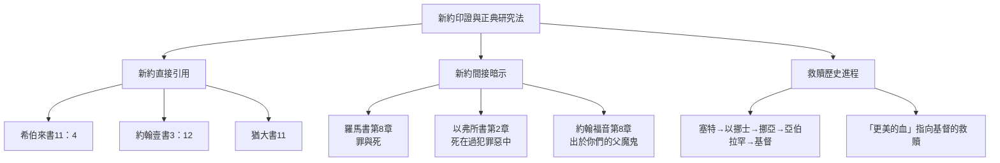


### 第一節　直接引用對照表

| 新約經文 | 引用創4章內容 | 神學詮釋 |
|---------|-------------|---------|
| 希伯來書11：4 | 亞伯因著信獻祭，比該隱所獻的更美 | 信心的本質——得神喜悅的關鍵 |
| 約翰壹書3：12 | 不可像該隱，他是屬那惡者，殺了他的兄弟 | 惡者之子vs.神之子的對立 |
| 猶大書11 | 該隱的道路——為利往錯謬裡直奔 | 該隱作為假師傅的預表 |
| 希伯來書12：24 | 「亞伯的血」vs.「耶穌的血」 | 亞伯的血呼求公義，耶穌的血宣告赦免 |

### 第二節　福音派立場的歸納與整合

#### ❶　「信心」的優先性

該隱與亞伯的核心區別，按照新約的權威詮釋，在於**信心的有無**。亞伯「因著信」獻上更美的祭物；該隱的道路——不論他的祭物外表如何——被稱為「那惡者的道路」。

#### ❷　兩條血脈敵對的預表

上帝在創3：15的應許（女人的後裔與蛇的後裔彼此為仇）在創世記第4章已開始實現：
- 該隱的後代（蛇的後裔）——不敬虔、暴力、自誇
- 塞特的後代（女人的後裔）——求告耶和華的名、認識人的軟弱

這兩條血脈的對立，最終指向基督與撒但的終極對決。

#### ❸　從「亞伯的血」到「耶穌的血」

創4：10「你弟弟血的聲音從地裏向我哀號」與來12：24「耶穌的血……所說的更美」形成終極對比。亞伯的血呼求**公義與復仇**；基督的血呼求**赦免與和好**。整本聖經正是在這個對比中完成其救恩敘事——從第一個殉道者的血，到神兒子的血。

#### ❹　末世論的意義

該隱的暴力（4：8）通過拉麥的復仇之歌（4：23–24）發展為系統性暴力文化，預示人類歷史中罪惡的**不斷升級**。然而，創4：25–26同時宣告神的**救恩不斷延續**——塞特一系敬虔的後裔，最終引向基督的降世。這兩條路線構成聖經歷史的主軸，直到末日審判時才最終分別。


## 📊 第八章　綜合圖表總匯

### 圖表一　研經方法總覽

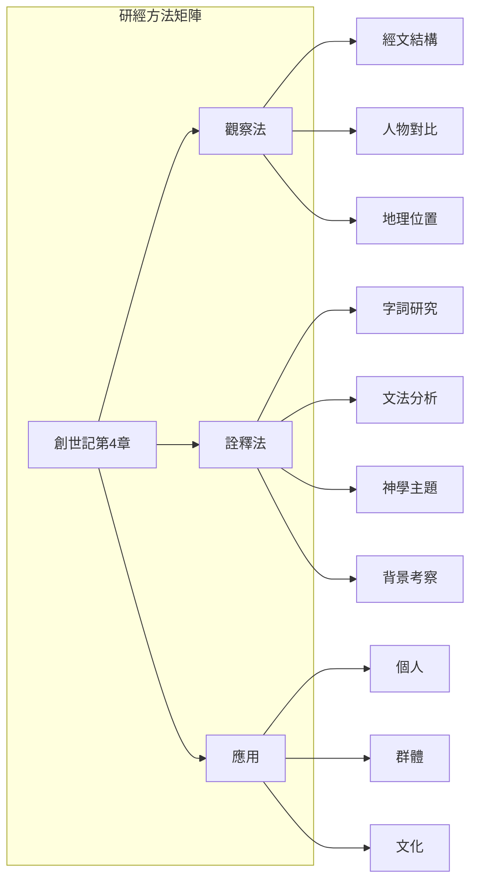


### 圖表二　神學主題層次圖

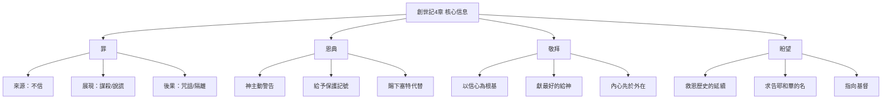


### 圖表三　創世記第4章的救恩線索

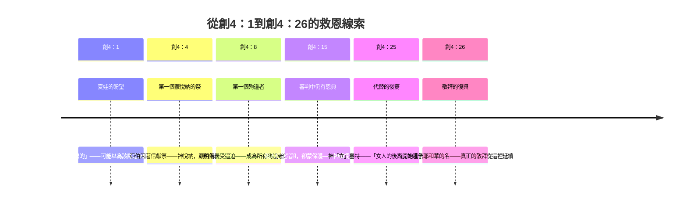


## 💭 第九章　反思與總結

### 第一節　核心信息提煉

創世記第4章記載了人類墮落後的第一次謀殺，也是神拯救恩典的第一次顯明。**三項核心真理**值得反覆思想：

1. **罪的真實與可怕**　罪從亞當一人入了世界，在該隱身上已顯明其毀滅性——蹲伏在心門外，控制人、毀滅人。罪的連鎖反應從一個人的憤怒擴散到整個文明的暴力文化。

2. **信心的不可或缺**　神看重人的內心過於祭物本身。亞伯「因著信」獻祭，比該隱所獻的更美。神的悅納不取決於外在形式的華美或祭物的豐富，而在於人對神的信靠與順服。

3. **神的恩典超越人的失敗**　即使該隱殺了亞伯，人的罪未能攔阻神的救恩計畫。神賜下塞特「代替亞伯」——敬虔的後裔繼續繁衍，最終指向耶穌基督——那位以「更美的血」所說的比亞伯的血更美的那一位。

### 第二節　當代應用思考

**對教會的意義**：我們是否像該隱，敬拜時只獻上「部分」而非「最好的」？是否像該隱一樣，對他人的蒙福心生嫉妒？求神幫助我們檢視**敬拜的內在動機**。

**對社會的意義**：該隱的文化——以自我為中心、自大、驕傲、沒有憐憫——在今天比比皆是。基督徒蒙召成為「求告耶和華的名」的群體，在暴力、嫉妒、推卸責任的世界中作光作鹽。

**對個人的意義**：你可能就是「該隱」——因嫉妒而憤怒、因比較而怨恨。但請記得：即使該隱的罪行如此嚴重，神仍然對他說話、給他記號保護他。你不必成為該隱，你可以成為「求告耶和華的名」的人——因為在基督裡，每一個人都有新的開始。

> **願我們不像該隱，而是像亞伯——因著信獻上最美好的給神；像塞特——成為神所「立」的根基；像以挪士——在認識自己的軟弱中開始求告耶和華的名。** 阿們。


## 📚 附錄　參考資料

1. 《和合本修訂版》（RCUV）聖經——經文來源，香港聖經公會，2010年
2. 《信望愛信仰與聖經資源中心》CBOL註釋資料──創世記第4章
3. 溫永生牧師，《每日研經釋義》創世記第4章研經分享
4. 《台灣聖經網》創世記第4章註釋彙編
5. 梁展熙博士，《聖經人物傳》加音和亞伯爾——故事的意義與訊息
6. 《爾道自建》3月19日——敬虔的後代（微讀聖經）
7. 《The Gospel Coalition》True Worship, Brotherly Peace（Ray Ortlund）
8. 《Inductive Bible Study》A Comprehensive Guide（David R. Bauer & Robert A. Traina）
9. 《穿越讀經的三個世界的旅程》——歸納式研經法介紹（新使者雜誌）
10. NET Bible（New English Translation）Notes on Genesis 4
11. Barnes’ Notes on the Whole Bible——Genesis 4 Commentary
12. The Textual Unity of Genesis 2-4 Against the Backdrop of the History of Exegesis（Toronto Scholars）
13. 台灣聖經網——創世記第4章文明發展註釋（CBOL）
14. 中華基督教網路發展協會——創世記4：17–24的背景資料
15. 聖經研究所——創世記第4章兩條血脈對照
16. MacLaren Expositions of Holy Scripture——Genesis 4